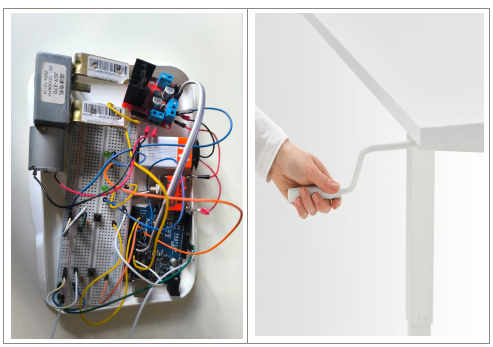

# How to Employ AI Prompting for Systems Engineering

**Duration:** 60–90 minutes | **Format:** Hands-on workshop + self-study guide

---

## Why This Matters

*"A.I. alone will not take our jobs; someone who knows how to employ it will."*

AI and intelligent agents can enhance your skills, help you grow, and work more efficiently by:
- **Accelerating documentation** (requirements, architecture, test cases) with smart templates and validation.
- **Addressing skill gaps** through co-pilot assistance without replacing human judgment.
- **Reducing busywork** so you focus on design decisions, validation, and creative problem-solving.

**Key principle:** AI is a tool for *smarter* engineering, not a shortcut. We validate everything.

## Workshop Agenda

- **Hands-on person?** Jump to [Hello World LED](01_hello-world.md).
- **Already know basics?** Skip to [Prompting Techniques](03_prompting_techniques.md).
- **Full project?** Go straight to [Desk Automation SysEng](04_00_deskautomation-syseng.md).

## What You'll Build

A practical desk automation electronic system using an Arduino microcontroller and DC motor, complete with:
- Mission statement and system objectives
- Concept of operations (ConOps)
- System and software requirements
- Architecture and detailed design
- Unit and integration tests
- ASPICE assessment alignment

This project demonstrates the **full V-Model lifecycle** - from stakeholder intent to verified code - using AI prompting at each stage.

---

## How We'll Work (Hands-On Format)

- **Session 1: Hello World** — Build and test your first Arduino LED blink
- **Session 2: AI Toolchain** — Set up VS Code, GitHub Copilot, and test frameworks
- **Session 3: Prompting Techniques** — Practice 4 key techniques with mini-drills
- **Session 4: Desk Automation SysEng** — Apply all techniques to a full requirements-to-test project

Each session builds on the previous. By the end, you will have real code, verified requirements, test cases, and a reusable prompting workflow.

---

## Success Criteria

By the end of the workshop, you will:
- ✅ Demonstrate a working LED blink circuit and code
- ✅ Set up VS Code + Copilot + Arduino toolchain without errors
- ✅ Write at least two well-formed AI prompts and explain why they work
- ✅ Complete the desk automation project: mission → code → tests
- ✅ Show a requirements-to-test traceability matrix
- ✅ Articulate one AI prompting strength and one risk or limitation

---

