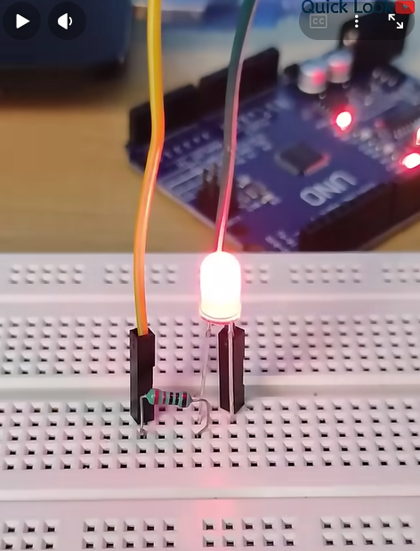
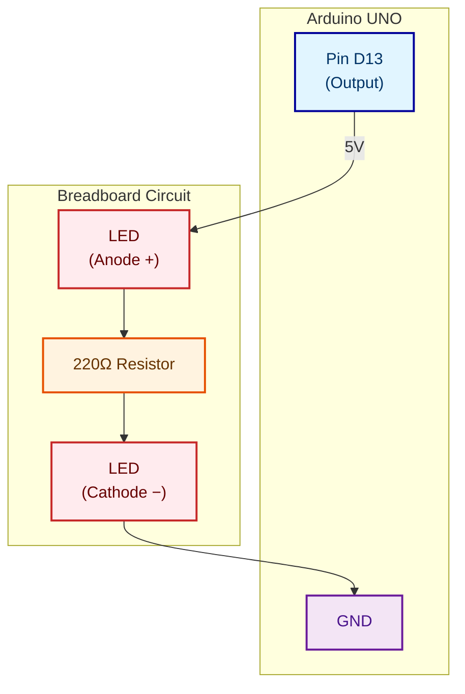

# Session 1: Hello World – Blinking LED with Arduino

**Time:** ~25 minutes 

---

## Learning Objectives

By the end of this session, you will:
- **Wire** a simple LED circuit to an Arduino microcontroller.
- **Generate** a C++ sketch using AI prompting.
- **Validate** the generated code and identify potential issues.
- **Test** the circuit and confirm the LED blinks.
- See video: https://www.youtube.com/shorts/e9Ml6kT-PPQ



## Prerequisites

- Arduino UNO microcontroller
- USB-A to USB-B cable (for programming)
- Breadboard
- Red LED (or any standard LED)
- 220 Ω resistor (current-limiting)
- Two jumper wires
- Arduino IDE installed (download from [arduino.cc](https://arduino.cc))

---

## Part 1: Understand the Circuit

### What Is a Blinking LED?
A **blinking LED** is the "Hello World" of embedded systems. It's simple, visual, and demonstrates:
- GPIO (General-Purpose Input/Output) control
- Digital output (HIGH = ~5V, LOW = 0V)
- Timing and loops
- Upload and execution

### The Circuit Diagram



**What's happening:**
1. Pin D13 outputs HIGH (~5V) → LED lights up
2. Pin D13 outputs LOW (0V) → LED turns off
3. We repeat this in a loop to make it blink

### Why a 220 Ω Resistor?
LEDs require **current limiting** to avoid burnout:
- Red LED forward voltage: ~2V
- Max safe current: ~20 mA
- Arduino GPIO output: ~5V
- Resistor calculation: R = (5V – 2V) / 0.020A ≈ 150 Ω; we use 220 Ω (safe margin)

**Don't skip the resistor**—it protects the LED and the Arduino pin.

---

## Part 2: Wire the Circuit

### Step 1: Prepare the Breadboard
- Place the Arduino on the left side (USB port facing outward).
- Plug the breadboard next to it.
- Connect a **GND jumper** from Arduino GND pin to a breadboard GND rail (blue stripe).

### Step 2: Wire the LED
1. Take a **red LED**: longer leg is **anode (+)**, shorter leg is **cathode (−)**.
2. Insert the **shorter leg (cathode)** into the breadboard **GND rail** (same row as the resistor).
3. Insert a **220 Ω resistor** in series with the cathode.
4. Insert the **longer leg (anode)** into the **positive power rail**.

### Step 3: Connect to D13
1. From Arduino **D13 pin**, run a **jumper wire** to the same breadboard row as the LED anode.

### Step 4: Power Check
- Arduino USB is plugged in ✅
- GND is connected ✅
- LED is in series with resistor ✅
- D13 is connected to LED anode ✅

**Do not proceed** until you can see all connections.

---

## Part 3: Generate Code with AI

### Write a Prompt

Open a text editor or VS Code and draft this prompt:

```
I'm learning Arduino embedded programming. I need a simple C++ sketch 
that blinks an LED on pin D13 of an Arduino UNO.

Requirements:
- LED connected to D13 via 220 Ω resistor to GND
- Blink pattern: 1 second ON, 1 second OFF, repeat forever
- Initialize the pin as OUTPUT in setup()
- Use digitalWrite() for digital control
- Use delay() for timing

Generate the complete C++ code. Include comments explaining each line.
Format: as Arduino .ino file code block.
```

### Use an AI Tool

**Setup:**
1. Open **Arduino IDE** on one side of your screen.
2. Open **Copilot 360 or GitHub Copilot** in a web browser on the other side.
3. This lets you generate code and paste it directly into the IDE.

**Steps:**
1. In your AI chat, copy and paste the prompt above.
2. The AI generates the complete sketch code.
3. In **Arduino IDE**, go to **File → New** to create a new sketch.
4. Copy the generated code from the AI chat.
5. Paste it into the Arduino IDE editor window.
6. Save the file as `blink.ino` (**File → Save** or `Ctrl+S`).

### Example Generated Code

The AI might produce:

```cpp
// Blink LED on pin D13
// LED connected to D13 via 220 Ω resistor to GND

const int LED_PIN = 13;          // GPIO pin for LED
const int BLINK_DELAY = 1000;    // Delay in milliseconds (1 second)

void setup() {
  // Initialize the LED pin as OUTPUT
  pinMode(LED_PIN, OUTPUT);
}

void loop() {
  // Turn LED ON
  digitalWrite(LED_PIN, HIGH);
  delay(BLINK_DELAY);            // Wait 1 second
  
  // Turn LED OFF
  digitalWrite(LED_PIN, LOW);
  delay(BLINK_DELAY);            // Wait 1 second
}
```

---

## Part 4: Validate the Code

**Do not upload yet.** Read the code and ask:

### Question 1: Does the Logic Match the Intent?
- ✅ `pinMode(LED_PIN, OUTPUT)` — Correct; tells Arduino that D13 is an output.
- ✅ `digitalWrite(LED_PIN, HIGH)` — Correct; pulls D13 to ~5V (LED on).
- ✅ `digitalWrite(LED_PIN, LOW)` — Correct; pulls D13 to 0V (LED off).
- ✅ `delay(BLINK_DELAY)` — Correct; 1-second pause between state changes.

### Question 2: Are There Any Issues?
- ⚠️ **Minor:** Arduino D13 has an onboard LED, so you'll see *two* LEDs blink (one on the board, one on your breadboard). This is harmless and confirms the code works!
- ✅ **Good:** No division by zero, no out-of-bounds array access, no blocking calls that would prevent real-time control.

### Question 3: What Could Go Wrong?
- ❌ If the resistor is missing, the LED could burn out (or the Arduino pin could fail).
- ❌ If the LED is inserted backwards (anode to GND), it won't light.
- ❌ If D13 is not set as OUTPUT, digitalWrite has no effect.

**Verdict:** ✅ Code looks correct. Proceed to upload.

---

## Part 5: Upload and Test

### Step 1: Connect Arduino to USB
Plug the Arduino UNO into your computer via USB-B cable.

### Step 2: Open Arduino IDE
1. Launch **Arduino IDE**.
2. Go to **File → New** (or open the blink.ino file you created).
3. Copy and paste the generated code into the editor.

### Step 3: Select Board and Port
1. **Tools → Board → Arduino AVR Boards → Arduino UNO**
2. **Tools → Port → COM3** (or whichever port shows "Arduino UNO")
   - On macOS: `/dev/ttyACM0` or `/dev/ttyUSB0`
   - On Linux: `/dev/ttyACM0` or `/dev/ttyUSB0`

### Step 4: Upload
1. Click **Upload** (or press `Ctrl+U`).
2. Wait for: **"Uploaded successfully"**
3. You should see the **LED on your breadboard blink** (and the onboard D13 LED also blinks).

### Step 5: Verify
- ✅ LED blinks at ~1 Hz (1 on, 1 off, repeat).
- ✅ Blink pattern is steady and predictable.
- ✅ No errors in the IDE console.

**Troubleshooting:**
| Issue | Cause | Fix |
|-------|-------|-----|
| LED doesn't light | Resistor or LED inserted backwards | Check polarity: longer LED leg to D13 |
| LED doesn't blink | Code didn't upload | Check Board/Port selection; retry Upload |
| LED glimmers but doesn't blink | Pin not initialized as OUTPUT | Verify `pinMode(LED_PIN, OUTPUT)` in setup() |
| Upload fails: "board not found" | USB not connected or port wrong | Reconnect USB; select correct port in Tools |

---

## Part 6: Experiment & Iterate

Once the LED blinks, **play with it:**

### Experiment 1: Change the Blink Speed
Edit the sketch:
```cpp
const int BLINK_DELAY = 500;  // 0.5 second on/off (faster)
```
Upload and observe. Does it blink faster? ✅

### Experiment 2: Change the Pattern
Ask AI for a **different blink pattern**:

**Prompt:**
```
Modify the blink sketch to use a pattern: 
100 ms ON, 100 ms OFF, 100 ms ON, 500 ms OFF, repeat.
This creates a "double blink" effect.

Show me the updated loop() function.
```

**Expected output:** The AI modifies `loop()` to add multiple delay cycles per cycle.

### Experiment 3: Add a Second LED
If you have another LED:

**Prompt:**
```
I want to blink two LEDs on pins D13 and D12, in opposite phase 
(when D13 is ON, D12 is OFF, and vice versa).

Update the sketch to control both pins.
```

**What you'll learn:** GPIO independence and parallel control.

---

## Part 7: Reflection & Checkpoint

Before moving to the next session, answer these questions:

1. **Did the AI-generated code work on the first try?** If not, what did you have to fix?
2. **What validation step did you do** (read the code, check logic, verify pin assignments) **before uploading?**
3. **If the LED hadn't blinked, how would you diagnose the problem?**
   - (Hint: Check hardware first—power, connections, resistor. Then check code—print debug statements, verify pin number.)
4. **What's the relationship between the `delay()` time and the blink frequency?**
   - (Hint: Total cycle time = 2 × delay; frequency = 1 / cycle time.)

Write a brief note on each; we'll revisit these concepts when we test the desk motor controller.

---

## Key Takeaways

- ✅ **AI can generate working code** from a clear prompt, but you must validate it.
- ✅ **Hardware and software are linked**—an incorrect circuit will fail even with perfect code.
- ✅ **Testing is essential**—blink is visual feedback; always verify behavior matches intent.
- ✅ **Iteration is fast**—change a constant, re-upload, observe. This builds intuition.
- ✅ **Prompting matters**—a good prompt (specific, constrained) yields better code than a vague one.

---

## What's Next?

Congratulations! You've built your first AI-assisted embedded project. 🎉

Next session: [Session 2 – AI Toolchain Setup](02_aisetup.md)

In that session, you'll:
- Set up VS Code + GitHub Copilot for faster iteration
- Configure Arduino build tools and test frameworks
- Prepare to work on the full desk automation project

---

## Additional Resources

- **Arduino Language Reference:** [arduino.cc/reference](https://arduino.cc/reference) (digitalWrite, delay, pinMode)
- **LED Wiring Guide:** [Arduino LED tutorial](https://arduino.cc/en/Tutorial/Foundations/DigitalPins)
- **Resistor Color Codes:** [Quick reference](https://en.wikipedia.org/wiki/Electronic_color_code) (220 Ω = Red-Red-Brown)
- **If things go wrong:** Reread "Troubleshooting" section above; then ask your AI to help debug.
