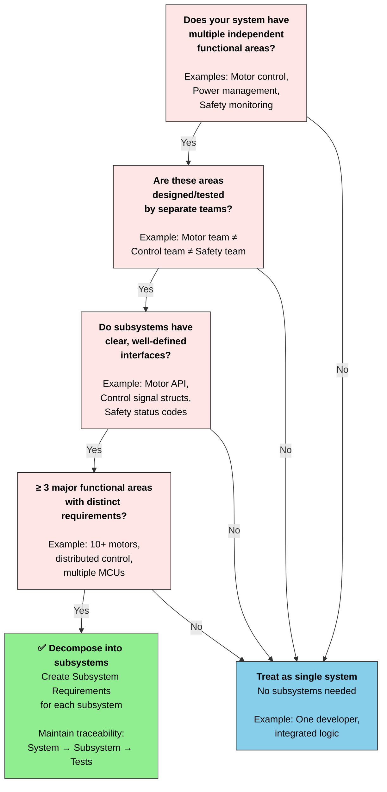

# Session 4.1: System Definition - Sys and SW Requirements

**Focus:** Mission Statement → System Objectives → Concept of Operations → System Requirements → Software Requirements

**Time:** ~30 minutes

---

## Part 1: Mission Statement & System Objectives

### Step 1: Draft Mission Statement (why the system exists)

**Prompt:**
```
Write a mission statement for a standing desk automation system.

Context:
- Manual desk, 30–120 cm height, 20 kg max load
- Motor: 12V brushed DC, 2A nominal
- Controls: UP/DOWN/STOP buttons, limit switch
- Safety: Must stop immediately on STOP press or mechanical jam
- User: Office worker; needs smooth, responsive control
- Deployment: Commercial office building

Constraints:
- 1–2 sentences max
- Focus on user value and safety, not technology
- Use accessible language (not jargon)

Format: store it under documentation following prefixed numbering format 00_.
```

**Your feedback:** 
- Review the mission. 
- Does it capture the **why**? 
- Does it avoid over-specifying **how**?

### Step 2: Derive System Objectives

**Prompt:**
```
Derive 4–5 core system objectives from the mission statement under documentation directory.

Context:
- Desk height: 30–120 cm
- Lift time: ≤ 30 sec for full stroke
- Load: ≤ 20 kg
- Safety: Immediate stop on STOP press or jam
- User experience: Responsive (button → motion within 1 sec)

Objectives should be:
- Specific and measurable
- Traceable back to mission
- Non-overlapping
- Achievable with stated hardware

Format: Numbered list (OBJ-001, OBJ-002, ...); each with brief rationale.
Store under documentation following prefixed numbering format 0X_.
```

**Validate and iterate:** 
- Are these objectives realistic? 
- Do they trace back to the mission? 
- Are they measurable?
- Do we need more (or less) objectives ?

**If improvements needed:** Refinement prompt:
```
These objectives are too implementation-focused. 
Rewrite OBJ-001 to focus on user capabilities (WHAT) not technology (HOW).
Remove all references to "motor speed", "ramping", "PWM". Instead, 
describe what the user can do.
```

---

## Part 3: Concept of Operations (ConOps)

**ConOps** describes the normal workflow: how the user interacts with the system in realistic scenarios.

**Prompt:**
```
Create ConOps artifact for this project.

Write 3-5 operational scenarios for the standing desk system based on the upstream artifacts.

Context:
- User controls: UP button, DOWN button, STOP button
- Desk height: 30–120 cm
- Motor: Controlled by Arduino
- Safety: STOP halts motion immediately

For each scenario, provide:
1. Scenario name (e.g., "Normal Raise")
2. Initial state (desk height, button state)
3. User actions (which buttons pressed, in order)
4. System response (motor moves, LED changes)
5. Final state (desk at new height, buttons released)

Now write 3-5 scenarios:
1. Raise desk (sitting → standing)
2. Lower desk (standing → sitting)
3. Emergency STOP (halt during motion)
...
```

**Check:** Are all system objectives covered in the ConOps?


## Part 4: System Requirements

Decompose system objectives into **system requirements** (what the system does), then into **software requirements** (what the software subsystem does).

### Step 1: Derive System Requirements

**Prompt:**
```
Derive 6–8 functional system requirements from the system objectives and ConOps artifacts from upstream documentation.

For each requirement format following industry best-practices, such as INCOSE rules:
At least:
- REQ-ID: SysReq-001, SysReq-002, ...
- Statement: "System shall ..." (quantified, measurable)
- Rationale: Why this requirement exists
- Verification: How to test (simulation, measurement)
- Derived from: Which objective/scenario

Constraints:
- Use "shall" not "should"
- Maximum 2 sentences per statement
- Include quantitative acceptance criteria
- Must be verifiable (not subjective)

Format: Markdown table (REQ-ID, Statement, Rationale, Verification, Derived From)
Add results under system requirements artifact.
```

**Verify:**
- Are the system requirements complete?
- Do we need any more requirements?
- Is the formatting correct?
- Are the requirements following best-practices?

### Subsystem Requirements

**When to use subsystems?**

Decompose your system into subsystems only if it exhibits **high complexity**. Use the decision tree below to determine if your project needs subsystems:



**For the Desk Automation Project:**
- **Functional areas:** Motor control, Button input, LED feedback, Safety monitoring
- **Team structure:** Single developer/team
- **Interface complexity:** Low (simple GPIO, PWM signals)
- **Decision:** ➜ **Single system, no subsystems needed**

All software requirements apply to the single integrated system.

**If this were a complex system (e.g., 10+ motors, distributed control, multiple MCUs):**
- Break into subsystems (e.g., Motor Subsystem, Control Subsystem, Safety Subsystem)
- Create separate Software Requirements for each subsystem
- Define clear subsystem interfaces (data exchange, timing)
- Maintain traceability from system requirements → subsystem requirements → subsystem tests


### Step 2: Software Requirements

**Prompt:**
```
Derive 6-10 software requirements from the system requirements artifact. 

For each software requirement, format following industry best-practices, such as INCOSE rules:
- SWReq-ID: SWReq-001, SWReq-002, ...
- Statement: "Software subsystem shall ..." (software-focused, not hardware)
- Rationale: Why
- Test Method: How to unit test (with mock hardware)
- Derives from: Which SysReq
- Use short sentences while avoiding ambiguity

Constraints:
- Focus on software behavior, not implementation details
- Must be unit (component-level) testable (use mocks/stubs for GPIO)
- Include quantitative metrics
- Link to parent system requirement
- Consider industry best-practices and INCOSE rules

Format: Markdown table 
Store software requirements artifact under documentation directory
```

**Verify:**
- Are the requirements complete?
- Do we need any more requirements?
- Is the formatting correct?
- Are the requirements following best-practices? 
- Is the level of details appropriate?

---

**Next Step:** Proceed to [04_02_system-construction.md](04_02_system-construction.md) for detailed design and code generation.