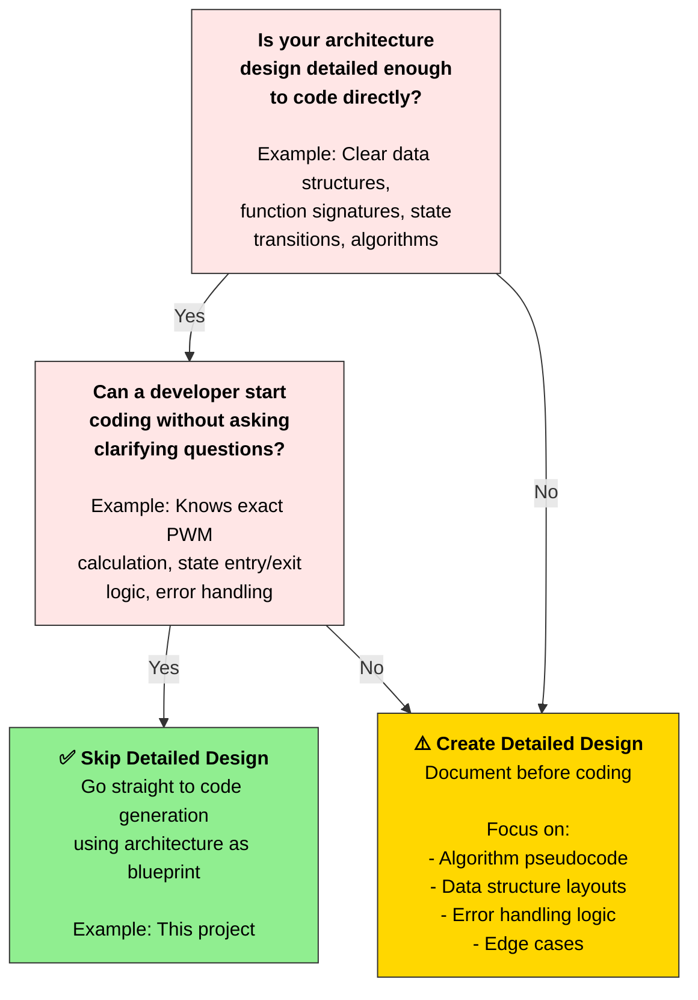

# Session 4.2: Implementation – Detailed Design & Code Generation

**Focus:** Detailed Design → Source Code

**Time:** ~30 minutes

## Part 1: Detailed Design

When is Detailed Design Really Necessary?

**Short answer:** Detailed Design is necessary when the gap between architecture and code is significant.

### Why Sequence Diagrams Are Critical

- ✅ Catches design flaws before coding
- ✅ Helps developers understand the execution flow without reading code
- ✅ Simplifies testing (test each sequence independently)
- ✅ Eases debugging (trace actual execution against expected sequence)
- ✅ Documents how layers coordinate (crucial for team handoffs)

**Create separate detailed design document when:**
- Architecture is vague on algorithm specifics
- Team members are unsure how to implement a component
- Complex state machines need visual walkthroughs
- Standards (IEC 61508, DO-178C, IEC 62304) mandate detailed design phase
- Cross-team coordination needed (unclear interfaces)
- Estimated code size > 5000 lines

**Skip detailed design if:**
- Architecture specifies all data structures and function signatures
- Algorithms are simple (linear ramp, debounce filter)
- Team understands design well enough to code directly
- Project timeline is tight and team is experienced

**Decision Tree**



### Key Elements of a Detailed Design

When you decide detailed design is necessary, include these elements:

| Element | Purpose | Example (Desk Automation) |
|---------|---------|--------------------------|
| **Data Structure Layouts** | Define exact memory layout, field ordering, sizes | `struct AppInput_t { bool btn_up; bool btn_down; bool btn_stop; bool limit; uint32_t elapsed_ms; }` |
| **Algorithm Pseudocode** | Step-by-step logic before code (not in code comments) | Linear PWM ramp: `pwm = (target_pwm * elapsed_ms) / 500` for 0–500 ms |
| **State Machine Diagram** | Visual state transitions with entry/exit actions | IDLE → RAISING (entry: start ramp), RAISING → IDLE (exit: stop ramp, decelerate) |
| **Sequence Diagrams** | Interaction between components over time | Main Loop calls DeskApp_task() → calls MotorControl_getRampedSpeed() → returns PWM → HAL_setMotorPWM() |
| **Error Handling Logic** | How to handle edge cases and faults | If stall timeout (2 sec at PWM ≥ 240), transition to FAULT; require STOP to reset |
| **Interface Specifications** | Exact function signatures, parameters, return types | `uint8_t MotorControl_getRampedSpeed(uint32_t elapsed_ms)` returns 0–255 linearly over 500 ms |
| **Timing Diagrams** | Critical timing constraints (latency, frequencies) | Button debounce: 50 ms hysteresis; Main loop: 10 ms cycle (100 Hz); Ramp: 500 ± 50 ms |
| **Decision Tables** | Complex conditionals in tabular form | State transitions table: From state, input → next state, action |
| **Risk & Edge Cases** | Known issues and mitigation | Risk: limit switch fails during RAISING → mitigation: 2-sec stall timeout catches blockage |

---

### Prompt to Generate Detailed Design (Copy & Paste)

**Use this prompt to generate a detailed design document:**

```
Generate a detailed design specification for the desk automation software system.

Review UPSTREAM ARTIFACTS AVAILABLE;

DETAILED DESIGN ELEMENTS TO INCLUDE:
- Data Structure Definitions
- State Machine Documentation
- Sequence Diagrams (Mermaid)
- Algorithm Pseudocode
- Class diagrams
- Class and Function Interface Specifications
- Timing Diagrams (ASCII or Mermaid Gantt)
- Interface Specifications (Function Contracts)
- Error Handling & Edge Cases
- Risk Assessment

FORMAT: Markdown document with sections above. Use Mermaid diagrams for state machine, sequence diagrams, and timing. Include pseudocode blocks. Provide detailed rationale for each design choice.

DELIVERABLE: A detailed design document that a developer can use to implement code without ambiguity. Add it under documentation directory.

```

**For this project:** 3 key sequences cover all use cases (RAISE, STOP, STALL).

## Part 2: Code Implementation

### Prompt for Source Code Generation (Copy & Paste)

```
TASK: Implement complete Arduino source code for standing desk motor controller based on upstream documentation.

UPSTREAM DOCUMENTATION TO REVIEW:
1. Software Architecture 
2. Software Requirements 
3. System Requirements 
4. ConOps
5. Detailed Design (if available) 

ARCHITECTURE ADHERENCE:
- Implement exactly 4 layers: Main Loop → DeskApp → MotorController → HAL (+ PinConfig file)
- DeskApp: State machine (IDLE, RAISING, LOWERING, FAULT) with deterministic transitions
- MotorController: PWM ramping (0→255 over 500±50ms), stall detection (2±0.2s timeout)
- HAL: GPIO abstraction (buttons, limit switch, motor PWM, LED), debouncing (50ms)
- Main Loop: Polling, task invocation, output dispatch (~100ms cycle)

FILE STRUCTURE (create all files under src):
1. pin_config.h
2. hal.h / hal.cpp — Hardware Abstraction Layer
3. motor_controller.h / motor_controller.cpp — Motor Control Logic
4. desk_app.h / desk_app.cpp — Application Control (State Machine)
5. desk_automation.ino — Main Loop (Arduino entry point)

CODING STANDARDS (industry best practices):
- Use const for immutable data (pin definitions, configuration)
- Use static for file-scope variables (avoid global pollution)
- Prefix all functions with module name (e.g., HAL_readButton, DeskApp_init)
- Add header guards (#ifndef HAL_H / #define HAL_H / #endif)
- Use enums for states, button types, LED colors (not magic numbers)
- Comment all public functions with purpose, parameters, return value
- Add file headers: filename, purpose, author/date (optional)
- Use meaningful variable names (debounceTimer, not dt; currentState, not cs)
- Avoid malloc/free (embedded constraint; use static allocation)
- Keep functions < 50 lines (single responsibility principle)
- Code must be correct, buildable, and warning-free
- Keep it simple: readable by unexperienced developers

REQUIREMENTS TRACEABILITY (verify each SWReq implemented)
BE AWARE TIMING AND RESOURCE CONSTRAINTS (validate in code)
OUTPUT LOCATION: Save all files under src directory

NOTES:
- Prioritize clarity over cleverness (code will be reviewed by others)
- Follow sequence diagrams exactly (Main Loop → DeskApp → MotorController → HAL → Hardware)
- DeskApp must be hardware-agnostic (no pinMode, digitalWrite, analogWrite calls in application layer)
- HAL is the only layer that directly interacts with lower-level APIS (e.g.: RTOS, MicroController libs, Arduino´s pinMode, digitalRead, analogWrite)
- Application layer entry points has API clearly defined through:
   - [APP_NAME]_Init(...) and [APP_NAME]_Task(&inputStruct, &outputStruct)
   - InputStruct: gathers all logical inputs needed from outside APP layer
   - OutputStruct: returns all logical outputs coming out of the APP Layer - These will be used by the integration/signal layer to call HAL and other target system functions.
   - Consider low big-O complexity algorithms

```

### Post generation:
- Check if it builds on arduino IDE.
- Refactor and re-work code as needed.
- The probably to be close to your ideal depends on how detailed the prompt was.


## Key Takeaways

- **Layer-by-layer implementation:** HAL → MotorControl → DeskApp → Main Loop (bottom-up coding)
- **Architecture drives code:** Every function traces back to architecture design
- **Compile early, compile often:** Catch errors incrementally, not all at once
- **Separation of concerns works:** Each layer has clear responsibility; easy to understand and modify
- **AI generates boilerplate fast:** But human review ensures correctness and alignment with design

---


**Next Step:** Proceed to [component verification](04_03_00_component-verification.md).