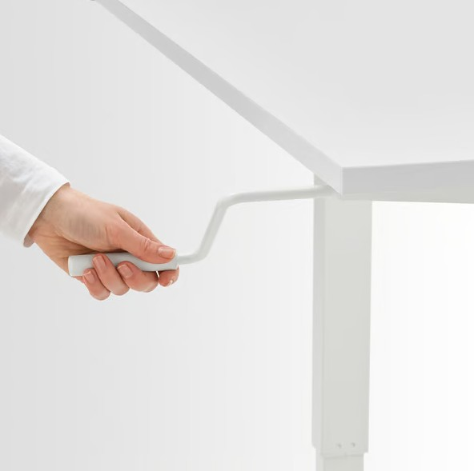

# Automated Mechanical Desk Lift System

Welcome! This project implements a motorized height adjustment system for a mechanical desk using an Arduino-based controller. It is designed for safety, modularity, and future extensibility.

<p align="center">
  
</p>

---

## Project Overview
- **Purpose:** Automate desk movement (up/down) with safety and reliability.
- **Technologies:** Arduino UNO, L298N motor driver, modular C++ codebase.
- **Features:**
    - Up/Down movement with button control
    - Host-based unit testing
- **Compliance:** ISO 25119, ASPICE

---

## Coding Standards

All contributors must follow the [Coding Guidelines](documentation/codingguidelines.md) to ensure code quality and consistency. These guidelines are enforced by automated linting and static analysis tools in CI.

---

## Quick Start
1. **Clone the repository:**
     ```sh
     git clone https://github.com/aperico/deskatuomation.git
     ```
2. **Install prerequisites:**
     - Arduino IDE or PlatformIO
     - [Hardware setup](documentation/HardwareConnections.md)
3. **Build the project:**
     - Use CMake tasks in VS Code or run:
         ```sh
         cmake -S . -B build
         cmake --build build --config Release
         ```
4. **Flash to Arduino:**
     - Open `source/arduino/arduino.ino` in Arduino IDE and upload.
5. **Run unit tests:**
     - Use CTest tasks or run:
         ```sh
         ctest --test-dir build -C Release --output-on-failure
         ```

---


---


## ASPICE Assessment Overview

See the [ASPICE Assessment](documentation/aspiceassessments.md) for a detailed checklist of compliance with ASPICE base practices, including system and software engineering. This document provides:
- A table-oriented checklist for SYS and SWE sections
- Status legend for process achievement (Not achieved, Partially achieved, Largely achieved, Fully achieved)
- Evidence mapping to project documentation
- Action items and recommendations for improvement
- Overall process maturity classification

**Overall ASPICE Maturity Level: Level 2 (Managed Process)**
Processes are planned, monitored, and managed, with requirements, architecture, and testing well documented and traceable. Some integration and validation steps remain partially manual, so full Level 3 (Defined Process) is not yet achieved. To reach higher maturity, further automation, standardization, and continuous improvement are recommended.

## Documentation Index

Below is a table listing all major `.md` documents in this project, with direct links and brief descriptions:

| Document                                                                 | Description                                                                                   |
|--------------------------------------------------------------------------|-----------------------------------------------------------------------------------------------|
| [README.md](README.md)                                                   | Project overview, quick start, file map, glossary, and contribution guidelines.               |
| [HardwareConnections.md](documentation/HardwareConnections.md)           | Hardware setup, wiring, and pin assignments for the desk lift system.                         |
| [SoftwareRequirements.md](documentation/SoftwareRequirements.md)         | Functional, safety, and interface requirements for the software.                              |
| [SoftwareTestCasesSpecification.md](documentation/SoftwareTestCasesSpecification.md) | Detailed test cases mapped to requirements, with steps and expected results.                  |
| [SystemUseCases.md](documentation/SystemUseCases.md)                     | Main user scenarios and flows driving requirements and tests.                                 |
| [TraceabilityMatrix.md](documentation/TraceabilityMatrix.md)             | Mapping between use cases, requirements, and test cases for traceability.                     |
| [SoftwareArchitecture.md](documentation/SoftwareArchitecture.md)         | High-level software structure, modules, and architectural principles.                         |
| [SoftwareDetailedDesign.md](documentation/SoftwareDetailedDesign.md)     | In-depth design details, rationale, and compliance notes for developers and testers.          |
| [aspiceassessments.md](documentation/aspiceassessments.md)               | ASPICE process maturity assessment and checklist for the project.                             |

---
## Project File Overview

This table provides an overview and description of the main project files and folders, with direct links for easy navigation.

| File/Folder | Description |
|-------------|-------------|
| [source/arduino/arduino.ino](source/arduino/arduino.ino) | Main application entry point for Arduino. Handles setup and main loop. |
| [source/arduino/PinConfig.h](source/arduino/PinConfig.h) | Pin assignments for all hardware connections. |
| [source/arduino/HAL.h](source/arduino/HAL.h), [HAL.cpp](source/arduino/HAL.cpp) | Hardware Abstraction Layer for controlling LEDs, buttons, and motor driver. |
| [source/arduino/DeskController.h](source/arduino/DeskController.h), [DeskController.cpp](source/arduino/DeskController.cpp) | Main logic and state machine for desk movement and safety. |
| [source/arduino/hal_mock/HALMock.h](source/arduino/hal_mock/HALMock.h), [HALMock.cpp](source/arduino/hal_mock/HALMock.cpp) | Mock hardware abstraction for unit testing. |
| [source/arduino/hal_mock/SerialMock.h](source/arduino/hal_mock/SerialMock.h) | Serial interface mock for testing. |
| [tests/UnitTests.cpp](tests/UnitTests.cpp) | Host-based unit tests for core logic and hardware abstraction. |

---
## Project Glossary

| Term            | Definition                                                                 |
|-----------------|---------------------------------------------------------------------------|
| ECU             | Electronic Control Unit; the microcontroller managing desk logic           |
| Debounce        | The process of filtering out rapid, unintended changes in a button's electrical signal caused by mechanical bounce, ensuring only deliberate presses/releases are registered. Implemented in this project via the `HAL_debounceButton` function. |
| Desk Controller | The software and hardware module responsible for desk movement and safety  |
| Motor Driver    | Hardware component (e.g., L298N) that powers and controls the motor        |
| State Machine   | Software logic managing system states and transitions                      |
| Error           | A detected fault or unsafe condition that disables movement                |
| Fault           | A hardware or software abnormality (e.g., overcurrent, both limits active)|
| Indicator LED   | Visual feedback device showing system state (IDLE, MOVING_UP, MOVING_DOWN, ERROR) |
| Limit Switch    | Hardware sensor indicating upper or lower desk position                    |
| Dwell           | A short waiting period before reversing desk direction                     |
| Test Case       | A repeatable procedure to verify requirement compliance                    |
| Requirement     | A statement of system behavior, function, or constraint                   |
| Use Case        | A scenario describing user interaction with the system                     |

---

## Development & Contribution
- **Code Structure:**
	- `source/arduino/PinConfig.h` – Pin assignments
	- `source/arduino/HAL.cpp/.h` – Hardware Abstraction Layer
	- `source/arduino/DeskController.cpp/.h` – Main logic & state machine
	- `source/arduino/arduino.ino` – Application entry point
- **Modular Design:** Follow the existing structure for new features.
- **How to contribute:**
	- Fork, branch, and submit pull requests.
	- See [Roadmap](documentation/Roadmap.md) for open tasks.
	- Document any new hardware or features.
- **Coding standards:** Use clear, modular C++ and document public interfaces.

---

## Planned Enhancements
See [Roadmap](documentation/Roadmap.md) for details:
- Upper and lower limit switches
- Current sensing for stall detection
- Height presets
- EEPROM-based calibration
- Soft-start/stop PWM control

---

## Compliance & Safety
- Designed for ISO 25119 (agricultural machinery safety) and ASPICE (automotive software process improvement)
- See [Safety Notes](documentation/SafetyNotes.md) for wiring and operational safety

---

## License
This project is open-source under the MIT License. See [LICENSE](LICENSE) for details.

---

## Contact & Support
- **Questions or issues?** Open an issue on GitHub.


## Out of Scope (Initial Phase)
- Closed-loop position control
