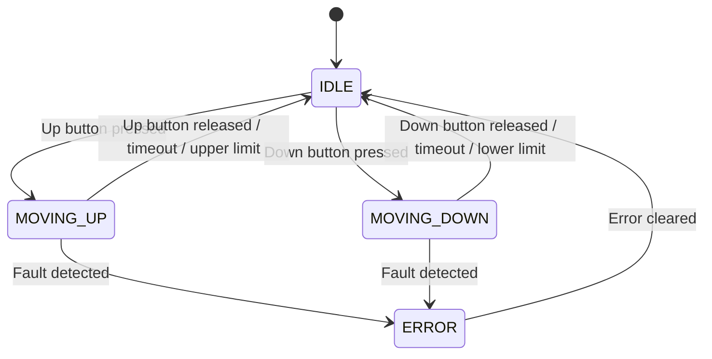

# Automated Mechanical Desk Lift  
**Arduino-Based Control System**

---

## Overview

This project implements a **motorized height adjustment system** for a mechanical desk using an **Arduino-based controller**.  
The system replaces manual adjustment with an electric drive, emphasizing **safety**, **modularity**, and **incremental development**.

The architecture is designed for:
- Temporary hardware during early development (JGY370 + L298N)
- Future extensibility (limit switches, current sensing, height presets)

**Software is structured to allow hardware replacement without rewriting control logic.**

---

## Project Goals

- Electrically raise and lower a mechanical desk
- Enable safe prototyping without limit switches
- Abstract hardware dependencies via a HAL (Hardware Abstraction Layer)
- Allow host-based unit testing using `g++`

---

## Out of Scope (Initial Phase)

- Automatic height presets
- User profiles
- Wireless or network connectivity
- Closed-loop position control

---

## Components
- Arduino UNO
- L298N motor driver
- JGY370 DC motor (12V)
- 9V–12V battery
- Elitek ON/OFF switch
---

## System Actors

| Actor              | Description                    |
|--------------------|-------------------------------|
| User               | Operates the desk              |
| Arduino Controller | Executes control logic         |
| DC Motor           | Provides mechanical movement   |
| Motor Driver       | Controls motor direction/power |
| Power Source       | Battery or external supply     |

---

## Use Cases (User Perspective)

---

[See System Use Cases](SystemUseCases.md)

## Key Design Constraints

- Initial operation without limit switches
- Motor must stop on reset or fault
- Direction changes require a stop before reversal
- Motor must never start automatically on power-up

---

## Planned Enhancements

- Upper and lower limit switches
- Current sensing for stall detection
- Height presets
- EEPROM-based calibration
- Soft-start and soft-stop PWM control

---

## Hardware Connections

| Function                | Arduino Pin |
|-------------------------|-------------|
| Error Indicator LED     | 13          |
| Left Position LED       | 5           |
| Right Position LED      | 4           |
| Button Up               | 3           |
| Button Down             | 2           |
| Motor IN1               | 8           |
| Motor IN2               | 9           |
| Motor ENA (PWM)         | 10          |

*Edit `PinConfig.h` to change hardware pin mappings.*

---

## Architecture

- **PinConfig.h**  
  Centralizes all Arduino pin assignments for LEDs, buttons, and the motor driver.

- **HAL.h / HAL.cpp**  
  Hardware Abstraction Layer. Provides functions to initialize and control hardware components (LEDs, buttons, motor driver) without exposing low-level details to the main application logic.

- **DeskController.h / DeskController.cpp**  
  Contains the main application logic and state machine for desk movement. Processes user inputs and determines outputs for hardware control.

- **arduino.ino**  
  Entry point for the application. Handles setup, main loop, and high-level control flow. Reads inputs, runs application logic, and updates outputs.

---

## Code Structure

- **Modular Design:**  
  Hardware, logic, and configuration are separated for clarity and maintainability.

- **State Management:**  
  Uses input/output structs to pass data between layers.

- **Non-blocking Loop:**  
  The main loop is designed to be responsive and non-blocking.

---

## Operation

- Use the UP and DOWN buttons to control desk movement.
- LEDs indicate desk position and errors.

---

## Application States and State Transitions

The application uses a simple state machine to manage desk movement and safety.  
Below are the main states and their transitions:

### **States**
- **IDLE**: Desk is stationary, waiting for user input.
- **MOVING_UP**: Desk is moving upward.
- **MOVING_DOWN**: Desk is moving downward.
- **ERROR**: A fault or unsafe condition has occurred; movement is disabled.

### **State Transitions**

- **IDLE → MOVING_UP**:  
  User presses the Up button (and not at upper limit).

- **IDLE → MOVING_DOWN**:  
  User presses the Down button (and not at lower limit).

- **MOVING_UP → IDLE**:  
  Up button released, timeout occurs, or upper limit reached.

- **MOVING_DOWN → IDLE**:  
  Down button released, timeout occurs, or lower limit reached.

- **MOVING_UP or MOVING_DOWN → ERROR**:  
  Fault detected (e.g., overcurrent, both limits active).

- **ERROR → IDLE**:  
  Error condition cleared (e.g., reset or safe state detected).

---

### **State Diagram**

---

## Wiring Diagrams

### Safety Notes

- Always disconnect power before wiring.
- Motor power must **never** pass through the Arduino.
- The ON/OFF switch must be placed **between the battery and the motor driver**.
- Arduino GND and motor driver GND **must be common**.

---

## Pin Assignments (Current Code)

| Signal             | Arduino Pin | Notes                |
|--------------------|-------------|----------------------|
| ERROR_LED          | 13          | On-board LED         |
| LED_LEFT_PIN       | 5           | Left position LED    |
| LED_RIGHT_PIN      | 4           | Right position LED   |
| BUTTON_UP_PIN      | 3           | Up button            |
| BUTTON_DOWN_PIN    | 2           | Down button          |
| IN1                | 8           | Motor direction 1    |
| IN2                | 9           | Motor direction 2    |
| ENA                | 10 (PWM)    | Motor speed (PWM)    |

---

## Use Case ↔ Unit Test Traceability

| Use Case | Test(s) |
|---|---|
| UC-01: Power the Desk Control System | DeskAppTest.UC01_Power_IdleStop_NoError; DeskAppTest.UC01_NoButtonsPressed_IdleNoMovement |
| UC-02: Raise Desk | DeskAppTest.UC02_UpPressed_MovesUp_WhenNotAtUpperLimit; DeskAppTest.UC02_UpPressed_DoesNotMoveUp_WhenAtUpperLimit |
| UC-03: Lower Desk | DeskAppTest.UC03_DownPressed_MovesDown_WhenNotAtLowerLimit; DeskAppTest.UC03_DownPressed_DoesNotMoveDown_WhenAtLowerLimit |
| UC-04: Emergency Stop (Software-Based or Manual) | DeskAppTest.UC04_EmergencyStop_FromUp_WhenLowerLimitActive; DeskAppTest.UC04_EmergencyStop_FromDown_WhenUpperLimitActive |
| UC-05: Visual Feedback | Covered by output assertions in all movement and error tests (e.g., outputs.moveUp, outputs.moveDown, outputs.error, outputs.stop) |
| UC-06: Power-Off During Movement | Not directly unit-testable; implied by stop behavior in DeskAppTest.UC01_NoButtonsPressed_IdleNoMovement |
| UC-07: Simultaneous Button Presses | DeskAppTest.UC07_BothButtonsPressed_UpHasPriority_WhenNotAtUpperLimit; DeskAppTest.UC08_BothButtonsPressed_NoMovement_WhenAtBothLimits |
| UC-08: Error Indication and Recovery | DeskAppTest.UC04_EmergencyStop_FromUp_WhenLowerLimitActive; DeskAppTest.UC04_EmergencyStop_FromDown_WhenUpperLimitActive; DeskAppTest.UC09_ErrorRecovery_ToIdle_WhenSafe |
| UC-10: Dwell before reversal (Up ↔ Down) | DeskAppTest.UC10_DwellBeforeReversal_UpToDown |
| Smoke/Basic Logic | SmokeTest.BasicTruth |

- **Note:** Some user experience aspects (like actual LED feedback and power cycling) are validated indirectly through output flags in the tests.

---

## Contributing

- Document any new hardware or features.
- Follow the existing modular structure for new code.

---

## License

MIT License (add your license text here if needed)