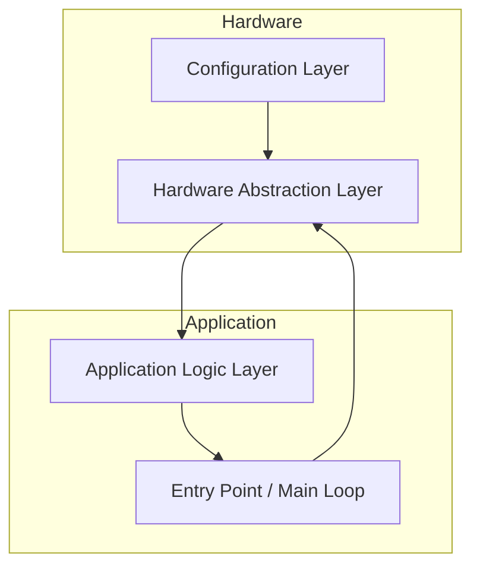

# Software Architecture

## Overview
This document describes the software architecture for the Automated Mechanical Desk Lift system. The architecture is designed to ensure safety, modularity, testability, and maintainability, and is traceable to the Software Requirements and System Use Cases.

---

## Architectural Principles
- **Modularity:** Separation of hardware abstraction, control logic, and configuration.
- **Safety:** Fault detection, error handling, and safe state transitions.
- **Testability:** Host-based unit testing and clear interfaces.
- **Extensibility:** Support for future hardware and feature enhancements.

---

## Layered Architecture

### 1. Hardware Abstraction Layer (HAL)
- **Files:** HAL.h, HAL.cpp
- **Responsibilities:**
	- Abstracts direct hardware access (LEDs, buttons, motor driver).
	- Provides initialization and control functions for hardware components.
	- Enables hardware replacement without changes to control logic.

### 2. Configuration Layer
- **Files:** PinConfig.h
- **Responsibilities:**
	- Centralizes all pin assignments and hardware configuration.
	- Allows easy adaptation to different hardware setups.

### 3. Application Logic Layer
- **Files:** DeskController.h, DeskController.cpp
- **Responsibilities:**
	- Implements the main state machine and control logic.
	- Processes user inputs and system states.
	- Determines outputs for hardware control.
	- Handles error detection, emergency stop, and safe transitions.

### 4. Entry Point / Main Loop
- **Files:** arduino.ino
- **Responsibilities:**
	- Initializes system and hardware.
	- Executes main loop: reads inputs, runs application logic, updates outputs.
	- Ensures non-blocking, responsive operation.

---

## Key Architectural Patterns
- **State Machine:** Manages desk movement, error states, and transitions.
- **Input/Output Structs:** Encapsulate data passed between layers for clarity and testability.
- **Non-blocking Loop:** Ensures responsiveness and safety.

---

## Safety and Fault Handling
- Emergency stop logic and error states are implemented in the Application Logic Layer.
- All movement is disabled on fault or error.
- System only resumes from error when safe conditions are detected.

---

## Testability
- Host-based unit tests (g++) validate all control logic and state transitions.
- Tests are mapped to requirements and use cases for full traceability.

---

## Extensibility
- Architecture supports future enhancements (limit switches, current sensing, presets, calibration).
- Hardware abstraction allows for easy integration of new components.

---

## Traceability
- All architectural decisions and components are traceable to Software Requirements and System Use Cases.
- See [SoftwareRequirements.md](SoftwareRequirements.md) and [TraceabilityMatrix.md](TraceabilityMatrix.md).

---

## Diagram

---

---

## Inputs and Outputs Table

| Name                | Direction | Data Type | Acceptable Range / Values         | Description                       |
|---------------------|-----------|-----------|-----------------------------------|-----------------------------------|
| btUPPressed         | Input     | Boolean   | TRUE (1), FALSE (0)               | Up button pressed state           |
| btDOWNPressed       | Input     | Boolean   | TRUE (1), FALSE (0)               | Down button pressed state         |
| upperLimitActive    | Input     | Boolean   | TRUE (1), FALSE (0)               | Upper limit switch active         |
| lowerLimitActive    | Input     | Boolean   | TRUE (1), FALSE (0)               | Lower limit switch active         |
| moveUp              | Output    | Boolean   | TRUE (1), FALSE (0)               | Command to move desk up           |
| moveDown            | Output    | Boolean   | TRUE (1), FALSE (0)               | Command to move desk down         |
| stop                | Output    | Boolean   | TRUE (1), FALSE (0)               | Command to stop motor             |
| error               | Output    | Boolean   | TRUE (1), FALSE (0)               | Error state indicator             |
| ERROR_LED           | Output    | Digital   | HIGH (1), LOW (0)                 | Error indicator LED               |
| LED_LEFT_PIN        | Output    | Digital   | HIGH (1), LOW (0)                 | Left position LED                 |
| LED_RIGHT_PIN       | Output    | Digital   | HIGH (1), LOW (0)                 | Right position LED                |
| BUTTON_UP_PIN       | Input     | Digital   | HIGH (1), LOW (0)                 | Up button hardware pin            |
| BUTTON_DOWN_PIN     | Input     | Digital   | HIGH (1), LOW (0)                 | Down button hardware pin          |
| IN1                 | Output    | Digital   | HIGH (1), LOW (0)                 | Motor direction 1                 |
| IN2                 | Output    | Digital   | HIGH (1), LOW (0)                 | Motor direction 2                 |
| ENA                 | Output    | PWM       | 0–255 (Arduino PWM range)         | Motor speed (PWM)                 |

---

## Notes
- Architecture is subject to change based on future requirements or hardware updates.
- All design decisions follow industry standards for embedded and safety-critical systems.
