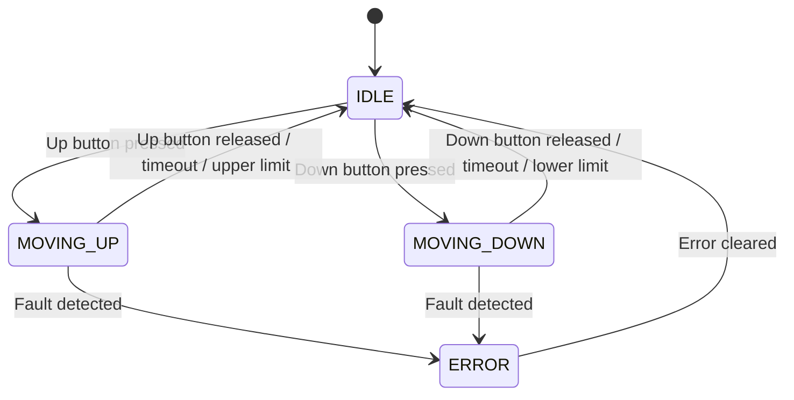
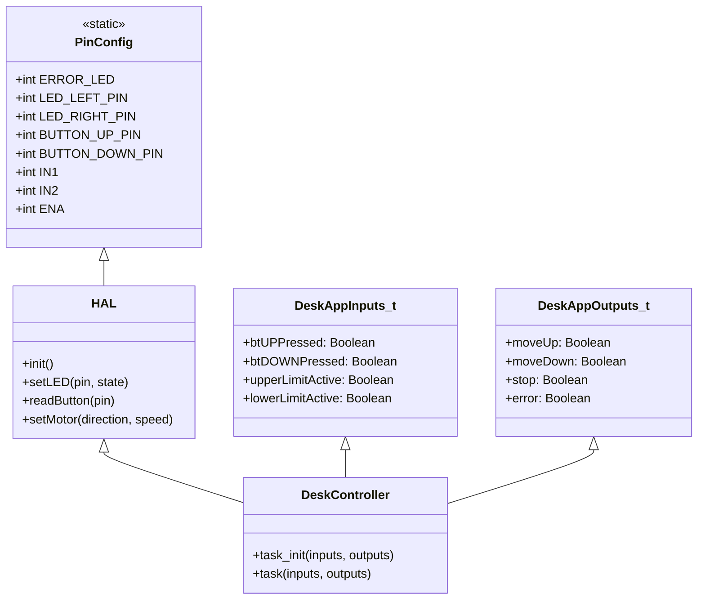

# Safety Analysis and Rationale

This section provides explicit safety analysis and rationale for each safety-related requirement, supporting ASPICE CL2+ compliance.

| Safety Requirement | Rationale | Safety Mechanism / Design Feature |
|-------------------|-----------|-----------------------------------|
| SR-04: Emergency Stop | Prevents unsafe movement in case of simultaneous button press or fault. | Immediate deactivation of all movement outputs; system enters ERROR state; error LED activated; recovery only via power cycle. |
| SR-05: Visual Feedback | Ensures user is always aware of system state, including errors. | LEDs indicate IDLE, MOVING_UP, MOVING_DOWN, ERROR; error LED is prominent during faults. |
| SR-08: Error Detection and Recovery | Detects hazardous conditions (e.g., both limits active, overcurrent) and prevents further movement. | System enters ERROR state; movement disabled; error LED activated; recovery via power cycle. |

All safety mechanisms are implemented in DeskController and HAL modules, with test cases verifying correct behavior under fault and error conditions. Safety features are designed to meet regulatory and industry standards for motorized furniture.
# Assumptions

The following assumptions, derived from SoftwareRequirements.md, are reflected in the design and test cases:

- System hardware (ECU, motor driver, indicator LEDs, limit switches, buttons) is available and functions as specified.
- The user is trained to operate the desk safely.
- The system operates in a typical office environment with standard power supply.
- Regulatory and safety standards for motorized furniture are met.
- Up/Down buttons and limit switches are functional and reliably detected.
- Fault detection and error logic are implemented and reliable.
- Power supply is stable and system can detect power loss.

These assumptions are considered in module decomposition, control flow, error handling, and test case design. Any change in assumptions may require design or test updates.
# Traceability to Software Requirements

This section maps each design module, feature, and behavioral logic to the corresponding requirements in SoftwareRequirements.md. This ensures every design element is justified and traceable.

| Design Element / Module                | Requirement ID(s) | Description / Rationale |
|----------------------------------------|-------------------|------------------------|
| PinConfig.h (hardware mapping)         | SR-01, SR-02      | Hardware abstraction, pin assignments for safety and flexibility |
| HAL (hardware abstraction)             | SR-01, SR-03      | Safe hardware control, error handling, modularity |
| DeskController (state machine logic)   | SR-04, SR-05, SR-06| Implements state transitions, error handling, and control logic |
| DeskAppInputs_t / DeskAppOutputs_t     | SR-02, SR-04      | Structured data for inputs/outputs, supports testability |
| Main Loop (arduino.ino integration)    | SR-01, SR-07      | Non-blocking, event-driven control, integrates all modules |
| Error Handling (emergency stop, faults)| SR-03, SR-06      | Ensures safety, disables movement on fault |
| Dwell Timing / Non-blocking Design     | SR-07             | Responsive, safe reversal, prevents unsafe direction changes |
| Testability (unit tests, coverage)     | SR-08             | All logic is unit tested and mapped to requirements |

Refer to SoftwareRequirements.md for full requirement text and rationale. All design elements are reviewed for compliance and traceability.
# Software Detailed Design
...existing code...

## State Machine Diagram



---

# Software Detailed Design

## Overview
This document provides a detailed design for the Automated Mechanical Desk Lift software, aligned with the Software Requirements and Architecture. It describes modules, interfaces, data structures, control flow, and error handling according to industry standards.

---

## Module Decomposition

### 1. PinConfig
- **File:** PinConfig.h
- **Purpose:** Defines all hardware pin assignments for LEDs, buttons, and motor driver.
- **Key Data:**
	- Pin numbers for each hardware function.
- **Usage:** Included by HAL and application logic for hardware abstraction.

### 2. Hardware Abstraction Layer (HAL)
- **Files:** HAL.h, HAL.cpp
- **Purpose:** Abstracts direct hardware access and provides initialization and control functions for LEDs, buttons, and motor driver.
- **Key Functions:**
	- `HAL_init()`: Initializes hardware components.
	- `HAL_setLED(pin, state)`: Controls LED state.
	- `HAL_readButton(pin)`: Reads button state.
	- `HAL_setMotor(direction, speed)`: Controls motor driver.
- **Interfaces:**
	- Exposes functions to application logic.
	- Uses pin assignments from PinConfig.h.

### 3. Application Logic (DeskController)
- **Files:** DeskController.h, DeskController.cpp
- **Purpose:** Implements the main state machine, control logic, and error handling.
- **Key Data Structures:**
	- `DeskAppInputs_t`: Struct for all input signals (button states, limit switches).
	- `DeskAppOutputs_t`: Struct for all output signals (motor commands, LED states, error flags).
- **Key Functions:**
	- `DeskApp_task_init(inputs, outputs)`: Initializes input/output structs and sets system to IDLE.
	- `DeskApp_task(inputs, outputs)`: Main control function; processes inputs, updates outputs, manages state transitions.
- **State Machine:**
	- States: IDLE, MOVING_UP, MOVING_DOWN, DWELL, ERROR
	- Transitions: Based on button presses, limit switches, faults, and timeouts.
- **Error Handling:**
	- Emergency stop on faults or both buttons pressed.
	- Error state latched until safe conditions detected.

### 4. Main Entry Point
- **File:** arduino.ino
- **Purpose:** Initializes system, runs main loop, integrates HAL and application logic.
- **Control Flow:**
	- Setup: Initializes hardware and application logic.
	- Loop: Reads inputs, calls DeskApp_task, updates outputs via HAL.

---

## Data Structures

### DeskAppInputs_t
- `btUPPressed`: Boolean, Up button state
- `btDOWNPressed`: Boolean, Down button state
- `upperLimitActive`: Boolean, upper limit switch state
- `lowerLimitActive`: Boolean, lower limit switch state

### DeskAppOutputs_t
- `moveUp`: Boolean, command to move up
- `moveDown`: Boolean, command to move down
- `stop`: Boolean, command to stop motor
- `error`: Boolean, error state flag

---

## Control Flow

1. **Initialization:**
	 - PinConfig.h sets hardware mapping.
	 - HAL_init() initializes hardware.
	 - DeskApp_task_init() sets system to IDLE.

2. **Main Loop:**
	 - Read button and limit switch states via HAL.
	 - Populate DeskAppInputs_t.
	 - Call DeskApp_task(inputs, outputs).
	 - Update hardware outputs via HAL based on DeskAppOutputs_t.

3. **State Machine Logic:**
	 - IDLE: Waits for user input.
	 - MOVING_UP: Moves desk up if allowed.
	 - MOVING_DOWN: Moves desk down if allowed.
	 - DWELL: Waits before allowing reversal.
	 - ERROR: Disables movement, indicates fault.

4. **Error Handling:**
	 - Emergency stop on faults or both buttons pressed.
	 - Error state latched until all inputs and limits are safe.

---

## Interfaces


### HAL <-> Application Logic

Application logic interacts with the HAL using the following interface functions:

```cpp
// PinConfig.h
// Pin assignments (int)
extern const int ERROR_LED;
extern const int LED_LEFT_PIN;
extern const int LED_RIGHT_PIN;
extern const int BUTTON_UP_PIN;
extern const int BUTTON_DOWN_PIN;
extern const int IN1;
extern const int IN2;
extern const int ENA;

// HAL.h
void HAL_init();
void HAL_setLED(int pin, bool state);
bool HAL_readButton(int pin);
void HAL_setMotor(int direction, int speed);
```

### Application Logic <-> Main Loop

The main loop passes input and output structs to the application logic:

```cpp
// DeskController.h
typedef struct {
	bool btUPPressed;
	bool btDOWNPressed;
	bool upperLimitActive;
	bool lowerLimitActive;
} DeskAppInputs_t;

typedef struct {
	bool moveUp;
	bool moveDown;
	bool stop;
	bool error;
} DeskAppOutputs_t;

void DeskApp_task_init(DeskAppInputs_t* inputs, DeskAppOutputs_t* outputs);
void DeskApp_task(const DeskAppInputs_t* inputs, DeskAppOutputs_t* outputs);
```

### Data Types

- All pin assignments: `int`
- Button/limit states: `bool`
- Motor direction: `int` (e.g., 0 = stop, 1 = up, -1 = down)
- Motor speed: `int` (0–255 for PWM)

These interface details ensure clear separation of concerns and support modularity, testability, and maintainability.

---

## Timing and Non-blocking Design
- Main loop is non-blocking; all logic is event-driven and responsive.
- Dwell timing managed via timestamp comparison in DeskController.cpp.

---

## Safety Features
- Motor stops on reset, fault, or both buttons pressed.
- Direction changes require a stop and dwell before reversal.
- Motor never starts automatically on power-up.
- Error state disables all movement until cleared.

---

## Extensibility
- PinConfig.h and HAL support easy hardware changes.
- Application logic is modular for future enhancements (limit switches, current sensing, presets).

---

## Testability
- All logic is unit tested using host-based tests (g++), mapped to requirements and use cases.

---

## Diagrams



---

## Notes
- Detailed design is subject to change with future requirements or hardware updates.
- All design elements follow industry standards for embedded and safety-critical systems.
