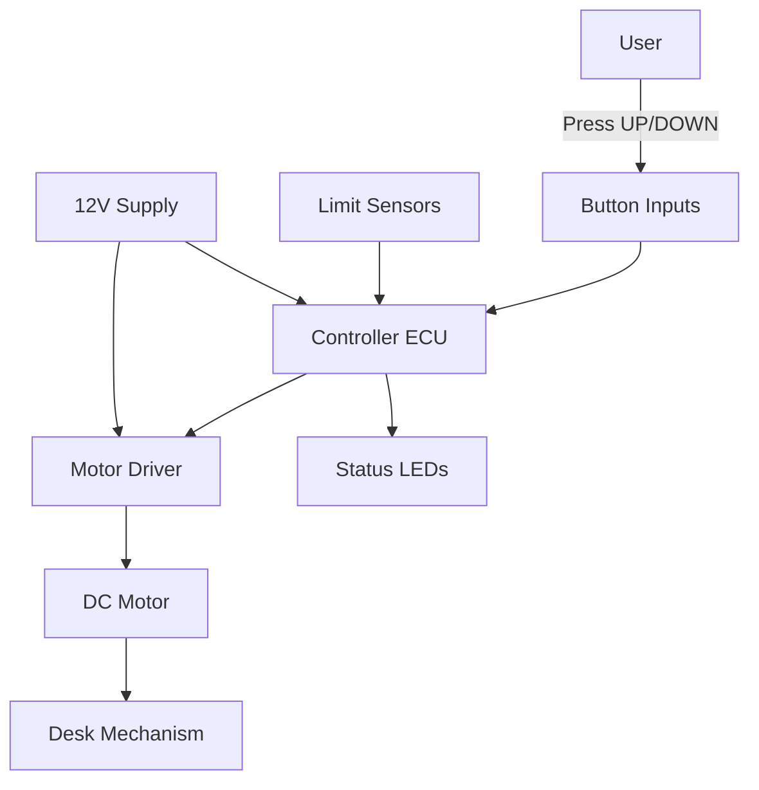

# System Architecture Document (SysAD)

**Document ID:** SysAD-Desk-001  
**System Name:** Automated Mechanical Desk Lift System  
**Date:** February 21, 2026  
**Version:** 1.0  
**Status:** Draft  
**Compliance:** ISO/IEC/IEEE 42010, IEEE 29148

## 1. Purpose and Scope

This document defines the system-level architecture, subsystem decomposition, and interfaces for the Automated Mechanical Desk Lift System. It bridges system requirements to hardware and software implementation boundaries.

**In Scope:** subsystem roles, hardware/electronic interfaces, control and safety flows, timing constraints.  
**Out of Scope:** software code design (see Software Architecture and Detailed Design).

**Document Purpose and Detail Level**
- **Purpose:** Provide a system-level view that enables requirement allocation to hardware and software and defines the system interfaces and constraints.
- **Detail Level:** System/subsystem decomposition and interactions; no software module or code-level design.
- **Use:** Baseline for safety concept and downstream software architecture.

---

## 2. Architecture Overview

### 2.1 Architecture Vision

The system uses a centralized embedded controller (Arduino UNO) that reads user inputs and limit sensors, executes safety logic, and commands a motor driver to move the desk. The architecture emphasizes deterministic response to user inputs and safe stopping behavior at limits or on command release.

### 2.2 Architecture Principles

| Principle | Description | Benefit |
|-----------|-------------|---------|
| Simplicity | Single ECU with direct I/O | Low cost, easy validation |
| Determinism | Periodic control loop | Predictable response times |
| Safety Override | Limits and conflicting inputs stop motion | Prevents unsafe motion |
| Testability | Clear HW/SW boundaries via HAL | Enables unit and integration tests |

---

## 3. System Context

---

## 4. System Decomposition

### 4.1 Subsystem Overview

| Subsystem | Primary Function | Interfaces |
|-----------|------------------|------------|
| User Controls | Capture UP/DOWN commands | Buttons -> ECU GPIO |
| Sensing | Detect travel limits | Limit switches -> ECU GPIO |
| Control ECU | Execute logic and safety rules | GPIO, PWM, status LEDs |
| Actuation | Convert commands into motion | Motor driver, DC motor |
| Power | Provide regulated power | 12V supply, regulators |
| Indicators | Show state and faults | LEDs, optional serial log |

### 4.2 Subsystem Details

#### User Controls
- **Purpose:** Capture user intent for motion.
- **Inputs:** UP/DOWN button states.
- **Outputs:** Discrete signals to ECU.

#### Sensing
- **Purpose:** Enforce travel limits.
- **Inputs:** Upper and lower limit switches.
- **Outputs:** Discrete signals to ECU.

#### Control ECU
- **Purpose:** Central control and safety logic.
- **Processing Model:** Periodic control loop; non-blocking scheduling.
- **Key Responsibilities:**
  - Execute control and safety logic for motion commands
  - Interface with sensing and actuation subsystems
  - Enforce system-level timing and safety constraints

#### Actuation
- **Purpose:** Execute desk motion.
- **Components:** L298N motor driver, DC motor, mechanical linkage.
- **Interfaces:** PWM and direction signals from ECU.

#### Indicators
- **Purpose:** Provide user feedback for state and faults.
- **Components:** LEDs (up, down, error).

---

## 5. Interfaces and Data Flow

### 5.1 Interface Summary

| Interface | Signal Type | Direction | Description |
|-----------|-------------|-----------|-------------|
| Buttons -> ECU | Digital input | In | User UP/DOWN commands |
| Limits -> ECU | Digital input | In | Upper/lower travel limits |
| ECU -> Driver | PWM + digital | Out | Motor direction and speed |
| Driver Sense -> ECU | Analog input | In | Motor current sense for fault detection |
| ECU -> LEDs | Digital output | Out | Status and fault indicators |

### 5.2 Control Flow (Normal Operation)

1. User presses UP or DOWN button.
2. ECU debounces and validates input.
3. ECU checks limits and conflict conditions.
4. ECU commands motor driver (direction + PWM).
5. Desk moves until button release or limit reached.

---

## 6. Timing and Performance

- **Command response:** Motion starts within 1.0 second of button press.
- **Stop response:** Motion halts within 500 ms of button release.
- **Scheduler cadence:** Application control logic at 4 Hz (250 ms).

---

## 7. Safety Architecture

- **Primary safety mechanisms:**
  - Button-release stop
  - Conflicting input rejection
  - Limit sensor enforcement
- **Functional Safety Status:** HARA completed; AgPLr confirmed (see [02_02_HARA-complete.md](02_02_HARA-complete.md)).

Safety-related architecture and mechanisms are defined in the Technical Safety Concept: [03_01_01_TechnicalSafetyConcept.md](03_01_01_TechnicalSafetyConcept.md).

---

## 8. Traceability

**Derived from:**
- [03_00_SystemRequirements.md](03_00_SystemRequirements.md)
- [02_ConceptOfOperations.md](02_ConceptOfOperations.md)
- [11_HardwareDocumentation.md](11_HardwareDocumentation.md)

**Downstream:**
- [05_SoftwareArchitecture.md](05_SoftwareArchitecture.md)
- [06_DetailedDesign.md](06_DetailedDesign.md)
