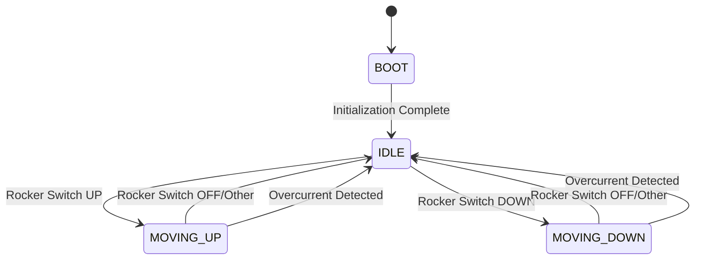

# Concept of Operations (ConOps)

**Document ID:** 03_ConOps  
**Version:** 1.0  
**Date:** January 19, 2026  
**Status:** Draft  
**Author:** System Engineering Team  
**Compliance:** IEEE 1362-1998 (ConOps Guide), ISO 25119, ASPICE SYS.2

---

## Purpose

This Concept of Operations (ConOps) document describes how the Automated Mechanical Desk Lift System will be employed by users in their operational environment. It establishes the operational context for requirements derivation and system design.

---

## Document Scope

This ConOps covers:
- User characteristics and operational scenarios
- System operational environment
- Operational modes and workflows
- User interaction patterns
- System lifecycle phases

---

## Table of Contents

1. [Current System (As-Is)](#1-current-system-as-is)
2. [Justification for Change](#2-justification-for-change)
3. [Proposed System (To-Be)](#3-proposed-system-to-be)
4. [Operational Environment](#4-operational-environment)
5. [User Classes and Characteristics](#5-user-classes-and-characteristics)
6. [Operational Scenarios](#6-operational-scenarios)
7. [Operational Modes](#7-operational-modes)
8. [System Lifecycle Phases](#8-system-lifecycle-phases)
9. [Support Concept](#9-support-concept)

---

## 1. Current System (As-Is)

### 1.1 Existing Desk Configuration

**Description:** IKEA mechanical height-adjustable desk with manual crank mechanism.

**Components:**
- Desktop work surface
- Frame with telescoping legs
- Manual crank handle (removable)
- Cranking shaft interface (hexagonal or spline)
- Mechanical linkage (gears, chains, or screws) for height adjustment
- Manual locking mechanism (some models)

### 1.2 Current Operation

**Height Adjustment Process:**
1. User removes crank handle from storage position
2. User inserts crank into shaft interface on desk frame
3. User manually turns crank clockwise (raise) or counterclockwise (lower)
4. User cranks until desired height reached (requires physical effort)
5. User removes crank and stores it
6. Desk remains at set height until next adjustment

**User Pain Points:**
- Physical effort required (especially for heavy desktop loads)
- Time-consuming (30-60 seconds per adjustment)
- Crank handle must be stored/retrieved
- Difficult for users with limited strength or mobility
- Discourages frequent position changes (recommended every 30-60 minutes)
- Two-handed operation required

---

## 2. Justification for Change

### 2.1 Operational Limitations

| Limitation | Impact | Severity |
|------------|--------|----------|
| Physical effort | Limits accessibility, discourages use | High |
| Time required | Interrupts workflow | Medium |
| Two-handed operation | Cannot adjust while holding items | Medium |
| Storage overhead | Crank handle management | Low |

### 2.2 User Needs

- **Primary Need:** Effortless, push-button height adjustment
- **Health Benefit:** Encourage sit-stand transitions per ergonomic guidelines (every 30-60 min)
- **Accessibility:** Enable use by individuals with limited strength/mobility
- **Productivity:** Minimize interruption to workflow

### 2.3 Solution Approach

Retrofit existing desk with motorized control system:
- Preserves desk mechanical structure (sunk cost)
- Adds motor-driven actuation
- Replaces manual crank with button control
- Maintains desk safety and stability

---

## 3. Proposed System (To-Be)

### 3.1 System Overview

**High-Level Description:**  
Arduino-based embedded control system driving a DC worm gear motor connected to the desk's existing cranking shaft. User initiates movement via Up/Down push buttons. System includes safety features (emergency stop, current monitoring) and visual feedback (LED indicators).

### 3.2 Key Characteristics

| Characteristic | Description |
|----------------|-------------|
| **Control Method** | Rocker switch (3-position: UP/OFF/DOWN) |
| **Motor Type** | 31ZY-5840 DC Worm Gear Motor (12/24V, 10 RPM) |
| **Motor Driver** | BTS7960 (IBT-2) H-bridge module with current sensing |
| **Controller** | Arduino UNO (ATmega328P) |
| **User Interface** | Single rocker switch with 3 positions |
| **Safety Features** | Rocker switch mechanical lock, overcurrent detection, soft-start |
| **Power Supply** | External 12V or 24V DC adapter (5A+) |
| **Installation** | Non-destructive retrofit (motor couples to crank shaft) |

### 3.3 Operational Improvements

| Metric | Manual (As-Is) | Automated (To-Be) | Improvement |
|--------|---------------|-------------------|-------------|
| Adjustment time | 30-60 sec | 10-20 sec | 50-67% faster |
| Physical effort | High (manual cranking) | Minimal (switch position change) | 95% reduction |
| User accessibility | Limited (strength required) | High (any user) | Universal access |
| Hands required | 2 (crank + stabilize) | 1 (switch operation) | 50% reduction |
| Encouragement to adjust | Low (effort barrier) | High (effortless) | Increased frequency |

---

## 4. Operational Environment

### 4.1 Physical Environment

**Typical Deployment:**
- Home office or corporate workspace
- Indoor, climate-controlled environment
- Temperature: 15°C to 30°C
- Humidity: 20% to 80% RH (non-condensing)
- Desk load: 5-50 kg (monitor, laptop, peripherals)

**Power:**
- AC mains outlet (110-240V) with DC adapter
- DC supply: 12V or 24V, 5A minimum

**Mounting:**
- Control box mounted to desk underside or frame
- Motor mechanically coupled to crank shaft
- Button panel accessible on desktop or desk edge
- Cable management to avoid interference with leg room

### 4.2 Operational Context

**Usage Pattern:**
- Typical use: 2-10 height adjustments per day
- Movement duration: 5-15 seconds per adjustment
- Desk remains stationary 99%+ of time
- Unattended periods: nights, weekends (powered off or idle)

**User Proximity:**
- User at desk or within arm's reach during operation
- Visual line-of-sight to desk during movement
- Emergency stop accessible within 1 second

---

## 5. User Classes and Characteristics

### 5.1 Primary User - Office Worker

**Profile:**
- Knowledge: Basic computer skills, no technical training required
- Age range: 18-70 years
- Physical ability: Variable (system must accommodate limited mobility)
- Frequency: Daily use

**Needs:**
- Simple, intuitive operation
- Reliable, consistent behavior
- Quick response to button press
- Clear visual feedback

**Interaction Pattern:**
- Move rocker switch UP → desk rises
- Move rocker switch DOWN → desk lowers
- Keep rocker switch OFF (center) → desk stops
- Monitor desk height visually during movement

---

### 5.2 Secondary User - Installer/Technician

**Profile:**
- Knowledge: Basic electrical/mechanical skills
- Age range: 18-65 years
- Role: One-time installation, occasional troubleshooting
- Frequency: Installation + rare maintenance

**Needs:**
- Clear installation instructions
- Safe installation procedure
- Diagnostic capability (LED codes)
- Access to support documentation

**Interaction Pattern:**
- Mount hardware to desk
- Connect wiring per schematic
- Verify operation (test movements)
- Troubleshoot if needed (LED indicators)

---

## 6. Operational Scenarios

### 6.1 Normal Operations

#### Scenario 1: Morning Setup (Sit → Stand Transition)

**Context:** User arrives at desk, wants to start workday standing.

**Pre-conditions:**
- System powered on (idle)
- Desk at sitting height (~75 cm)
- No faults present

**Operational Flow:**
1. User moves rocker switch to UP position
2. Motor starts (soft-start ramp), desk rises
3. User observes desk height visually
4. User moves rocker switch to OFF (center) position when standing height reached (~110 cm)
5. Motor stops immediately
6. Desk remains at standing height

**Post-conditions:**
- Desk at standing height
- System ready for next command
- Successful operation logged (if logging implemented)

**Duration:** 10-15 seconds

---

#### Scenario 2: Mid-Day Adjustment (Stand → Sit Transition)

**Context:** User wants to sit for focused work after standing session.

**Pre-conditions:**
- System powered on (idle)
- Desk at standing height (~110 cm)
- No faults present

**Operational Flow:**
1. User moves rocker switch to DOWN position
2. Motor starts (soft-start ramp), desk lowers
3. User observes desk height visually
4. User moves rocker switch to OFF (center) position when sitting height reached (~75 cm)
5. Motor stops immediately
6. Desk remains at sitting height

**Post-conditions:**
- Desk at sitting height
- System ready for next command

**Duration:** 10-15 seconds

---

#### Scenario 3: Fine Adjustment

**Context:** User wants to adjust height by small amount for ergonomic comfort.

**Pre-conditions:**
- System ready
- Desk at any height

**Operational Flow:**
1. User briefly moves rocker switch to UP or DOWN position (short pulse, 1-2 seconds)
2. Motor starts, desk moves slightly
3. User returns rocker switch to OFF (center) position
4. Motor stops, desk position adjusted incrementally

**Post-conditions:**
- Desk height fine-tuned
- System ready

**Duration:** 1-3 seconds

---

### 6.2 Safety Scenarios

#### Scenario 4: Emergency Stop Activation

**Context:** User detects hazard (e.g., cable caught, unexpected obstacle, child nearby) and needs to stop immediately.

**Pre-conditions:**
- Desk moving (UP or DOWN)
- Hazard observed

**Operational Flow:**
1. User moves rocker switch to OFF (center) position immediately
2. Motor stops (within 100 ms)
3. Desk remains at current position

**Post-conditions:**
- Motor stopped
- System ready for next command
- Desk position preserved

**Duration:** <100 ms (switch move to stop)

**Note:** Rocker switch spring-returns to center (OFF) position for inherent safety.

---

#### Scenario 5: Overcurrent Fault (Mechanical Binding)

**Context:** Desk movement encounters mechanical resistance (e.g., jammed mechanism, foreign object).

**Pre-conditions:**
- Desk moving
- Motor current exceeds threshold (>5A)

**Operational Flow:**
1. Motor current spikes due to mechanical load
2. Current sense circuit (R_IS/L_IS) detects overcurrent
3. System detects fault condition within 100 ms
4. Motor shuts down immediately
5. System enters FAULT state
6. User must move rocker switch to OFF and retry; if fault persists, power cycle required

**Post-conditions:**
- Motor stopped
- Fault condition logged
- Requires power cycle or mechanical issue resolution

**Duration:** <200 ms (fault to stop)

---

### 6.3 Exceptional Scenarios

#### Scenario 6: Power Loss During Movement

**Context:** Power supply interrupted while desk moving.

**Pre-conditions:**
- Desk moving UP or DOWN
- Power loss event (unplugged, outage)

**Operational Flow:**
1. Power supply disconnected
2. Arduino loses power
3. Motor driver loses enable signal → motor stops
4. Desk remains at current position (worm gear self-locking)
5. Power restored
6. System boots to IDLE state
7. User resumes normal operation

**Post-conditions:**
- Desk position preserved (no drift)
- System ready after boot
- No damage to system or desk

**Duration:** N/A (instant)

**Safety Note:** Worm gear motor is self-locking; desk will not drift on power loss.

---

#### Scenario 7: First Power-On (Installation)

**Context:** System powered on for first time after installation.

**Pre-conditions:**
- Hardware installed per instructions
- Wiring verified
- Power connected

**Operational Flow:**
1. Installer applies power
2. System initializes (BOOT state, ~2 seconds)
3. System runs self-test (GPIO, ADC, PWM)
4. System ready state indicator (if logging enabled)
5. Installer performs test movements (UP, then DOWN)
6. Installer verifies rocker switch functionality
7. Installer verifies normal operation

**Post-conditions:**
- System operational and verified
- Ready for end-user operation

**Duration:** 2-5 minutes (installation verification)

---

## 7. Operational Modes

### 7.1 State Machine Overview

The system operates according to a finite state machine (FSM) with the following primary states:

### 7.2 State Descriptions

| State | Description | Entry Conditions | Exit Conditions |
|-------|-------------|------------------|-----------------|
| **BOOT** | System initialization | Power-on | Init complete (~2s) |
| **IDLE** | Ready, awaiting command | Boot complete, movement stopped | Rocker switch UP/DOWN |
| **MOVING_UP** | Desk rising | Rocker switch moved UP in IDLE | Rocker switch OFF, overcurrent, or fault |
| **MOVING_DOWN** | Desk lowering | Rocker switch moved DOWN in IDLE | Rocker switch OFF, overcurrent, or fault |

### 7.3 Mode Characteristics

**Normal Operation Mode:**
- States: IDLE, MOVING_UP, MOVING_DOWN
- Motor: Controlled per rocker switch position
- Recovery: Automatic (return to IDLE when switch returns to OFF)

**Fault Mode:**
- Motor stops and disables movement until resolved
- User must address root cause (e.g., remove mechanical obstruction)
- System recovers automatically once condition clears

---

## 8. System Lifecycle Phases

### 8.1 Acquisition Phase

**Activities:**
- Procure hardware components (Arduino, motor, driver, buttons, power supply)
- Obtain IKEA desk (if not already owned)

**Duration:** 1-2 weeks (shipping)

**Responsibility:** End user or installer

---

### 8.2 Installation Phase

**Activities:**
1. Review safety documentation
2. Mount motor to desk frame (mechanical coupling to crank shaft)
3. Install control box (Arduino + motor driver)
4. Wire rocker switch and power supply per schematic
5. Connect power supply
6. Flash firmware to Arduino (if not pre-loaded)
7. Perform installation verification tests

**Duration:** 2-4 hours

**Responsibility:** Installer or technically capable user

**Prerequisites:**
- Installation instructions
- Basic tools (screwdrivers, drill, wrenches)
- Hardware schematic and wiring diagram

---

### 8.3 Operations Phase

**Activities:**
- Daily use (height adjustments)
- Periodic visual inspection (wiring, mechanical coupling)
- Occasional cleaning (dust removal)

**Duration:** 5-10 years (expected system lifetime)

**Responsibility:** End user

**Maintenance:**
- Minimal (sealed motor, no wear parts)
- Check mounting bolts quarterly
- Inspect wiring for damage

---

### 8.4 Maintenance Phase

**Activities:**
- Troubleshooting (if faults occur)
- Component replacement (if hardware failure)
- Firmware updates (future enhancements)

**Frequency:** Rare (as-needed)

**Responsibility:** User or technician

**Common Issues:**
- Button failure → replace button
- Motor failure → replace motor
- Power supply failure → replace adapter

---

### 8.5 Retirement Phase

**Activities:**
- Power off and disconnect system
- Remove motor and control box
- Restore desk to manual operation (reinstall crank handle)
- Dispose of electronics per local regulations

**Duration:** 1 hour

**Responsibility:** User

---

## 9. Support Concept

### 9.1 User Documentation

**Provided Materials:**
- Quick Start Guide (laminated card)
- Installation Manual (detailed, with photos)
- Troubleshooting Guide (LED codes, common issues)
- Safety Warnings (prominent, multi-language)

**Access Method:**
- Printed (included with kit)
- Digital (GitHub repository README)

---

### 9.2 Training

**End User:**
- No formal training required (intuitive design)
- Quick start guide sufficient
- Safety instructions must be read

**Installer:**
- Installation manual walkthrough
- Video tutorial (optional, YouTube)
- Estimated reading time: 30 minutes

---

### 9.3 Technical Support

**Support Channels:**
- Documentation (primary)
- GitHub Issues (community support)
- Email support (optional, project maintainer)

**Expected Support Load:**
- Low (simple design, clear documentation)
- Most issues resolvable via troubleshooting guide

---

### 9.4 Spare Parts

**Recommended Spares:**
- Spare rocker switch
- Spare power supply
- Spare Arduino UNO (if user is technical)

**Procurement:**
- Standard components, available online
- No custom or proprietary parts

---

## 10. Key Operational Decisions

### 10.1 Design Choices

| Decision | Rationale |
|----------|-----------|
| Rocker switch (vs. 2 buttons) | Intuitive 3-position control (UP/OFF/DOWN) with inherent spring-return to OFF |
| Worm gear motor | Self-locking: desk won't drift on power loss |
| No visual feedback (vs. LEDs) | First draft simplification; mechanical design inherently safe |
| Arduino platform | Accessible, well-documented, large community |
| Spring-return to OFF | Mechanical safety: switch always returns to neutral (OFF) position |

### 10.2 Operational Constraints

- **User must be present:** No autonomous or timed movements
- **Line-of-sight preferred:** User should observe desk during movement for safety
- **Single user system:** No multi-user conflict resolution (future feature)
- **Manual height sensing:** User determines height visually (no presets in v1.0)
- **Rocker switch position control:** Movement continues while switch is in UP/DOWN; stops when switched to OFF

---

## Document History

| Version | Date | Author | Changes |
|---------|------|--------|---------|
| 1.0 | 2026-01-19 | System Engineering Team | Initial ConOps document |

---

## References

- [Mission Statement](01_MissionStatement.md)
- [System Objectives](02_SystemObjectives.md)
- [System Context Diagram](04_SystemContextDiagram.md)
- [System Use Cases](05_SystemUseCases.md)
- [Software Architecture](08_SoftwareArchitecture.md)
- [Safety Notes](SafetyNotes.md)

---

**Approval Status:** Pending Review

| Role | Name | Signature | Date |
|------|------|-----------|------|
| System Engineer | TBD | | |
| User Representative | TBD | | |
| Safety Representative | TBD | | |
| Project Lead | TBD | | |
