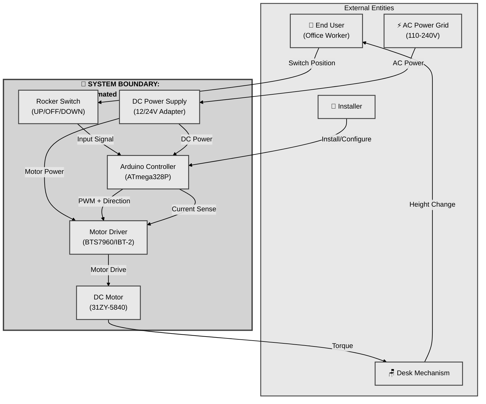
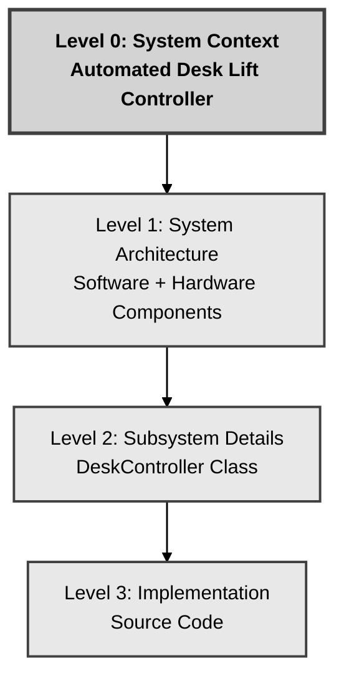

# System Context Diagram

**Document ID:** 04_SystemContextDiagram  
**Version:** 1.0  
**Date:** January 19, 2026  
**Status:** Draft  
**Author:** System Engineering Team  
**Compliance:** ISO 25119, ASPICE SYS.2, IEEE 1220

---

## Document History

| Version | Date | Author | Changes |
|---------|------|--------|---------|
| 1.0 | 2026-01-19 | System Engineering Team | Initial context diagram and interfaces |

**Approval Status:** Pending Review

| Role | Name | Signature | Date |
|------|------|-----------|------|
| System Engineer | TBD | | |
| Hardware Engineer | TBD | | |
| Software Engineer | TBD | | |
| Safety Representative | TBD | | |
| Project Lead | TBD | | |

---

## Purpose

This document defines the system boundary and context for the Automated Mechanical Desk Lift System, identifying all external entities (actors, systems, interfaces) that interact with the system. The context diagram establishes what is inside vs. outside the system scope.

---

## System Context Overview

The Automated Mechanical Desk Lift System is an embedded control system that interfaces with:
- **Human Actors:** End user, installer
- **Physical Systems:** IKEA desk mechanical structure, DC motor
- **Energy Sources:** AC/DC power supply
- **Environment:** Operational workspace (office, home)

---

## Context Diagram (Level 0)

---

## System Boundary Definition

### **INSIDE System Boundary (Under Development Control)**

The following components constitute the Automated Desk Lift Controller system:

| Component | Description | Responsibility |
|-----------|-------------|----------------|
| **Arduino Controller** | ATmega328P microcontroller running firmware | System brain: logic, state machine, safety |
| **Motor Driver Module** | BTS7960/IBT-2 H-bridge with current sensing | Power electronics: drive motor bi-directionally |
| **DC Worm Gear Motor** | 31ZY-5840 motor (12/24V, 10 RPM) | Electro-mechanical actuator |
| **Rocker Switch** | 3-position switch (UP/OFF/DOWN) | Human control interface |
| **DC Power Supply** | 12V or 24V AC-to-DC adapter (5A+) | Energy conversion and regulation |
| **Mechanical Coupling** | Shaft adapter connecting motor to desk crank | Torque transmission |
| **Wiring Harness** | Interconnect cables between components | Electrical connectivity |
| **Firmware** | C++ code running on Arduino | Software control logic |
| **Enclosure** | Protective housing for electronics (optional) | Physical protection |

---

### **OUTSIDE System Boundary (External Interfaces)**

These entities interact with the system but are not under development control:

| Entity | Type | Interface to System | Nature of Interface |
|--------|------|---------------------|---------------------|
| **End User** | Human Actor | Rocker switch (input), Desk (indirect) | Intentional operation |
| **Installer/Technician** | Human Actor | Physical installation, power connection | Setup and maintenance |
| **AC Power Grid** | Energy Source | Wall outlet (110-240V AC) | Electrical power input |
| **IKEA Desk** | Mechanical System | Cranking shaft interface | Mechanical load and movement |
| **Workspace Environment** | Physical Environment | Temperature, humidity, clearance | Operating conditions |

---

## External Interfaces Specification

### Interface 1: User → System (Rocker Switch Input)

**Interface Type:** Human-Machine Interface (HMI)  
**Direction:** User → System  
**Signal Type:** Multi-position switch (3-state)

| Parameter | Value |
|-----------|-------|
| Physical Connection | 3-position rocker switch (spring-return to center/OFF) |
| Electrical | Digital input to Arduino GPIO pins |
| Protocol | UP position = digital state 1, OFF (center) = digital state 0, DOWN = digital state 2 |
| Signals | Rocker switch pins connected to digital inputs (pins TBD) |
| Response Time | <50 ms detection latency |
| User Action | Move rocker switch to desired position; motor moves while switch is active |

---

### Interface 2: System → User (No Visual Feedback - v1.0)

**Interface Type:** User Feedback (Future Feature)  
**Direction:** N/A for v1.0  
**Status:** Deferred to future versions

**Note:** First draft does not include LED indicators. Visual feedback is provided by desk height position change and mechanical feedback (motor running/stopped).

**Future Enhancement (v2.0+):**
- Consider adding indicator LEDs or audible feedback
- Would require additional GPIO pins and components

**Current Feedback Method:**
- User observes desk rising/lowering
- Motor sound indicates operation
- No electronic visual indicators

---

### Interface 3: Power Grid → System (Electrical Power)

**Interface Type:** Energy Input  
**Direction:** Power Grid → System  
**Signal Type:** AC electrical power

| Parameter | Value |
|-----------|-------|
| Input Voltage | 110-240V AC, 50/60 Hz |
| Connector | Standard wall outlet (region-specific plug) |
| Conversion | AC-to-DC adapter (external, UL/CE certified) |
| DC Output | 12V or 24V DC, 5A minimum |
| Protection | Adapter fuse, system reverse-polarity protection |
| Power Consumption | Idle: <1W, Moving: 20-60W (depends on load) |

**Safety Considerations:**
- Adapter must be certified (UL, CE, etc.)
- User-replaceable (standard component)
- Overcurrent protection in adapter

---

### Interface 4: Controller → Motor Driver (Control Signals)

**Interface Type:** Digital Control + Analog Feedback  
**Direction:** Bidirectional  
**Signal Type:** PWM (output), Analog voltage (input)

**Control Signals (Controller → Motor Driver):**

| Signal | Pin | Type | Description |
|--------|-----|------|-------------|
| RPWM | Pin 5 (PWM) | Digital PWM | Right-side PWM (forward/raise) |
| LPWM | Pin 6 (PWM) | Digital PWM | Left-side PWM (reverse/lower) |
| R_EN | Pin 7 | Digital | Right enable (HIGH = active) |
| L_EN | Pin 8 | Digital | Left enable (HIGH = active) |

**Feedback Signals (Motor Driver → Controller):**

| Signal | Pin | Type | Description |
|--------|-----|------|-------------|
| R_IS | A0 (Analog) | Analog Voltage | Right current sense (0-5V ∝ 0-10A) |
| L_IS | A1 (Analog) | Analog Voltage | Left current sense (0-5V ∝ 0-10A) |

**Specifications:**
- PWM frequency: 1 kHz (configurable)
- PWM resolution: 8-bit (0-255)
- Current sense ratio: 0.5V/A (verify with BTS7960 datasheet)
- Overcurrent threshold: >5A (configurable in firmware)

---

### Interface 5: Motor → Desk (Mechanical Coupling)

**Interface Type:** Mechanical Power Transmission  
**Direction:** Motor → Desk  
**Signal Type:** Rotational torque and speed

| Parameter | Value |
|-----------|-------|
| Motor Output | 10 RPM, ~20 Nm torque (31ZY-5840 spec) |
| Coupling Type | Hexagonal or spline adapter (matches desk shaft) |
| Transmission | Direct coupling or gearbox (project-specific) |
| Desk Mechanism | Worm gear or screw-driven height adjustment |
| Expected Load | 5-50 kg desktop load |
| Speed | ~1.5 cm/sec vertical (depends on desk gear ratio) |

**Coupling Note:** Desk shaft coupling radius 6 mm; motor shaft coupling radius 7 mm. Adapter must accommodate this mismatch.

**Mechanical Constraints:**
- Motor torque must overcome desk load + friction
- Coupling must handle torque without slipping
- Desk mechanism must support continuous operation

**Requirements Trace:** OBJ-FUNC-01 (motorized adjustment)

---

### Interface 6: Desk → User (Height Position)

**Interface Type:** Visual Feedback (Indirect)  
**Direction:** Desk → User  
**Signal Type:** Physical position

| Parameter | Value |
|-----------|-------|
| Position Range | ~65 cm to ~125 cm (typical desk travel) |
| Position Sensing | **None in v1.0** (user visually judges height) |
| Feedback Method | User observes desk surface height |
| Control Method | User releases button when desired height reached |

**Future Enhancement:**
- Add position sensor (potentiometer, encoder, or ultrasonic)
- Enable height presets and automatic positioning

**Requirements Trace:** OBJ-FUNC-01, OBJ-EXT-01

---

### Interface 7: Environment → System (Operating Conditions)

**Interface Type:** Environmental Factors  
**Direction:** Environment → System  
**Signal Type:** Physical conditions

| Parameter | Operating Range | Storage Range |
|-----------|----------------|---------------|
| Temperature | 15°C to 30°C | -10°C to 50°C |
| Humidity | 20% to 80% RH (non-condensing) | 10% to 90% RH |
| Altitude | 0 to 2000 m | 0 to 3000 m |
| Physical Clearance | >10 cm around desk frame | N/A |

**Environmental Hazards:**
- Dust: Acceptable (indoor environment)
- Water: Must avoid (electronics not waterproof)
- Vibration: Minimal (desk is stable platform)

**Requirements Trace:** OBJ-PERF-02 (reliability)

---

## System Interfaces Summary Table

| Interface ID | External Entity | Interface Type | Direction | Critical? |
|-------------|----------------|----------------|-----------|-----------|
| IF-01 | End User | Rocker Switch | User → System | Yes |
| IF-03 | Power Grid | AC Power | Grid → System | Yes |
| IF-04 | Motor Driver | PWM + Analog | Bidirectional | Yes |
| IF-05 | Desk Mechanism | Mechanical Torque | Motor → Desk | Yes |
| IF-06 | End User | Visual Position | Desk → User | No (indirect) |
| IF-07 | Environment | Physical Conditions | Environment → System | No (passive) |
| IF-08 | Installer | Physical Installation | Installer → System | No (one-time) |

---

## Context Hierarchy

---

## Data Flow Summary

### Primary Data Flows

1. **User Intent → System Action:**
   - User presses button → Controller reads GPIO → State machine transitions → PWM output → Motor moves → Desk height changes

2. **System State → User Feedback:**
   - State machine updates → LED output changes → User observes LED → User understands system status

3. **Safety Monitoring:**
   - Motor draws current → Current sense signal → ADC reading → Controller evaluates → (if >threshold) → Fault state → Motor shutdown

4. **Power Flow:**
   - AC grid → DC adapter → Arduino (5V logic) + Motor Driver (12/24V power) → Motor (mechanical work)

---

## Assumptions and Dependencies

### Assumptions

1. **Desk Mechanical Integrity:** IKEA desk structure can support motorized operation without modification
2. **Power Availability:** Reliable AC power outlet near desk location
3. **User Capability:** User can read and follow basic instructions (button operation)
4. **Environment:** System operates indoors in climate-controlled space
5. **Load Range:** Desktop load within motor torque capability (5-50 kg)

### Dependencies

1. **External Components:** System depends on commodity hardware (Arduino, motor, driver) availability
2. **Power Supply:** System non-functional without external DC adapter
3. **Mechanical Coupling:** System requires custom or adapted coupling matching desk shaft
4. **User Action:** System is passive (no autonomous operation); requires user initiation

---

## Out-of-Scope

The following are explicitly **outside** the system boundary:

| Item | Rationale |
|------|-----------|
| **Desk Structural Design** | Pre-existing IKEA product (not modified) |
| **Position Sensing (v1.0)** | Future feature; v1.0 relies on user visual feedback |
| **Mobile App / IoT Connectivity** | Future feature; v1.0 is standalone |
| **Multi-User Management** | Single-user system (no access control) |
| **Height Memory Presets** | Future feature requiring position sensor |
| **Load Weighing** | Not required; current sense detects overload indirectly |
| **Desk Assembly/Disassembly** | User responsibility per IKEA instructions |

---

## References

- [Mission Statement](01_MissionStatement.md)
- [System Objectives](02_SystemObjectives.md)
- [Concept of Operations](03_ConOps.md)
- [System Use Cases](05_SystemUseCases.md)
- [Software Architecture](08_SoftwareArchitecture.md)
- [Software Requirements](07_SoftwareRequirements.md)
- [Hardware Schematic](Schematic.md)

