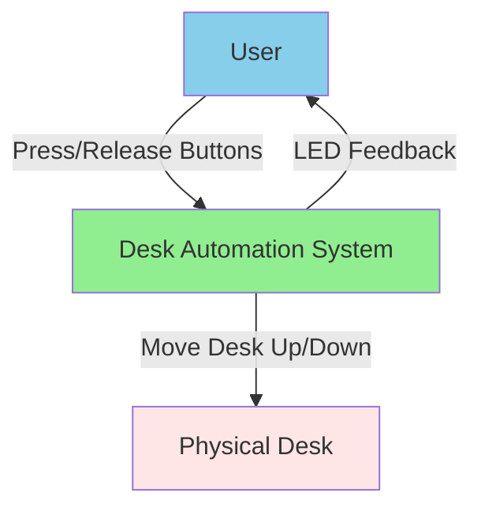
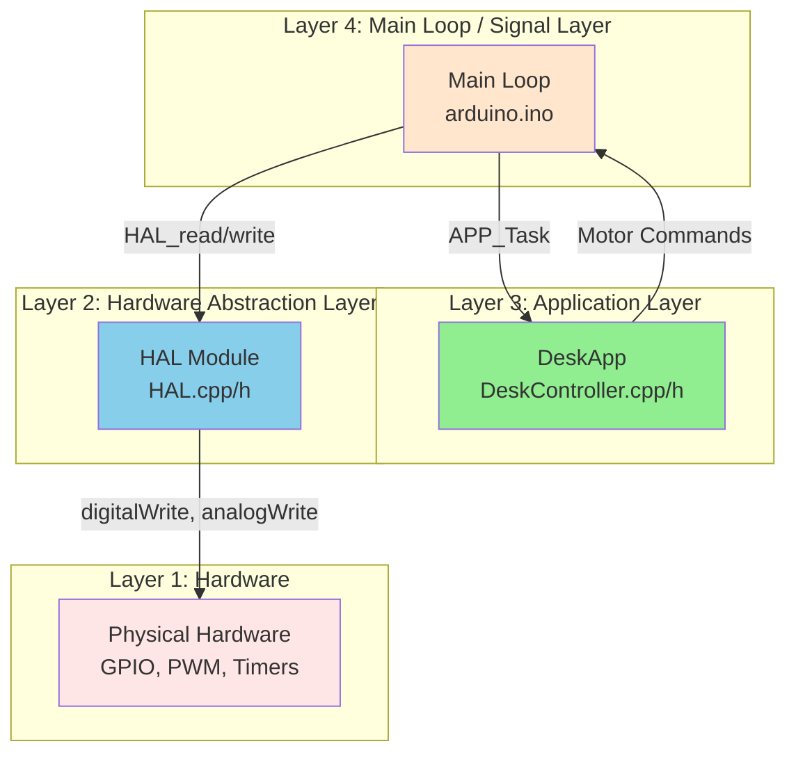
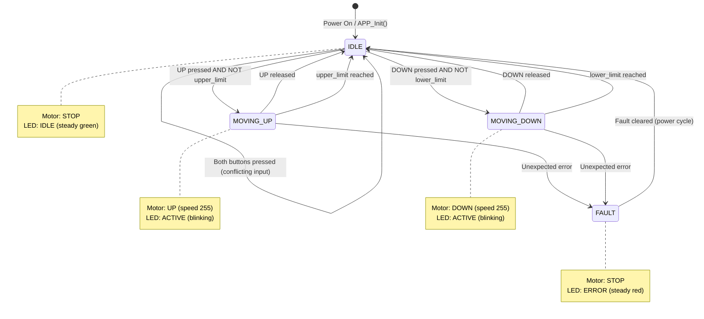
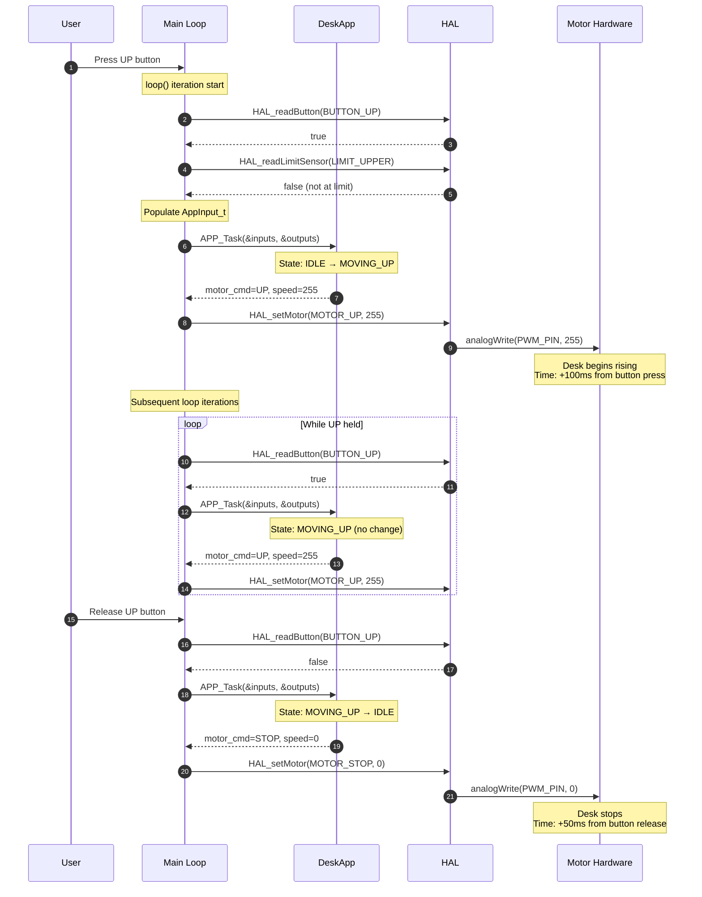
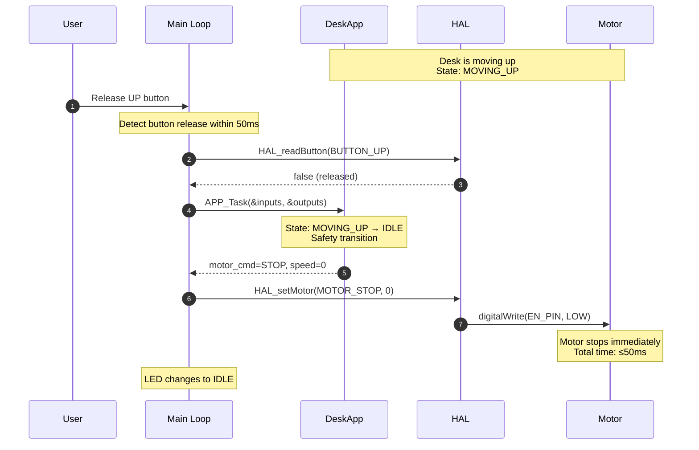
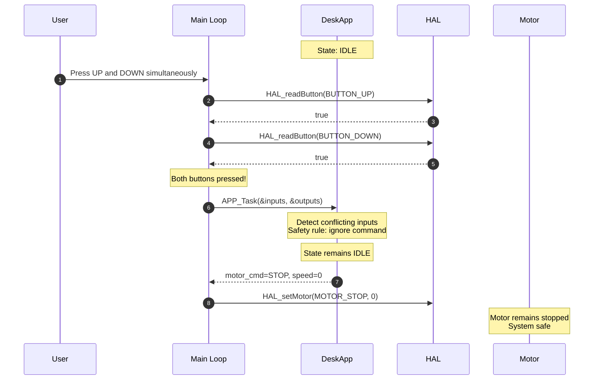
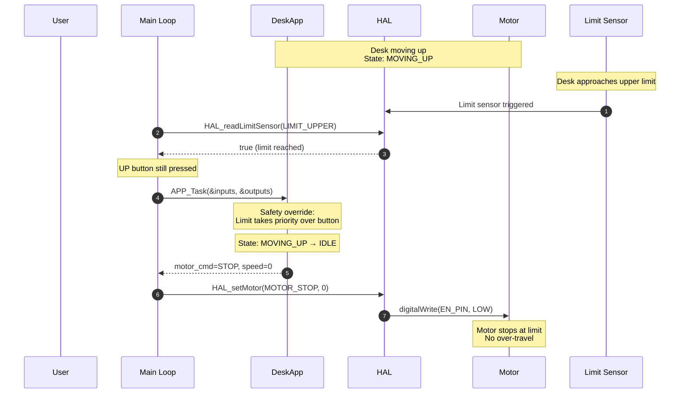
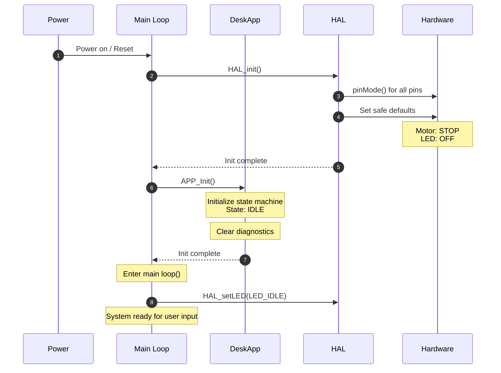
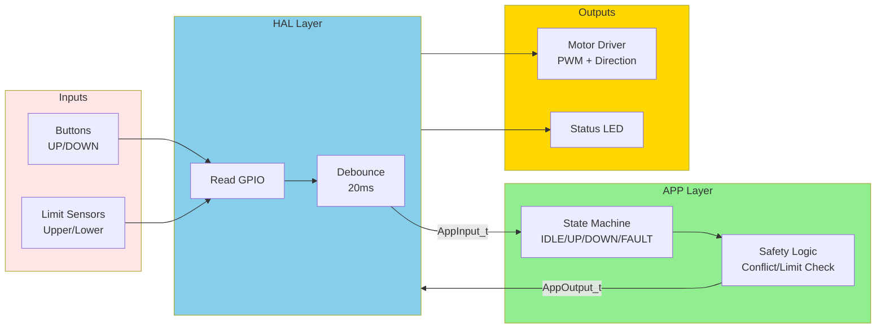

# Software Architecture

## Overview

This document defines the software architecture for the Standing Desk Automation System. The architecture follows a layered design pattern with clear separation of concerns to enable testability, maintainability, and safety.

---

## Traceability

**Derived from:**
- [03_SystemRequirements.md](03_SystemRequirements.md)
- [04_SoftwareRequirements.md](04_SoftwareRequirements.md)

---

## Architectural Principles

1. **Testability**: Application logic is hardware-independent and unit-testable with mocks
2. **Simplicity**: Suitable for resource-constrained Arduino environment
3. **Safety**: State machine enforces safety rules and deterministic behavior
4. **Real-time**: Button response ≤ 1 sec achieved through efficient control loop

---

## System Context



---

## Layer Architecture



### Layer 1: Hardware (Physical Components)

**Responsibility:** Physical interface to buttons, motor driver, limit sensors, LEDs.

**Components:**
- Arduino UNO microcontroller
- BTS7960 motor driver
- Push buttons (UP, DOWN)
- Limit sensors (upper, lower)
- Status LEDs
- 12V DC motor

**Description:** Physical hardware layer; no software components.

---

### Layer 2: Hardware Abstraction Layer (HAL)

**Responsibility:** Encapsulate all hardware-specific code; provide hardware-independent API to upper layers.

**File:** `HAL.h`, `HAL.cpp`, `PinConfig.h`

**Public API:**

```cpp
// Initialization
void HAL_init(void);

// Button Input (debounced)
bool HAL_readButton(ButtonID button);  // Returns true if pressed
uint8_t HAL_readButtons(void);          // Returns bitmask of all buttons

// Limit Sensors
bool HAL_readLimitSensor(LimitID sensor);  // Returns true if limit reached

// Motor Control
void HAL_setMotor(MotorDirection dir, uint8_t speed);  // dir: STOP/UP/DOWN, speed: 0-255

// LED Output
void HAL_setLED(LEDStatus status);  // status: OFF/IDLE/ACTIVE/ERROR

// Timing
uint32_t HAL_getTime(void);  // Returns milliseconds since startup
void HAL_delay(uint32_t ms);  // Blocking delay (use sparingly)

// Diagnostics
void HAL_logMessage(const char* msg);  // Debug output to serial
```

**Data Types:**

```cpp
typedef enum {
    BUTTON_UP = 0,
    BUTTON_DOWN = 1
} ButtonID;

typedef enum {
    LIMIT_UPPER = 0,
    LIMIT_LOWER = 1
} LimitID;

typedef enum {
    MOTOR_STOP = 0,
    MOTOR_UP = 1,
    MOTOR_DOWN = 2
} MotorDirection;

typedef enum {
    LED_OFF = 0,
    LED_IDLE = 1,      // Steady green
    LED_ACTIVE = 2,    // Blinking green
    LED_ERROR = 3      // Steady red
} LEDStatus;
```

**Description:** HAL is the only layer with direct access to Arduino libraries (digitalWrite, analogWrite, millis). All pin numbers defined in `PinConfig.h`.

---

### Layer 3: Application Layer (DeskApp)

**Responsibility:** Implement desk control logic, state machine, and safety rules; hardware-agnostic.

**File:** `DeskController.h`, `DeskController.cpp`

**Public API:**

```cpp
// Initialization
void APP_Init(void);

// Main Task (called every control loop cycle)
void APP_Task(const AppInput_t* inputs, AppOutput_t* outputs);

// Diagnostics (optional)
AppState_t APP_GetState(void);
uint32_t APP_GetStateTransitionCount(void);
```

**Data Structures:**

```cpp
// Input Structure (from Main Loop)
typedef struct {
    bool button_up;          // True if UP button pressed
    bool button_down;        // True if DOWN button pressed
    bool limit_upper;        // True if upper limit reached
    bool limit_lower;        // True if lower limit reached
    uint32_t timestamp_ms;   // Current time in milliseconds
} AppInput_t;

// Output Structure (to Main Loop)
typedef struct {
    MotorDirection motor_cmd;    // Motor command: STOP/UP/DOWN
    uint8_t motor_speed;         // Motor speed: 0-255 (255 = full speed)
    LEDStatus led_status;        // LED indicator status
    bool diagnostics_enabled;    // Enable diagnostic logging
} AppOutput_t;

// Application State
typedef enum {
    APP_STATE_IDLE = 0,
    APP_STATE_MOVING_UP = 1,
    APP_STATE_MOVING_DOWN = 2,
    APP_STATE_FAULT = 3
} AppState_t;
```

**Description:** DeskApp contains the state machine and business logic. It is fully testable with mock inputs/outputs.

---

### Layer 4: Main Loop / Signal Layer

**Responsibility:** Poll hardware via HAL, populate input structure, call APP_Task, execute output commands.

**File:** `arduino.ino`

**Pseudocode:**

```cpp
void setup() {
    HAL_init();
    APP_Init();
}

void loop() {
    // 1. Read hardware inputs via HAL
    AppInput_t inputs;
    inputs.button_up = HAL_readButton(BUTTON_UP);
    inputs.button_down = HAL_readButton(BUTTON_DOWN);
    inputs.limit_upper = HAL_readLimitSensor(LIMIT_UPPER);
    inputs.limit_lower = HAL_readLimitSensor(LIMIT_LOWER);
    inputs.timestamp_ms = HAL_getTime();
    
    // 2. Call application task
    AppOutput_t outputs;
    APP_Task(&inputs, &outputs);
    
    // 3. Execute outputs via HAL
    HAL_setMotor(outputs.motor_cmd, outputs.motor_speed);
    HAL_setLED(outputs.led_status);
    
    // 4. Maintain loop timing (target: ≤ 50 ms)
    // Loop naturally runs fast enough; no explicit delay needed
}
```

**Description:** Main loop orchestrates the system; it has no business logic, only I/O coordination.

---

## State Machine Design

### State Diagram



### State Transition Table

| Current State | Input Condition | Next State | Motor Command | LED Status |
|--------------|----------------|-----------|---------------|-----------|
| IDLE | UP pressed AND NOT upper_limit | MOVING_UP | UP, speed=255 | ACTIVE |
| IDLE | DOWN pressed AND NOT lower_limit | MOVING_DOWN | DOWN, speed=255 | ACTIVE |
| IDLE | Both buttons pressed | IDLE | STOP | IDLE |
| IDLE | No buttons pressed | IDLE | STOP | IDLE |
| MOVING_UP | UP still pressed AND NOT upper_limit | MOVING_UP | UP, speed=255 | ACTIVE |
| MOVING_UP | UP released | IDLE | STOP | IDLE |
| MOVING_UP | upper_limit reached | IDLE | STOP | IDLE |
| MOVING_DOWN | DOWN still pressed AND NOT lower_limit | MOVING_DOWN | DOWN, speed=255 | ACTIVE |
| MOVING_DOWN | DOWN released | IDLE | STOP | IDLE |
| MOVING_DOWN | lower_limit reached | IDLE | STOP | IDLE |
| Any State | Unexpected error | FAULT | STOP | ERROR |

### State Entry/Exit Actions

**IDLE State:**
- **Entry:** Motor STOP, LED IDLE
- **In-State:** Monitor button inputs
- **Exit:** None

**MOVING_UP State:**
- **Entry:** Motor UP (speed=255), LED ACTIVE
- **In-State:** Monitor button release and upper limit
- **Exit:** Motor STOP

**MOVING_DOWN State:**
- **Entry:** Motor DOWN (speed=255), LED ACTIVE
- **In-State:** Monitor button release and lower limit
- **Exit:** Motor STOP

**FAULT State:**
- **Entry:** Motor STOP, LED ERROR, log fault
- **In-State:** System halted
- **Exit:** Requires power cycle to clear

---

## Sequence Diagrams

### Sequence 1: Normal Desk Raise (SysReq-002, SysReq-004)



### Sequence 2: Emergency Halt via Button Release (SysReq-003)



### Sequence 3: Conflicting Button Inputs (SysReq-005, SWReq-004)



### Sequence 4: Upper Limit Protection (SysReq-007, SWReq-005)



### Sequence 5: Full System Initialization (SysReq-001, SWReq-007)



---

## Data Flow Diagram



---

## Requirements Traceability Matrix

### System Requirements → Architecture Elements

| System Req | Software Req | Architecture Element | Layer | Verification |
|-----------|-------------|---------------------|-------|--------------|
| SysReq-001 | SWReq-005, SWReq-006 | Limit sensor input + Safety logic | APP, HAL | Unit test with mock sensors |
| SysReq-002 | SWReq-001, SWReq-002, SWReq-008 | Button input handler + State transitions | APP, HAL | Timing test with mock GPIO |
| SysReq-003 | SWReq-003 | Button release detection + Motor stop | APP, HAL | Unit test with mock timer |
| SysReq-004 | SWReq-008 | Control loop timing (≤50ms cycle) | Main Loop | Loop timing measurement |
| SysReq-005 | SWReq-004 | Conflicting input detection | APP | Unit test with both buttons |
| SysReq-006 | — | Motor speed control (constant 255) | HAL | (Future: PWM ramping) |
| SysReq-007 | SWReq-005, SWReq-006 | Limit override logic | APP | Unit test with limit active |
| SysReq-008 | SWReq-010 | State transition logging | APP | Diagnostic log verification |

### Software Requirements → Architecture Functions

| Software Req | Function/Module | API | Layer |
|-------------|----------------|-----|-------|
| SWReq-001 | Button UP handler | `HAL_readButton(BUTTON_UP)` | HAL |
| SWReq-002 | Button DOWN handler | `HAL_readButton(BUTTON_DOWN)` | HAL |
| SWReq-003 | Button release handler | `HAL_readButton()` + debounce | HAL |
| SWReq-004 | Conflicting input check | Safety logic in `APP_Task()` | APP |
| SWReq-005 | Upper limit check | `HAL_readLimitSensor(LIMIT_UPPER)` | HAL |
| SWReq-006 | Lower limit check | `HAL_readLimitSensor(LIMIT_LOWER)` | HAL |
| SWReq-007 | State machine | `APP_Task()` state transitions | APP |
| SWReq-008 | Control loop | `loop()` execution | Main |
| SWReq-009 | Debouncing | `HAL_readButton()` internal logic | HAL |
| SWReq-010 | Diagnostics | `APP_GetState()`, state log | APP |

---

## Interface Specifications

### HAL ↔ Hardware Interface

**GPIO Pin Assignments** (defined in `PinConfig.h`):

```cpp
// Input Pins
#define PIN_BUTTON_UP      2   // Digital input (pull-up)
#define PIN_BUTTON_DOWN    3   // Digital input (pull-up)
#define PIN_LIMIT_UPPER    4   // Digital input (pull-up)
#define PIN_LIMIT_LOWER    5   // Digital input (pull-up)

// Output Pins
#define PIN_MOTOR_RPWM     9   // PWM output (raise)
#define PIN_MOTOR_LPWM    10   // PWM output (lower)
#define PIN_MOTOR_REN      6   // Digital output (raise enable)
#define PIN_MOTOR_LEN      7   // Digital output (lower enable)
#define PIN_LED_STATUS    13   // Digital output (status LED)
```

**Timing Constraints:**
- Button debounce: 20 ms
- Sensor read: <5 ms
- Motor command: <10 ms

---

### APP ↔ Main Loop Interface

**Input Structure:** `AppInput_t` (passed by pointer, read-only)

| Field | Type | Range | Description |
|-------|------|-------|-------------|
| button_up | bool | 0/1 | True if UP button pressed (debounced) |
| button_down | bool | 0/1 | True if DOWN button pressed (debounced) |
| limit_upper | bool | 0/1 | True if upper limit sensor active |
| limit_lower | bool | 0/1 | True if lower limit sensor active |
| timestamp_ms | uint32_t | 0 - 2^32 | Current time in milliseconds |

**Output Structure:** `AppOutput_t` (passed by pointer, written by APP)

| Field | Type | Range | Description |
|-------|------|-------|-------------|
| motor_cmd | MotorDirection | 0/1/2 | STOP=0, UP=1, DOWN=2 |
| motor_speed | uint8_t | 0-255 | Motor PWM duty cycle (0=off, 255=full) |
| led_status | LEDStatus | 0/1/2/3 | OFF=0, IDLE=1, ACTIVE=2, ERROR=3 |
| diagnostics_enabled | bool | 0/1 | Enable diagnostic logging |

---

## Architectural Decisions

### AD-001: Layered Architecture
**Decision:** Use 4-layer architecture (Hardware, HAL, APP, Main Loop).  
**Rationale:** Enables unit testing of application logic without hardware; supports future platform portability.  
**Traceability:** All software requirements (SWReq-001 through SWReq-010).

### AD-002: State Machine Pattern
**Decision:** Implement control logic as explicit state machine with 4 states.  
**Rationale:** Provides deterministic, verifiable behavior; simplifies safety analysis.  
**Traceability:** SWReq-007, SysReq-002, SysReq-003.

### AD-003: Input/Output Structures
**Decision:** Use C structures for APP_Task interface instead of individual parameters.  
**Rationale:** Simplifies unit testing; easier to extend with new signals; clear API boundary.  
**Traceability:** SWReq-001 through SWReq-006.

### AD-004: HAL Owns All Hardware Access
**Decision:** Only HAL layer calls Arduino functions (digitalWrite, analogWrite, millis).  
**Rationale:** Enables mock-based testing; single point for hardware dependencies.  
**Traceability:** All software requirements.

### AD-005: Constant Motor Speed (No Ramping)
**Decision:** Motor speed fixed at 255 (full speed); no acceleration/deceleration profile.  
**Rationale:** Simplifies initial implementation; meets system requirements; ramping can be added later.  
**Traceability:** SysReq-004, SysReq-006.

### AD-006: Debouncing in HAL
**Decision:** Button debouncing implemented inside HAL_readButton().  
**Rationale:** Isolates timing complexity from APP layer; reusable across projects.  
**Traceability:** SWReq-009.

### AD-007: Limit Sensors Override Buttons
**Decision:** Limit sensors take priority over button inputs in safety logic.  
**Rationale:** Prevents mechanical over-travel; safety-critical requirement.  
**Traceability:** SysReq-007, SWReq-005, SWReq-006.

---

## Design Constraints

1. **Memory:** Arduino UNO has 2 KB SRAM; minimize global variables
2. **Timing:** Control loop must execute in ≤50 ms
3. **Safety:** All motor commands must be fail-safe (default to STOP)
4. **Testability:** APP layer must be testable without Arduino hardware

---

## Future Enhancements (Out of Scope)

- PWM ramping for smooth acceleration/deceleration
- Position sensing and closed-loop control
- EEPROM storage for height presets
- Serial command interface for diagnostics
- Watchdog timer for fault detection

---

**Document Version:** 1.0  
**Date:** January 24, 2026  
**Status:** Approved  

