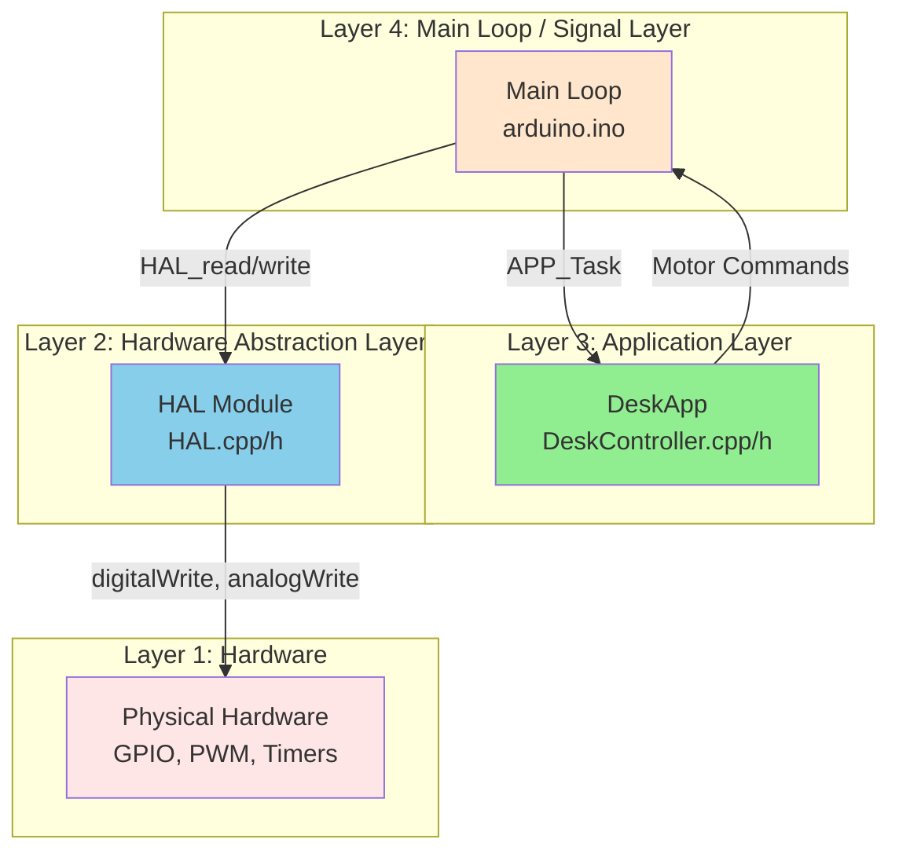
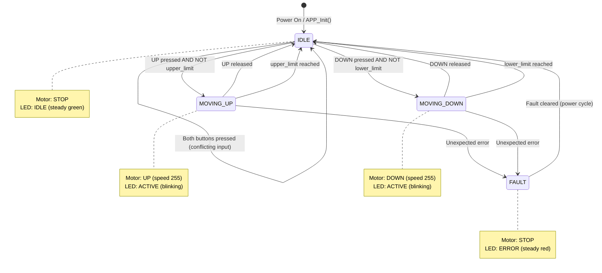

# Software Architecture

## Overview

This document defines the software architecture for the Standing Desk Automation System. The architecture follows a layered design pattern with clear separation of concerns to enable testability, maintainability, and safety.

**Document Purpose and Detail Level**
- **Purpose:** Define the software structure, responsibilities, and interfaces needed to implement the system requirements.
- **Detail Level:** Software layers, modules, data flow, and state machine behavior; no system hardware decomposition.
- **Use:** Input to detailed design and test development; aligns with system architecture constraints.

**Document Version:** 1.0  
**Date:** January 24, 2026  
**Status:** Approved

---

## Traceability

**Derived from:**
- [03_00_SystemRequirements.md](03_00_SystemRequirements.md)
- [03_01_SystemArchitecture.md](03_01_SystemArchitecture.md)
- [04_SoftwareRequirements.md](04_SoftwareRequirements.md)

---

## Architectural Principles

1. **Testability**: Application logic is hardware-independent and unit-testable with mocks
2. **Simplicity**: Suitable for resource-constrained Arduino environment
3. **Safety**: State machine enforces safety rules and deterministic behavior
4. **Real-time**: Software design meets system-level timing constraints

---

## Timing and Safety Constraints

System-level timing and safety requirements are defined in the System Architecture and Technical Safety Concept. The software design implements these constraints via the control loop, state machine, and safety logic.

---

## Layer Architecture



### Layer 1: Hardware (External)

**Responsibility:** Provide physical inputs/outputs to the software via GPIO, PWM, and ADC signals.

**Description:** Hardware composition and wiring are defined at the system level; see System Architecture for component details.

---

### Layer 2: Hardware Abstraction Layer (HAL)

**Responsibility:** Encapsulate all hardware-specific code; provide hardware-independent API to upper layers.

**Files:** `HAL.h`, `HAL.cpp`, `PinConfig.h`

**Key Interfaces:** Hardware I/O functions for buttons, limits, motor, LEDs, and time services. Detailed signatures and data types are defined in the Detailed Design Specification.

**Description:** HAL is the only layer with direct access to Arduino libraries (digitalWrite, analogWrite, millis). Pin assignments and concrete data types are specified in the Detailed Design.

---

### Layer 3: Application Layer (DeskApp)

**Responsibility:** Implement desk control logic, state machine, and safety rules; hardware-agnostic.

**File:** `DeskController.h`, `DeskController.cpp`

**Description:** DeskApp contains the state machine and business logic. It is fully testable with mock inputs/outputs.

**Interfaces:** Function signatures and data structures are defined in the Detailed Design Specification.

---

### Layer 4: Main Loop / Signal Layer

**Responsibility:** Poll hardware via HAL, populate input structure, call APP_Task, execute output commands.

**File:** `arduino.ino`

**Description:** Main loop orchestrates I/O coordination and schedules the application task. Implementation details are specified in the Detailed Design.

---

## Motor Driver Abstraction

### Supported Drivers

The software architecture supports multiple motor driver implementations transparent to application logic:

| Driver | Model | Capabilities | Status |
|--------|-------|--------------|--------|
| **MT_BASIC** | L298N Dual H-Bridge | Standard H-bridge with PWM speed control | ✅ Supported |
| **MT_ROBUST** | IBT_2 Dual H-Bridge (FET) | Enhanced H-bridge with better thermal characteristics | ✅ Supported |

### Abstraction Strategy

**Motor-Type-Agnostic Application Logic:**
- Application layer (`DeskApp`) makes no assumptions about hardware capabilities
- All control logic, safety features, and timing constraints are identical for both drivers
- Motor type influences only HAL implementation details, not functional behavior

**HAL Motor Control Interface:**
```
HAL_setMotor(direction, speed)  // Same interface for both drivers
├── MT_BASIC: Drives L298N GPIO pins (standard H-bridge)
└── MT_ROBUST: Drives IBT_2 GPIO pins (enhanced FET driver)
```

**Current Sensing Abstraction:**
```
current_ma = HAL_readMotorCurrent()  // Same interface for both drivers
├── MT_BASIC: Always returns 0 (no current sensor in hardware)
└── MT_ROBUST: Returns actual current from sense resistor
```

### Configuration Selection

Motor type is selected at compile-time via `motor_config.cpp`:
```cpp
#define MOTOR_TYPE MT_BASIC  // Change to MT_ROBUST for IBT_2 driver
```

All 37 unit and integration tests verify identical behavior across both configurations:
- Tests execute with default MT_BASIC configuration
- Can be recompiled with `TEST_MOTOR_TYPE=MT_ROBUST` to validate IBT_2 without code changes
- Both configurations pass all verification specifications without functional differences

---

## State Machine Design

### State Diagram



### State Transition Table

| Current State | Input Condition | Next State | Motor Command | LED Status |
|--------------|----------------|-----------|---------------|-----------|
| IDLE | UP pressed AND NOT upper_limit | MOVING_UP | UP, speed=255 | ACTIVE |
| IDLE | DOWN pressed AND NOT lower_limit | MOVING_DOWN | DOWN, speed=255 | ACTIVE |
| IDLE | Both buttons pressed | IDLE | STOP | IDLE |
| IDLE | No buttons pressed | IDLE | STOP | IDLE |
| MOVING_UP | UP still pressed AND NOT upper_limit | MOVING_UP | UP, speed=255 | ACTIVE |
| MOVING_UP | UP released | IDLE | STOP | IDLE |
| MOVING_UP | upper_limit reached | IDLE | STOP | IDLE |
| MOVING_DOWN | DOWN still pressed AND NOT lower_limit | MOVING_DOWN | DOWN, speed=255 | ACTIVE |
| MOVING_DOWN | DOWN released | IDLE | STOP | IDLE |
| MOVING_DOWN | lower_limit reached | IDLE | STOP | IDLE |
| Any State | Unexpected error | FAULT | STOP | ERROR |

### State Entry/Exit Actions

**IDLE State:**
- **Entry:** Motor STOP, LED IDLE
- **In-State:** Monitor button inputs
- **Exit:** None

**MOVING_UP State:**
- **Entry:** Motor UP (speed=255), LED ACTIVE
- **In-State:** Monitor button release and upper limit
- **Exit:** Motor STOP

**MOVING_DOWN State:**
- **Entry:** Motor DOWN (speed=255), LED ACTIVE
- **In-State:** Monitor button release and lower limit
- **Exit:** Motor STOP

**FAULT State:**
- **Entry:** Motor STOP, LED ERROR, log fault
- **In-State:** System halted
- **Exit:** Requires power cycle to clear

---

## Interaction Diagrams

Interaction sequences and data flow diagrams are maintained in the Detailed Design Specification to keep implementation-level behavior in a single location.

---

## Requirements Traceability Matrix

### System Requirements → Architecture Elements

| System Req | Software Req | Architecture Element | Layer | Verification |
|-----------|-------------|---------------------|-------|--------------|
| SysReq-001 | SWReq-005, SWReq-006 | Limit sensor input + Safety logic | APP, HAL | Unit test with mock sensors |
| SysReq-002 | SWReq-001, SWReq-002, SWReq-008 | Button input handler + State transitions | APP, HAL | Timing test with mock GPIO |
| SysReq-003 | SWReq-003 | Button release detection + Motor stop | APP, HAL | Unit test with mock timer |
| SysReq-004 | SWReq-008 | Control loop timing (≤50ms cycle) | Main Loop | Loop timing measurement |
| SysReq-005 | SWReq-004 | Conflicting input detection | APP | Unit test with both buttons |
| SysReq-006 | — | Motor speed control (constant 255) | HAL | (Future: PWM ramping) |
| SysReq-007 | SWReq-005, SWReq-006 | Limit override logic | APP | Unit test with limit active |
| SysReq-008 | SWReq-010 | State transition logging | APP | Diagnostic log verification |

### Software Requirements → Architecture Functions

| Software Req | Function/Module | API | Layer |
|-------------|----------------|-----|-------|
| SWReq-001 | Button UP handler | `HAL_readButton(BUTTON_UP)` | HAL |
| SWReq-002 | Button DOWN handler | `HAL_readButton(BUTTON_DOWN)` | HAL |
| SWReq-003 | Button release handler | `HAL_readButton()` + debounce | HAL |
| SWReq-004 | Conflicting input check | Safety logic in `APP_Task()` | APP |
| SWReq-005 | Upper limit check | `HAL_readLimitSensor(LIMIT_UPPER)` | HAL |
| SWReq-006 | Lower limit check | `HAL_readLimitSensor(LIMIT_LOWER)` | HAL |
| SWReq-007 | State machine | `APP_Task()` state transitions | APP |
| SWReq-008 | Control loop | `loop()` execution | Main |
| SWReq-009 | Debouncing | `HAL_readButton()` internal logic | HAL |
| SWReq-010 | Diagnostics | `APP_GetState()`, state log | APP |

---

## Interface Specifications

Detailed interface definitions, pin assignments, and timing budgets are specified in the Detailed Design Specification.

## Architectural Decisions

### AD-001: Layered Architecture
**Decision:** Use 4-layer architecture (Hardware, HAL, APP, Main Loop).  
**Rationale:** Enables unit testing of application logic without hardware; supports future platform portability.  
**Traceability:** All software requirements (SWReq-001 through SWReq-010).

### AD-002: State Machine Pattern
**Decision:** Implement control logic as explicit state machine with 4 states.  
**Rationale:** Provides deterministic, verifiable behavior; simplifies safety analysis.  
**Traceability:** SWReq-007, SysReq-002, SysReq-003.

### AD-003: Input/Output Structures
**Decision:** Use C structures for APP_Task interface instead of individual parameters.  
**Rationale:** Simplifies unit testing; easier to extend with new signals; clear API boundary.  
**Traceability:** SWReq-001 through SWReq-006.

### AD-004: HAL Owns All Hardware Access
**Decision:** Only HAL layer calls Arduino functions (digitalWrite, analogWrite, millis).  
**Rationale:** Enables mock-based testing; single point for hardware dependencies.  
**Traceability:** All software requirements.

### AD-005: Constant Motor Speed (No Ramping)
**Decision:** Motor speed fixed at 255 (full speed); no acceleration/deceleration profile.  
**Rationale:** Simplifies initial implementation; meets system requirements; ramping can be added later.  
**Traceability:** SysReq-004, SysReq-006.

### AD-006: Debouncing in HAL
**Decision:** Button debouncing implemented inside HAL_readButton().  
**Rationale:** Isolates timing complexity from APP layer; reusable across projects.  
**Traceability:** SWReq-009.

### AD-007: Limit Sensors Override Buttons
**Decision:** Limit sensors take priority over button inputs in safety logic.  
**Rationale:** Prevents mechanical over-travel; safety-critical requirement.  
**Traceability:** SysReq-007, SWReq-005, SWReq-006.

### AD-008: Non-Blocking Main Loop with Time-Based Scheduler
**Decision:** Main loop is non-blocking and executes application control logic at 4 Hz (every 250 ms).  
**Rationale:** 
- Prevents blocking delays that can impair safety-critical button response
- 4 Hz scheduler provides predictable timing for application task invocation
- Arduino loop() is called frequently; explicit timing check prevents excessive application task calls
- Allows I/O operations (HAL calls) to complete without waiting
**Traceability:** Foundational to responsive button handling (SysReq-002: ≤1 sec response) and halt timing (SysReq-003: ≤500 ms halt).

### AD-009: Motor Configuration Encapsulation
**Decision:** Motor type configuration is encapsulated via `MotorConfig_getMotorType()` getter function; direct application code shall not use the `MOTOR_TYPE` macro.

**Rationale:** 
- **Abstraction:** Hides motor type definition details from application code
- **Testability:** Enables testing both motor configurations (MT_BASIC and MT_ROBUST) without recompilation via `TEST_MOTOR_TYPE` override
- **Future NVM Support:** Architecture is prepared for runtime motor configuration via non-volatile memory without requiring header changes
- **Safety:** Centralized control of motor type configuration reduces risk of inconsistent usage across codebase
- **Maintenance:** Single point of definition for motor type handling simplifies future hardware variants

**Current Implementation:** Compile-time configuration (default: MT_BASIC/L298N). MOTOR_TYPE macro is defined and validated in `motor_config.cpp`.

**Future Implementation:** Will read motor type from NVM at runtime, enabling hardware auto-detection and multi-configuration support without recompilation.

**Verification:** 
- Application code uses `inputs->motor_type` from AppInput struct (populated via `MotorConfig_getMotorType()`)
- HAL layer uses runtime `g_motor_type` variable (set via `HAL_setMotorType()`)
- All 37 unit and integration tests validate both MT_BASIC and MT_ROBUST configurations

**Traceability:** All software requirements (SWReq-001 through SWReq-014); ensures motor-type-agnostic application logic.

---

## Design Constraints

1. **Memory:** Arduino UNO has 2 KB SRAM; minimize global variables
2. **Timing:** 
    - Meet system-level response and halt timing constraints
    - No blocking delays in main loop; utilize non-blocking scheduler (see AD-008)
3. **Safety:** All motor commands must be fail-safe (default to STOP)
4. **Testability:** APP layer must be testable without Arduino hardware

---

## Future Enhancements (Out of Scope)

- **Runtime Motor Configuration (In Progress):** Migrate from compile-time `MOTOR_TYPE` macro to NVM-based runtime configuration, enabling hardware auto-detection without recompilation (see AD-009: Motor Configuration Encapsulation for architecture readiness)
- PWM ramping for smooth acceleration/deceleration
- Position sensing and closed-loop control
- EEPROM storage for height presets
- Serial command interface for diagnostics
- Watchdog timer for fault detection


