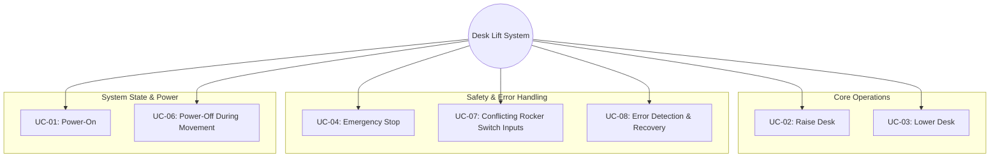

# System Use Cases

**Document Version:** 1.1  
**Last Updated:** January 7, 2026  
**Status:** Approved  
**Author:** Development Team  
**Reviewers:** System Engineering, Safety Team  

---


## Overview

This document describes the main use cases for the Automated Mechanical Desk Lift system. For the DeskHigh torque branch, the system includes:
- Monitoring of motor current via R_IS and L_IS (BTS7960/IBT-2 current sense outputs) to detect stalls or overcurrent conditions.
- PWM soft-start for the worm gear motor to reduce mechanical shock and protect hardware.
Use cases help clarify user interactions and drive requirements and test cases. Each use case follows IEEE 29148-2018 standard format.

---

## Navigation

- [Software Requirements](07_SoftwareRequirements.md)
- [Software Architecture](08_SoftwareArchitecture.md)
- [Software Test Cases Specification](10_ComponentTestCasesSpecification.md)
- [Traceability Matrix](12_TraceabilityMatrix.md)

---


## Use Case Summary

| Use Case ID | Name | Priority | Frequency | Status |
|------------|------|----------|-----------|--------|
| UC-01 | Power-On the Desk Control System | Critical | Every Session | Approved |
| UC-02 | Raise Desk | Critical | High | Approved |
| UC-03 | Lower Desk | Critical | High | Approved |
| UC-04 | Emergency Stop | Critical | Low | Approved |
| UC-06 | Power-Off During Movement | Medium | Low | Approved |
| UC-07 | Conflicting Rocker Switch Inputs | High | Low | Approved |
| UC-08 | Error Detection and Recovery | High | Low | Approved |
| UC-09 | Motor Current Monitoring (R_IS/L_IS) | High | Continuous | Approved |
| UC-10 | PWM Soft-Start for Motor | High | Every Movement | Approved |

---


## System Use Case Diagram

This diagram shows a hierarchical breakdown of the system's use cases, grouped by functionality, with the core system at the center.



---


---

## Detailed Use Cases

### UC-01: Power-On the Desk Control System

**Brief Description:** User powers on the desk control system, initializing all components and entering ready state.

**Actor:** User

**Trigger:** Power switch toggled to ON position

**Priority:** Critical

**Frequency:** Every session (daily/multiple times per day)

**Preconditions:**
- Power supply is connected (12V DC)
- All hardware components are properly connected
- No physical damage to system components

**Main Flow:**
1. User toggles the power switch to ON
2. Motor driver receives power from external supply
3. ECU powers up via regulated 5V supply
4. System performs self-check routine
5. System initializes to IDLE state
6. System is ready to accept user commands

**Alternative Flows:**
- **AF-01a:** If initialization fails, system enters ERROR state (see UC-08)
- **AF-01b:** If power supply voltage is out of range, system enters ERROR state

**Exception Flows:**
- **EF-01a:** Power supply failure → System shuts down safely
- **EF-01b:** Hardware fault detected → Enter ERROR state

**Postconditions:**
- **Success:** System is in IDLE state, all inputs monitored
- **Failure:** System is in ERROR state

**Test Cases:** TC-001, TC-002, IT-001

---

### UC-02: Raise Desk

**Brief Description:** User commands the desk to move upward by moving the rocker switch to the UP position and holding it there.

**Actor:** User

**Trigger:** Rocker switch moved to UP position

**Priority:** Critical

**Frequency:** High (multiple times per day)

**Preconditions:**
- System is in IDLE state (UC-01 completed)
- Desk is not at upper limit position
- No active error conditions
- Rocker switch is in center (OFF) position

**Main Flow:**
1. User moves the rocker switch to the UP position
2. ECU reads debounced rocker switch state via HAL_debounceButton()
3. System validates no conflicting inputs (switch not moved to DOWN simultaneously)
4. ECU transitions to MOVING_UP state
5. ECU sets motor direction to UP via HAL_setMotorDirection()
6. Motor driver energizes the motor
7. Desk begins moving upward
8. User holds rocker switch in UP position for desired movement duration
9. User releases rocker switch, spring-return moves it to center (OFF) position
10. ECU detects switch center position
11. Motor driver de-energizes motor
12. Desk stops moving
13. System transitions to IDLE state

**Alternative Flows:**
- **AF-02a:** Upper limit reached → Motor stops automatically, return to IDLE
- **AF-02b:** Maximum movement timeout (30s) → Motor stops, return to IDLE
- **AF-02c:** Switch released immediately (< 50ms) → Ignore as noise, remain in IDLE

**Exception Flows:**
- **EF-02a:** Rocker switch moved to DOWN during upward movement → Enter ERROR state (UC-04)
- **EF-02b:** Motor stall detected → Stop motor, enter ERROR state (UC-08)
- **EF-02c:** Overcurrent detected → Stop motor immediately, enter ERROR state

**Postconditions:**
- **Success:** System in IDLE state, desk at new higher position
- **Failure:** System in ERROR state, desk stopped

**Test Cases:** TC-003, TC-004, TC-009, IT-002

---

### UC-03: Lower Desk

**Brief Description:** User commands the desk to move downward by moving the rocker switch to the DOWN position and holding it there.

**Actor:** User

**Trigger:** Rocker switch moved to DOWN position

**Priority:** Critical

**Frequency:** High (multiple times per day)

**Preconditions:**
- System is in IDLE state (UC-01 completed)
- Desk is not at lower limit position
- No active error conditions
- Rocker switch is in center (OFF) position

**Main Flow:**
1. User moves the rocker switch to the DOWN position
2. ECU reads debounced rocker switch state via HAL_debounceButton()
3. System validates no conflicting inputs (switch not moved to UP simultaneously)
4. ECU transitions to MOVING_DOWN state
5. ECU sets motor direction to DOWN via HAL_setMotorDirection()
6. Motor driver energizes the motor
7. Desk begins moving downward
8. User holds rocker switch in DOWN position for desired movement duration
9. User releases rocker switch, spring-return moves it to center (OFF) position
10. ECU detects switch center position
11. Motor driver de-energizes motor
12. Desk stops moving
13. System transitions to IDLE state

**Alternative Flows:**
- **AF-03a:** Lower limit reached → Motor stops automatically, return to IDLE
- **AF-03b:** Maximum movement timeout (30s) → Motor stops, return to IDLE
- **AF-03c:** Switch released immediately (< 50ms) → Ignore as noise, remain in IDLE

**Exception Flows:**
- **EF-03a:** Rocker switch moved to UP during downward movement → Enter ERROR state (UC-04)
- **EF-03b:** Motor stall detected → Stop motor, enter ERROR state (UC-08)
- **EF-03c:** Overcurrent detected → Stop motor immediately, enter ERROR state

**Postconditions:**
- **Success:** System in IDLE state, desk at new lower position
- **Failure:** System in ERROR state, desk stopped

**Test Cases:** TC-005, TC-006, TC-010, IT-003

---

### UC-04: Emergency Stop

**Brief Description:** System immediately stops all motion when rocker switch is held in center (neutral) position during movement, or when system fault is detected.

**Actor:** User, System (automatic)

**Trigger:** Rocker switch moved to center/neutral during movement, OR system fault detected

**Priority:** Critical (Safety-related)

**Frequency:** Low (emergency use only)

**Preconditions:**
- System is powered on
- May occur during any operational state

**Main Flow:**
1. System detects emergency condition:
   - Rocker switch in center (OFF) position for more than 50ms during movement, OR
   - System fault/timeout detected
2. ECU immediately transitions to ERROR state
3. Motor driver is de-energized within 50ms
4. Desk movement stops immediately (emergency stop)
5. System locks in ERROR state

**Alternative Flows:**
- **AF-04a:** Brief center position (< 50ms) during movement → Treat as normal switch transition, continue movement if immediately moved to UP/DOWN
- **AF-04b:** Any input after emergency stop → No action (system locked)

**Exception Flows:**
- **EF-04a:** Motor driver fails to de-energize → System logs fault, remains in ERROR state

**Postconditions:**
- **Success:** System in ERROR state, motor OFF, desk stopped
- System remains locked until power cycle

**Test Cases:** TC-011, TC-012, TC-015, IT-004

---

### UC-06: Power-Off During Movement

**Brief Description:** User powers off the system during active desk movement, and system safely shuts down and recovers.

**Actor:** User

**Trigger:** Power switch toggled to OFF during MOVING_UP or MOVING_DOWN state

**Priority:** Medium (Safety consideration)

**Frequency:** Low (unintended or emergency)

**Preconditions:**
- System is in MOVING_UP or MOVING_DOWN state
- Desk is in motion
- Power switch is accessible

**Main Flow:**
1. User toggles power switch to OFF during desk movement
2. Power supply to system is interrupted
3. Motor driver loses power immediately (< 10ms)
4. Motor stops due to loss of power (mechanical inertia decay)
5. Desk coasts to stop (< 500ms)
6. All system components power down
7. User waits for desk to stop completely
8. User toggles power switch back to ON
9. System performs power-on sequence (UC-01)
10. System initializes to IDLE state
11. System has no memory of previous state (stateless reset)

**Alternative Flows:**
- **AF-06a:** Power loss during rocker switch move → On restart, ignore stale switch state
- **AF-06b:** Brief power interruption (< 100ms) → System may reset or continue

**Exception Flows:**
- **EF-06a:** Desk position unknown after power cycle → User must manually verify position

**Postconditions:**
- **Success:** System safely powered down, no damage to components
- On restart: System in IDLE state, ready for operation
- Desk position memory lost (no position tracking implemented)

**Test Cases:** TC-013, IT-006

---

### UC-07: Conflicting Rocker Switch Inputs

**Brief Description:** System detects and safely handles conflicting rocker switch inputs (simultaneous UP and DOWN detection) to prevent conflicting commands.

**Actor:** User (intentional or accidental)

**Trigger:** Rocker switch detected moving to both UP and DOWN positions simultaneously (due to mechanical malfunction or electrical noise)

**Priority:** High (Safety interlock)

**Frequency:** Low (rare, typically indicates hardware malfunction)

**Preconditions:**
- System is powered on
- May occur from any state (IDLE, MOVING_UP, MOVING_DOWN)

**Main Flow:**
1. System detects conflicting switch input (both UP and DOWN active within debounce window)
2. System recognizes this as invalid/conflicting
3. ECU immediately transitions to ERROR state (invokes UC-04)
4. Motor driver is de-energized
5. Any ongoing movement stops immediately
6. System ignores all switch inputs while in ERROR state
7. User releases rocker switch (returns to center)
8. System remains in ERROR state (locked)
9. User must cycle power to recover (UC-01)

**Alternative Flows:**
- **AF-07a:** Brief simultaneous detection (< 50ms noise) → Treated as electrical glitch, may recover if condition clears quickly
- **AF-07b:** Simultaneous from IDLE → Enter ERROR immediately, no movement initiated
- **AF-07c:** Simultaneous during movement → Emergency stop, enter ERROR

**Exception Flows:**
- **EF-07a:** Switch remains in conflicting state → System remains locked, requires manual intervention

**Postconditions:**
- **Success:** System in ERROR state, motor stopped, system locked
- No conflicting motion command executed
- System requires power cycle to resume operation

**Test Cases:** TC-014, TC-015, IT-007

---


### UC-09: Motor Current Monitoring (R_IS/L_IS)

**Brief Description:**
The system continuously monitors the BTS7960/IBT-2 current sense outputs (R_IS, L_IS) via Arduino analog inputs (A0, A1) during motor operation. If an overcurrent or stall condition is detected, the system stops the motor and enters ERROR state.

**Actor:** System (automatic monitoring)

**Trigger:** Current on R_IS or L_IS exceeds configured threshold during movement

**Priority:** High (hardware protection)

**Frequency:** Continuous while motor is running

**Preconditions:**
- System is moving desk (MOVING_UP or MOVING_DOWN)
- Current sense wiring is present and enabled in software

**Main Flow:**
1. System commands motor movement (up or down)
2. System periodically reads A0 (R_IS) and A1 (L_IS)
3. If current exceeds threshold, system immediately stops the motor
4. System transitions to ERROR state
5. Error LED activates

**Alternative Flows:**
- **AF-09a:** Transient current spike below threshold → Ignore, continue monitoring
- **AF-09b:** Current returns to normal before threshold exceeded → No action

**Exception Flows:**
- **EF-09a:** Current sense wiring fault (open/short) → System may ignore or enter ERROR based on configuration

**Postconditions:**
- **Success:** System in ERROR state, motor stopped
- **Failure:** (if not detected) Possible hardware damage (should not occur if monitoring is active)


**Test Cases:** IT-008 (if implemented)

---


### UC-10: Stall Protection (Current-Based)

### UC-11: PWM Soft-Start for Motor

**Brief Description:**
The system applies a PWM soft-start ramp when initiating motor movement (up or down) to gradually increase power and reduce mechanical shock to the worm gear motor.

**Actor:** System (automatic control)

**Trigger:** Motor movement command (MOVING_UP or MOVING_DOWN state entry)

**Priority:** High (hardware protection, longevity)

**Frequency:** Every movement initiation

**Preconditions:**
- System is in IDLE state
- Movement command is issued (Up or Down)

**Main Flow:**
1. System receives movement command
2. System sets PWM output to a low initial value
3. System gradually ramps PWM to target speed over a configurable time (e.g., 200–500ms)
4. Motor accelerates smoothly to full speed

**Alternative Flows:**
- **AF-11a:** Movement is stopped during ramp (button released, limit reached, error) → PWM immediately set to zero

**Exception Flows:**
- **EF-11a:** Ramp fails to reach target PWM (hardware fault) → System enters ERROR state

**Postconditions:**
- **Success:** Motor reaches target speed smoothly, reduced mechanical stress
- **Failure:** System in ERROR state, motor stopped

**Test Cases:** IT-009 (if implemented)

**Brief Description:**
The system implements stall protection by monitoring motor current via R_IS and L_IS. If the measured current exceeds a calibrated threshold (indicating a stall or jam), the system immediately stops the motor and enters ERROR state to prevent hardware damage.

**Actor:** System (automatic monitoring)

**Trigger:** Current on R_IS or L_IS exceeds stall threshold during movement

**Priority:** High (motor/driver protection)

**Frequency:** Continuous while motor is running

**Preconditions:**
- System is moving desk (MOVING_UP or MOVING_DOWN)
- Current sense wiring is present and enabled in software
- Stall threshold is calibrated and configured

**Main Flow:**
1. System commands motor movement (up or down)
2. System periodically reads A0 (R_IS) and A1 (L_IS)
3. If current exceeds stall threshold, system immediately stops the motor
4. System transitions to ERROR state
5. Error LED activates

**Alternative Flows:**
- **AF-10a:** Transient current spike below threshold → Ignore, continue monitoring
- **AF-10b:** Current returns to normal before threshold exceeded → No action

**Exception Flows:**
- **EF-10a:** Current sense wiring fault (open/short) → System may ignore or enter ERROR based on configuration

**Postconditions:**
- **Success:** System in ERROR state, motor stopped
- **Failure:** (if not detected) Possible hardware damage (should not occur if monitoring is active)

**Test Cases:** IT-008 (if implemented)

**Example Implementation:**
```cpp
// Simple stall protection logic (Arduino)
const int R_IS = A0;
const int L_IS = A1;
const int STALL_THRESHOLD = 500; // Calibrate for your hardware

void loop() {
  int r_current = analogRead(R_IS);
  int l_current = analogRead(L_IS);
  if (r_current > STALL_THRESHOLD || l_current > STALL_THRESHOLD) {
    stopMotor();
    setErrorState();
  }
  // ... rest of control logic ...
}
```

**Calibration Instructions:**
1. With the desk unloaded, run the motor and record typical current readings (analogRead values).
2. Manually stall the motor and record the peak current value.
3. Set `STALL_THRESHOLD` to a value above normal running current but below the stall peak.
4. Test with various loads to ensure reliable stall detection without false positives.

### UC-08: Error Detection and Recovery

**Brief Description:** System detects internal errors and allows user to recover through power cycle.

**Actor:** User, System (automatic detection)

**Trigger:** System fault detected (stall, timeout, invalid state, hardware fault)

**Priority:** High (System reliability)

**Frequency:** Low (rare, fault conditions only)

**Preconditions:**
- System is powered on and operational
- Error condition occurs during operation

**Main Flow:**
1. System detects an error condition:
   - Movement timeout exceeded (> 30s)
   - Motor stall detected
   - Both limit switches active (invalid)
   - Hardware fault detected
   - Invalid state transition
2. ECU immediately transitions to ERROR state
3. Motor driver de-energized (if moving)
4. System logs error type (if diagnostic available)
5. System ignores all rocker switch inputs
6. User observes no movement (desk stopped)
7. User identifies need for recovery
8. User toggles power switch OFF
9. User waits 2+ seconds
10. User toggles power switch ON
11. System performs power-on sequence (UC-01)
12. If error condition cleared: System enters IDLE state
13. If error persists: System re-enters ERROR state immediately

**Alternative Flows:**
- **AF-08a:** Transient error (electrical noise) → Error clears on power cycle
- **AF-08b:** Persistent hardware fault → System enters ERROR state repeatedly
- **AF-08c:** Multiple error recovery attempts → Consider service/repair needed

**Exception Flows:**
- **EF-08a:** Critical hardware failure → System cannot recover, requires repair
- **EF-08b:** Power cycle during error → Same as UC-06, restart from UC-01

**Postconditions:**
- **Success:** System recovers, enters IDLE state, ready for operation
- **Failure:** System remains in ERROR, requires troubleshooting/repair

**Test Cases:** TC-016, TC-017, IT-008

---


---

## Appendix: BTS7960/IBT-2 Enable Pin Safety Rules

**Important:** For safe and correct operation of the BTS7960/IBT-2 driver, the following rules must always be enforced in software:

- `R_EN` and `L_EN` must always be set to the same value (both HIGH to enable, both LOW to disable)
- Never enable one side and disable the other (do not set one HIGH and the other LOW)
- PWM alone is not sufficient if EN is LOW (motor will not move)

**Valid combinations:**

| R_EN | L_EN | Result            |
|------|------|------------------|
| HIGH | HIGH | Normal operation |
| LOW  | LOW  | Motor disabled   |
| HIGH | LOW  | ❌ Invalid       |
| LOW  | HIGH | ❌ Invalid       |

**Violation of these rules may result in hardware damage or undefined behavior.**

## Functional Coverage Map

This map links core functions to the use cases that exercise them (see Architectural Overview for definitions).

- Initialization → UC-01
- Input acquisition + debouncing → UC-02, UC-03, UC-07
- State evaluation and transition → UC-02..UC-08
- Motion command generation → UC-02, UC-03
- Safety interlocks and emergency stop → UC-04, UC-07, UC-08
- Dwell management → UC-02, UC-03 (applies on direction changes)
- Indicators and HMI → UC-02, UC-03, UC-05
- Power handling → UC-06
