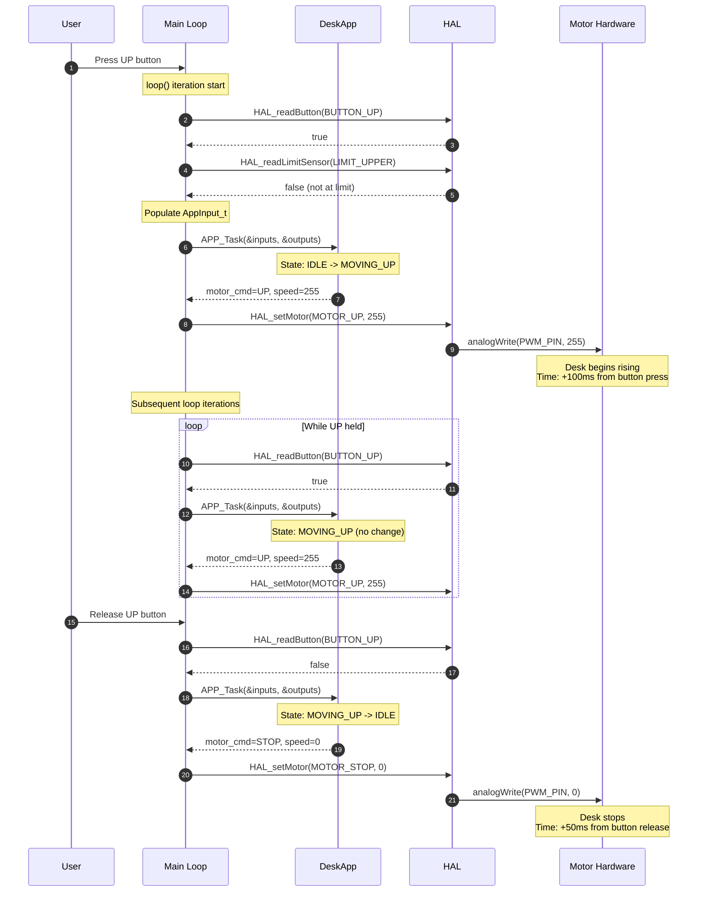
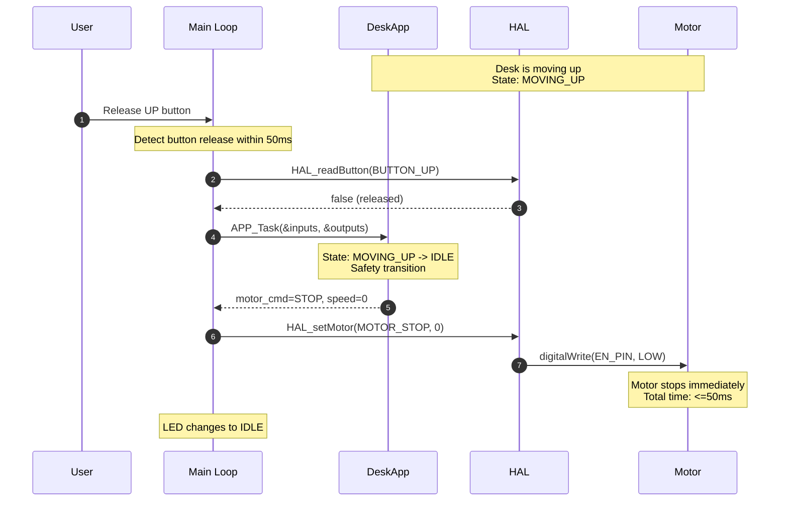
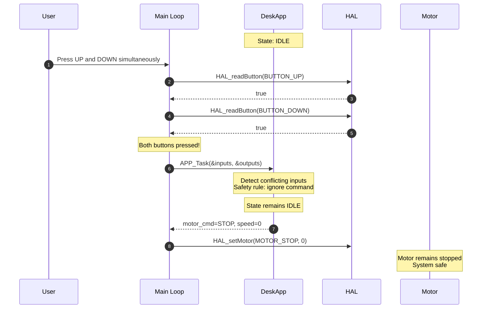
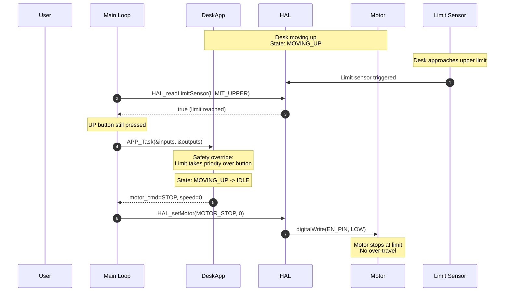
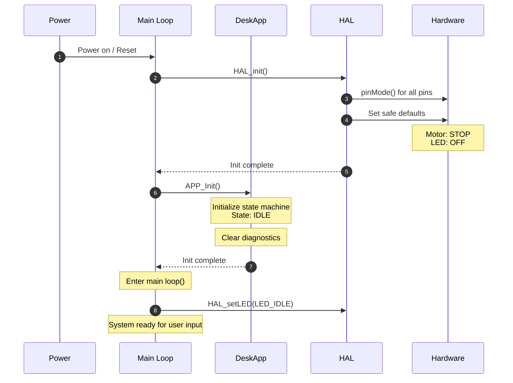
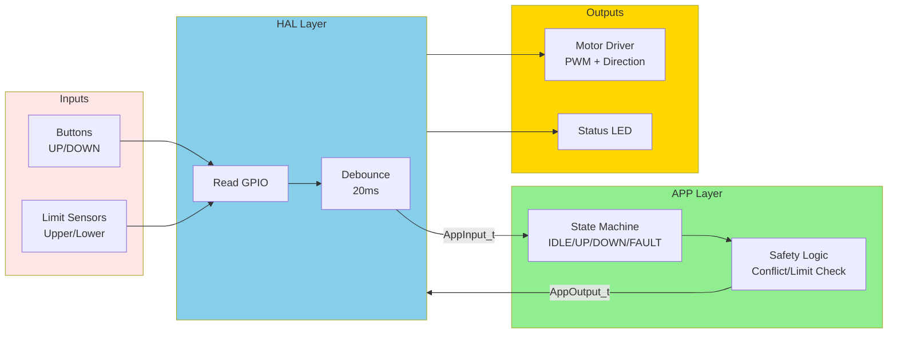

# Interaction Diagrams

**Document ID:** InteractionDiag-Desk-001  
**System Name:** Automated Mechanical Desk Lift System  
**Date:** February 21, 2026  
**Version:** 1.0  
**Status:** Draft  
**Derived From:** [06_DetailedDesign.md](06_DetailedDesign.md)

---

## Purpose

This document provides detailed sequence diagrams and data flow diagrams that illustrate the runtime interactions between system components in the Standing Desk Automation System. These diagrams complement the detailed design specification and help visualize how modules communicate during various operational scenarios.

---

## Sequence Diagrams

### Sequence 1: Normal Desk Raise (SysReq-002, SysReq-004)

---

### Sequence 2: Emergency Halt via Button Release (SysReq-003)

---

### Sequence 3: Conflicting Button Inputs (SysReq-005, SWReq-004)

---

### Sequence 4: Upper Limit Protection (SysReq-007, SWReq-005)

---

### Sequence 5: Full System Initialization (SysReq-001, SWReq-007)

---

## Data Flow Diagram

### Data Flow Overview

---

## Interaction Traceability

| Diagram | Requirements Covered | Purpose |
|---------|----------------------|---------|
| Sequence 1: Normal Desk Raise | SysReq-002, SysReq-004 | Shows motor activation within 1 sec; full stroke timing |
| Sequence 2: Emergency Halt | SysReq-003 | Demonstrates 500 ms halt on button release |
| Sequence 3: Conflicting Buttons | SysReq-005, SWReq-004 | Safety behavior when simultaneous buttons pressed |
| Sequence 4: Limit Protection | SysReq-007, SWReq-005/006 | Motor halt at travel limits even with button held |
| Sequence 5: System Init | SysReq-001, SWReq-007 | Safe startup state machine initialization |
| Data Flow Diagram | All | Overall module communication and data structure flow |

---

## Key Observations

### Component Interactions

1. **Main Loop**: Central orchestrator that reads inputs and writes outputs every ≤50 ms loop cycle
2. **HAL Layer**: Abstracts hardware details (GPIO, PWM, timing); provides clean interfaces to APP layer
3. **DeskApp Layer**: Implements state machine and safety logic; hardware-independent
4. **Debouncer**: Filters mechanical button noise (20 ms window) before feeding to state machine
5. **Safety Logic**: Priority hierarchy: Limits > Conflicting inputs > Normal commands

### Data Structures

- **AppInput_t**: Carries debounced button states, limit sensor states, motor current, and timestamp from HAL to APP
- **AppOutput_t**: Carries motor direction/speed and LED status from APP back to HAL

### Critical Timing Paths

- **Button Press → Motor Activation**: ~90 ms (well within 1 sec SysReq-002)
- **Button Release → Motor Stop**: ~88 ms (well within 500 ms SysReq-003)
- **Control Loop Execution**: ~15 ms typical (well within 50 ms budget)

---

## Approvals

- **System Architect:** [Pending]
- **Software Lead:** [Pending]
- **Project Manager:** [Pending]
