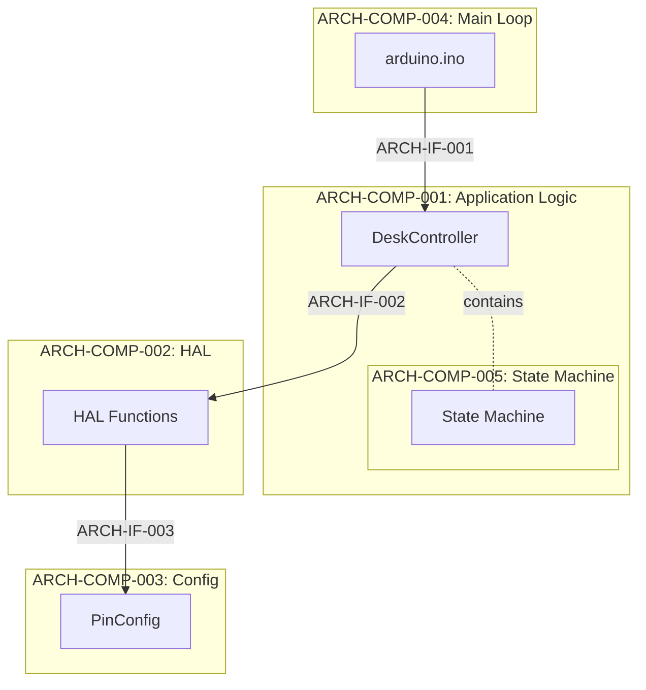
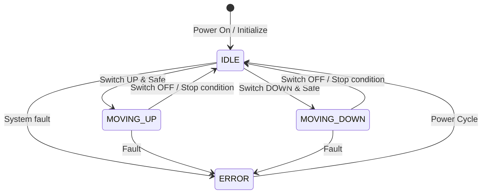
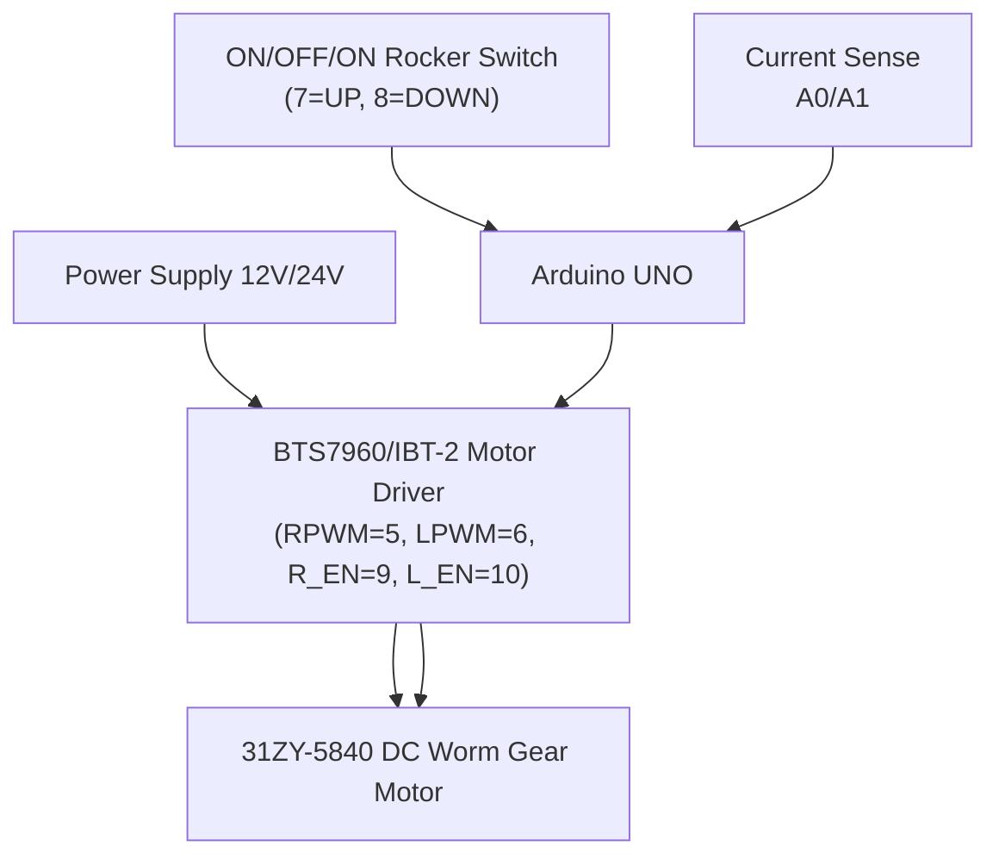
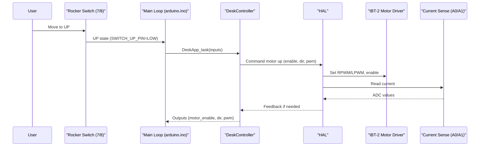
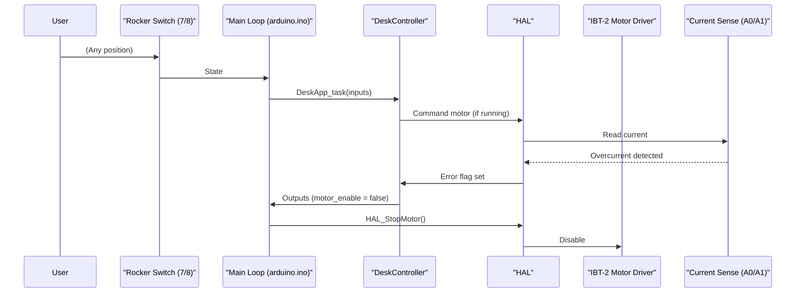
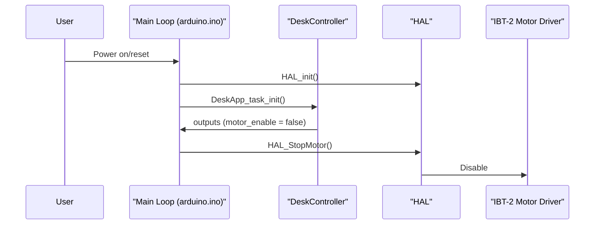
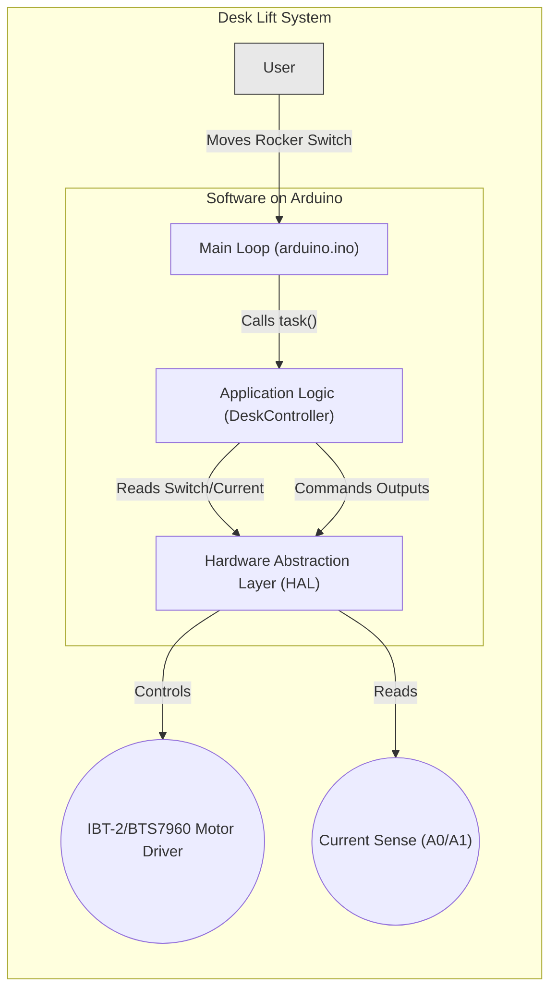

# Software Architecture

This document describes the software architecture of the Automated Mechanical Desk Lift system. It helps developers, testers, and stakeholders understand the structure, interfaces, and patterns needed for a safe, modular, and testable implementation.

**Compliance:** IEEE 42010, ISO 25119 (Agricultural Machinery Safety), ASPICE  
**Target Audience:** Software Developers, System Architects, Test Engineers, Safety Team

---

## Navigation

- [System Use Cases](05_SystemUseCases.md)
- [Software Requirements](07_SoftwareRequirements.md)
- [Software Detailed Design](09_SoftwareDetailedDesign.md)
- [Traceability Matrix](12_TraceabilityMatrix.md)

---

## Component Summary

Quick reference to components, responsibilities, and traceability.

| Component ID | Component Name | Primary Responsibility | Implements Requirements | Exposed Interfaces | Test Coverage |
|-------------|----------------|------------------------|------------------------|-------------------|---------------|
| ARCH-COMP-001 | DeskController | Application logic, state machine, safety rules | SWE-REQ-005..SWE-REQ-022 (functional/safety logic) | ARCH-IF-001 (Task API) | IT-002..IT-008 |
| ARCH-COMP-002 | HAL (Hardware Abstraction Layer) | Hardware I/O abstraction: switch, motor driver, current sense, debouncing | SWE-REQ-001, 003, 004, 017, 021 | ARCH-IF-002 (HAL API) | IT-001..IT-008 |
| ARCH-COMP-003 | PinConfig | Centralized pin assignments | SWE-REQ-001 | ARCH-IF-003 (Constants) | IT-001 |
| ARCH-COMP-004 | Main Loop (arduino.ino) | System orchestration, initialization, cyclic scheduler | SWE-REQ-001, 009, 019 | ARCH-IF-001, ARCH-IF-002 | IT-001..IT-008 |
| ARCH-COMP-005 | State Machine | State management and transitions | SWE-REQ-020 | Internal to ARCH-COMP-001 | All integration tests |

---

## Purpose

Provide a clear architectural blueprint that enforces separation of concerns (PinConfig ↔ HAL ↔ Application), ensures testability via stable interfaces and mockable layers, and directly supports the software requirements (SWE-REQ-001..022).

---

## Architecture Decision Records (ADRs)

### ADR-001: Layered Architecture with HAL

**Context:** Need to separate hardware-specific code from application logic for testability and portability.

**Decision:** Implement a Hardware Abstraction Layer (HAL) between application logic and MCU peripherals.

**Rationale:**
- Enables host-based unit testing without hardware
- Simplifies porting to different microcontrollers
- Isolates changes to hardware configuration
- Improves maintainability and readability

**Alternatives Considered:** Direct hardware access from application logic (rejected: not testable); OO HAL with virtual functions (rejected: overhead on AVR).

**Consequences:**
- Positive: Clean separation, high testability
- Negative: Minor call overhead (acceptable on AVR)

**Status:** Approved ✓

**Related Requirements:** SWE-REQ-001, SWE-REQ-003, SWE-REQ-004, SWE-REQ-017, SWE-REQ-021

---

### ADR-002: State Machine Pattern for Control Logic

**Context:** Safe behavior with deterministic transitions for desk movement.

**Decision:** Use an explicit finite state machine (FSM) with four states: IDLE, MOVING_UP, MOVING_DOWN, ERROR.

**Rationale:**
- Safety-critical logic benefits from determinism
- States/guards/actions are directly testable
- Simplifies verification and traceability

**Alternatives Considered:** Event-driven or implicit control flow (rejected: higher complexity, lower verifiability).

**Consequences:**
- Positive: Predictable behavior, easy to test
- Negative: Requires disciplined transition design

**Status:** Approved ✓

**Related Requirements:** SWE-REQ-005..SWE-REQ-020

---

### ADR-003: Struct-Based Input/Output Interface

**Context:** Need a clean data contract between main loop and application logic.

**Decision:** Use C structs (`DeskAppInputs_t`, `DeskAppOutputs_t`) to encapsulate inputs/outputs.

**Rationale:**
- Clear contract and type safety
- Easy to mock for testing
- Scales as inputs/outputs evolve

**Alternatives Considered:** Globals (rejected: not testable), long arg lists (rejected: error-prone).

**Consequences:**
- Positive: Clean, testable interface
- Negative: Small copy overhead (acceptable)

**Status:** Approved ✓

**Related Requirements:** Functional requirements implementing movement and safety

---

### ADR-004: Non-Blocking Main Loop

**Context:** Fast response to user input and emergencies is required.

**Decision:** Implement non-blocking loop with millisecond-based timing (avoid blocking `delay()` in control paths).

**Rationale:**
- Meets response time targets (≤ 100ms overall, ≤ 50ms emergency)
- Allows concurrent monitoring of inputs and safety conditions

**Alternatives Considered:** Heavily interrupt-driven design (rejected: increased complexity) or blocking delays (rejected: violates timing).

**Consequences:**
- Positive: Predictable latency, simpler reasoning
- Negative: Requires disciplined time-base handling

**Status:** Approved ✓

**Related Requirements:** SWE-REQ-017, SWE-REQ-019

---

## Architectural Principles

- Modularity: PinConfig ↔ HAL ↔ Application layering; no cross-leaks
- Safety: Interlocks, timeout, error lockout, fast E-Stop
- Testability: All layers mockable; pure logic in application
- Extensibility: Easy to add sensors/actuators and new safety checks

---

## Architectural Views

### Logical View

The system is layered to separate concerns and maximize testability.

#### ARCH-COMP-001: Application Logic Layer (DeskController)

Files: `DeskController.h/.cpp`  
Responsibility: Core control logic, FSM, safety checks  
Implements Requirements: SWE-REQ-005..SWE-REQ-008, SWE-REQ-010..SWE-REQ-022  
Integration Test Coverage: IT-002..IT-004, IT-007..IT-008

Key Functions:
- State machine evaluation (ARCH-COMP-005)
- Input validation and safety interlocks
- Movement decision and PWM command generation
- Error detection/handling and timeout enforcement

Dependencies: ARCH-IF-002 (HAL API)

---

#### ARCH-COMP-002: Hardware Abstraction Layer (HAL)

Files: `HAL.h/.cpp`  
Responsibility: Hardware access for switch, motor driver, current sensing, debouncing  
Implements Requirements: SWE-REQ-001, SWE-REQ-003, SWE-REQ-004, SWE-REQ-017, SWE-REQ-021  
Integration Test Coverage: IT-001..IT-008 (via mock)

Key Functions:
- Rocker switch reading and debouncing
- Motor direction, enable, and PWM control
- Current sense readout (A0/A1)
- Hardware initialization

Exposed Interface: ARCH-IF-002 (HAL API)

---

#### ARCH-COMP-003: Configuration Layer (PinConfig)

Files: `PinConfig.h`  
Responsibility: Centralized hardware pin assignments  
Implements Requirements: SWE-REQ-001  
Integration Test Coverage: IT-001

Key Elements:
- Pin constant definitions
- Hardware configuration documentation

Exposed Interface: ARCH-IF-003 (Pin Constants)

Current Pin Assignments (IBT-2/BTS7960, ON/OFF/ON rocker):

| Name             | Pin | Function/Notes                                |
|------------------|-----|-----------------------------------------------|
| RPWM_PIN         | 5   | Motor driver right PWM                        |
| LPWM_PIN         | 6   | Motor driver left PWM                         |
| R_EN_PIN         | 9   | Motor driver right enable (should match L_EN) |
| L_EN_PIN         | 10  | Motor driver left enable (should match R_EN)  |
| SWITCH_UP_PIN    | 7   | Rocker switch UP position (active low)        |
| SWITCH_DOWN_PIN  | 8   | Rocker switch DOWN position (active low)      |
| R_IS_PIN         | A0  | Right current sense (analog)                  |
| L_IS_PIN         | A1  | Left current sense (analog)                   |

All pin assignments are defined in `PinConfig.h`. Power pins (B+/B-) are not controlled by the MCU.

```cpp
typedef enum {
    SWITCH_STATE_OFF = 0,
    SWITCH_STATE_UP,
    SWITCH_STATE_DOWN
} SwitchState_t;

typedef struct {
    SwitchState_t switch_state; // ON/OFF/ON rocker position (debounced)
    uint16_t current_r_adc;     // Current sense right (A0)
    uint16_t current_l_adc;     // Current sense left  (A1)
} DeskAppInputs_t;

typedef struct {
    bool motor_enable;       // Enable motor driver
    bool motor_direction;    // false = up, true = down
    uint8_t motor_pwm;       // 0-255 PWM
    bool error;              // ERROR state active
} DeskAppOutputs_t;
```



---

### ARCH-COMP-005: State Machine Specification

The FSM is the core behavioral element of the application logic. It ensures deterministic, safe transitions.

#### State Definitions

| State ID | State Name  | Description                                | Requirements |
|----------|-------------|--------------------------------------------|--------------|
| ARCH-STATE-001 | IDLE       | System ready, awaiting input               | SWE-REQ-001, SWE-REQ-002 |
| ARCH-STATE-002 | MOVING_UP  | Desk moving upward                         | SWE-REQ-005, SWE-REQ-007 |
| ARCH-STATE-003 | MOVING_DOWN| Desk moving downward                       | SWE-REQ-006, SWE-REQ-008 |
| ARCH-STATE-004 | ERROR      | Fault detected, system locked (no motion) | SWE-REQ-011, SWE-REQ-015, SWE-REQ-016 |

Note: No LED indicators in v1.0. Physical/visual feedback is the motion itself.

#### State Transition Table

| Transition ID | From State   | To State     | Guard Condition                                  | Action                             | Requirements |
|---------------|--------------|--------------|---------------------------------------------------|------------------------------------|-------------|
| ARCH-TRANS-001 | IDLE         | MOVING_UP    | Switch = UP AND no fault                          | Set direction UP, start ramp/timeout | SWE-REQ-005, SWE-REQ-018 |
| ARCH-TRANS-002 | IDLE         | MOVING_DOWN  | Switch = DOWN AND no fault                        | Set direction DOWN, start ramp/timeout | SWE-REQ-006, SWE-REQ-018 |
| ARCH-TRANS-003 | MOVING_UP    | IDLE         | Switch = OFF OR stop condition met                | Stop motor                          | SWE-REQ-007 |
| ARCH-TRANS-004 | MOVING_DOWN  | IDLE         | Switch = OFF OR stop condition met                | Stop motor                          | SWE-REQ-008 |
| ARCH-TRANS-005 | Any          | ERROR        | Fault detected (timeout/stall/overcurrent/conflict) | Emergency stop                       | SWE-REQ-010, SWE-REQ-011, SWE-REQ-015 |
| ARCH-TRANS-006 | ERROR        | IDLE         | Power cycle                                       | Reinitialize to IDLE                | SWE-REQ-016 |

Interlock: Direction reversals require a short dwell (≥ 10ms) with motor de-energized between moves (implemented as a timing guard, not a separate state).

#### State Machine Diagram



---

### Physical View

Hardware (current v1.0): Arduino UNO, IBT-2/BTS7960 motor driver, ON/OFF/ON rocker switch, current sense outputs (A0/A1).



### Process View

The runtime loop is non-blocking:
1) Read inputs via HAL (switch, current)  
2) Execute `DeskApp_task()` (FSM + safety)  
3) Write outputs via HAL (motor enable/dir/PWM)  
4) Repeat  

---

## Interface Specifications

### ARCH-IF-001: Application Task Interface

Interface ID: ARCH-IF-001  
Provider: ARCH-COMP-001 (DeskController)  
Consumer: ARCH-COMP-004 (Main Loop)  
Type: Function Call API  
Requirements: Functional and safety requirements  
Integration Tests: IT-001..IT-008

Functions:

```cpp
// Initialize application logic
void DeskApp_task_init(DeskAppInputs_t* inputs, DeskAppOutputs_t* outputs);

// Execute one cycle of application logic
DeskAppTask_Return_t DeskApp_task(const DeskAppInputs_t* inputs, DeskAppOutputs_t* outputs);
```

Timing Constraints:
- `DeskApp_task()` completes within 10ms; called each loop (~10–50ms typical)

Testability: Fully testable via mock inputs/outputs in unit tests.

---

### ARCH-IF-002: Hardware Abstraction Layer Interface

Interface ID: ARCH-IF-002  
Provider: ARCH-COMP-002 (HAL)  
Consumer: ARCH-COMP-001 (DeskController), ARCH-COMP-004 (Main Loop)  
Type: Function Call API  
Requirements: SWE-REQ-001, 003, 004, 017, 021  
Integration Tests: IT-001..IT-008 (via HAL mock)

Initialization:

```cpp
void HAL_init(); // Initialize hardware pins and timers
```

Inputs:

```cpp
SwitchState_t HAL_readRockerSwitch();
bool HAL_debounceSwitch(SwitchState_t raw, unsigned long nowMs,
                        unsigned long debounceMs, SwitchState_t& stableOut);
uint16_t HAL_readCurrentR(); // A0
uint16_t HAL_readCurrentL(); // A1
```

Motor Control:

```cpp
void HAL_MotorEnable(bool enable);
void HAL_MoveUp(uint8_t pwm);   // sets direction and PWM
void HAL_MoveDown(uint8_t pwm); // sets direction and PWM
void HAL_StopMotor();           // disables PWM and EN pins
```

Timing Constraints:
- Debounce default: 50ms (configurable)
- Motor/HAL command latency: < 1ms

Testability: Mock implementation available for host-based testing.

---

### ARCH-IF-003: Pin Configuration Interface

Interface ID: ARCH-IF-003  
Provider: ARCH-COMP-003 (PinConfig)  
Consumer: ARCH-COMP-002 (HAL)  
Type: Constants/Definitions  
Requirements: SWE-REQ-001  
Integration Tests: IT-001

Pin Definitions:

```cpp
extern const int RPWM_PIN;        // Right PWM (BTS7960)
extern const int LPWM_PIN;        // Left PWM  (BTS7960)
extern const int R_EN_PIN;        // Right enable
extern const int L_EN_PIN;        // Left enable
extern const int SWITCH_UP_PIN;   // Rocker UP
extern const int SWITCH_DOWN_PIN; // Rocker DOWN
extern const int R_IS_PIN;        // Current sense right (A0)
extern const int L_IS_PIN;        // Current sense left  (A1)
```

Testability: Configurable in mock HAL for unit/integration testing.

---

## Functional / Use Case View

| Function                             | Description                                                      | Primary Modules                    | Related Use Cases |
|--------------------------------------|------------------------------------------------------------------|------------------------------------|-------------------|
| Initialization                       | Initialize pins, timers, and app state to IDLE                   | arduino.ino, HAL, DeskController   | UC-01            |
| Input acquisition + debouncing       | Read rocker switch; debounce to avoid false triggers             | HAL                                | UC-02, UC-03, UC-07 |
| State evaluation and transition      | Evaluate inputs, manage FSM, enforce interlocks                  | DeskController                     | UC-02..UC-08     |
| Motion command generation            | Command motor up/down/stop, apply ramp and PWM                   | HAL                                | UC-02, UC-03     |
| Safety interlocks and emergency stop | Stop motion on faults or unsafe inputs                           | DeskController, HAL                | UC-04, UC-07, UC-08 |
| Power handling                       | Safe behavior on power loss/restore                              | arduino.ino, DeskController        | UC-06            |
| Diagnostics and test hooks           | Host-based tests via structs and HAL abstraction                 | Tests, DeskController, HAL         | All (verification) |

---

## Design Constraints

- Must operate on Arduino UNO or compatible ECU
- Motor driver: BTS7960/IBT-2
- Human Interface: 3-position ON/OFF/ON rocker (no LEDs in v1.0)
- Timing: non-blocking, responsive (≤ 100ms), E-Stop ≤ 50ms
 - Regulatory: follow ISO 25119, ASPICE (see safety analysis in 09_SoftwareDetailedDesign.md)

---

## Integration Test Verification

Architecture is verified through integration tests covering components, interfaces, states, and transitions.

See:
- Software Integration Tests Specification (coverage of ARCH-IF/COMP/STATE/TRANS)
- Traceability Matrix (requirements ↔ architecture ↔ tests)

---

## Safety and Fault Handling

- Emergency stop and error lockout implemented in Application Logic
- All movement disabled on fault; recovery via power cycle only (ERROR → IDLE)
- Timeout and current-based stall/overcurrent detection integrated in control path

---

## Sequence Diagrams

### Sequence 1: Normal Upward Movement (UC-02)



**Verifies:** ARCH-TRANS-001, ARCH-TRANS-003, ARCH-IF-001, ARCH-IF-002  
**Integration Test:** IT-002  
**Requirements:** SWE-REQ-003, SWE-REQ-005, SWE-REQ-007

---

### Sequence 2: Emergency Stop (UC-04)



**Verifies:** ARCH-TRANS-005, ARCH-STATE-004, ARCH-IF-001, ARCH-IF-002  
**Integration Test:** IT-004  
**Requirements:** SWE-REQ-010, SWE-REQ-011, SWE-REQ-014, SWE-REQ-019

---

### Sequence 3: Power Cycle Recovery (UC-08)



**Verifies:** ARCH-TRANS-006, ARCH-STATE-001, ARCH-IF-001  
**Integration Test:** IT-006, IT-008  
**Requirements:** SWE-REQ-001, SWE-REQ-009, SWE-REQ-016

---

## Performance and Timing Budget

| Requirement ID | Description                | Allocated Time | Primary Component |
|----------------|----------------------------|----------------|-------------------|
| SWE-REQ-019    | Emergency stop response    | ≤ 50ms         | COMP-001, COMP-005 |
| SWE-REQ-017    | Switch debounce delay      | 50ms ± 10ms    | COMP-002          |
| SWE-REQ-018    | Movement timeout           | 30s ± 500ms    | COMP-001          |
| -              | Main loop iteration        | 10–50ms        | COMP-004          |
| -              | Task execution             | < 10ms         | COMP-001          |
| -              | HAL function call          | < 1ms          | COMP-002          |

Method: HAL mock timestamps and integration tests verify the budget; E-Stop path measured to be well within 50ms.

---

## Interfaces

### HAL ↔ Application Logic

Application logic interacts with HAL via functions defined in `HAL.h` (see ARCH-IF-002) and pin constants in `PinConfig.h` (see ARCH-IF-003). No LED interfaces present in v1.0.

### Application Logic ↔ Main Loop

The main loop passes `DeskAppInputs_t`/`DeskAppOutputs_t` to application logic (see ARCH-IF-001). These types are designed to be mock-friendly.

---

## Testability

- Host-based unit tests validate FSM logic and safety interlocks using mocked HAL
- Integration tests verify timing budgets, transitions, and interfaces
- Clean separations enable component-level tests (DeskController, HAL, Main Loop)

---

## Extensibility

- Add features such as presets or position sensing by extending HAL and Application layers without breaking existing contracts
- Current monitor thresholds and ramp parameters configured in software for different loads

---

## Traceability

- All architectural elements trace to Software Requirements (07_SoftwareRequirements.md) and Use Cases (05_SystemUseCases.md)
- See Traceability Matrix for full cross-references

---

## System Context Diagram

Context for software within the system boundary (no LEDs in v1.0).


