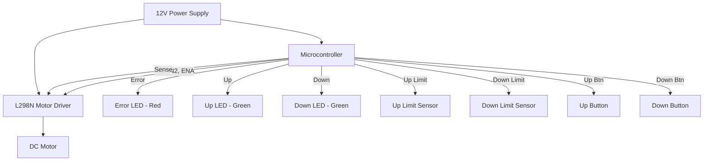
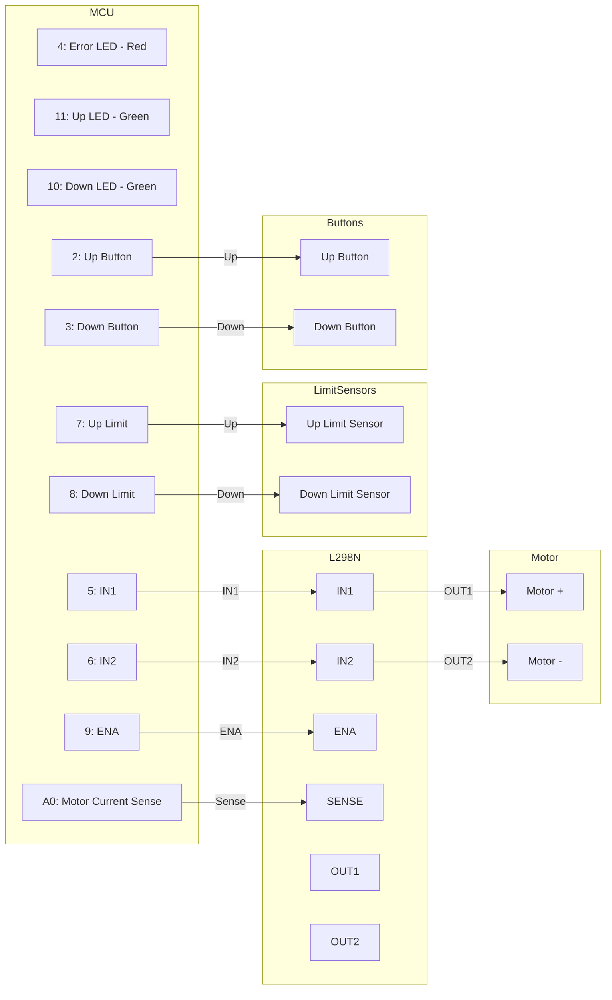

# Hardware Documentation

## Component Descriptions

### 1. Microcontroller
- **Type:** Arduino-compatible (e.g., Arduino Uno/Nano)
- **Purpose:** Main controller for desk automation logic, motor control, and safety monitoring.

### 2. Motor Driver
- **Type:** L298N Dual H-Bridge
- **Purpose:** Drives the DC motor for desk lift/lower operations.
- **Key Pins:** IN1, IN2 (direction), ENA (PWM speed control)

### 2.1 Motor Current Sense
- **Type:** Shunt resistor on L298N SENSE pins
- **Purpose:** Measures motor current for stuck-on/runaway detection.
- **Notes:** Routed to MCU ADC input via RC filter as needed.

### 3. DC Motor
- **Type:** JGY-370 12V 30RPM (High-torque geared motor)
- **Purpose:** Raises and lowers the desk.

### 4. Push Buttons
- **Up Button:** User input to raise the desk.
- **Down Button:** User input to lower the desk.
- **Purpose:** Manual control of desk movement.

### 5. Resistors
- **Type:** 220Ω current-limiting resistors for LEDs and pull-up/pull-down resistors for buttons.
- **Purpose:** Protect LEDs from overcurrent and ensure stable button readings.
- **Placement:** Between MCU pins and LEDs, and for button signal conditioning.

### 6. Limit Sensors
- **Type:** KW11-3Z-5 micro switch
- **Up Limit Sensor:** Detects when the desk is at its highest safe position.
- **Down Limit Sensor:** Detects when the desk is at its lowest safe position.
- **Purpose:** Prevents overdriving the motor and ensures safe operation.

### 7. LEDs
- **Error Indicator LED (Red):** Onboard or external, signals error states.
- **Up Movement LED (Green):** Indicates desk moving up.
- **Down Movement LED (Green):** Indicates desk moving down.

### 8. Power Supply
- **Type:** 12V DC (sized for motor current, minimum 2A recommended for JGY-370)
- **Purpose:** Powers motor and logic circuits.

---

## Schematics

### System Overview

### Pin Mapping

---

## Pins & Notes

| Function                | Arduino Pin | L298N Pin | Notes                                 |
|------------------------|-------------|-----------|---------------------------------------|
| Error Indicator LED (Red) | 4         | -         | Onboard LED, signals error states      |
| Up Movement LED (Green)   | 11        | -         | Indicates desk moving up (with resistor) |
| Down Movement LED (Green) | 10        | -         | Indicates desk moving down (with resistor) |
| Motor IN1               | 5           | IN1       | Motor direction control                |
| Motor IN2               | 6           | IN2       | Motor direction control                |
| Motor ENA (PWM)         | 9           | ENA       | Motor speed control (PWM)              |
| Motor Current Sense     | A0          | SENSE     | Shunt resistor to ADC for current sense |
| Up Limit Sensor         | 7           | -         | Detects desk at upper limit (KW11-3Z-5) |
| Down Limit Sensor       | 8           | -         | Detects desk at lower limit (KW11-3Z-5) |
| Up Button               | 2           | -         | User input: raise desk (with resistor)  |
| Down Button             | 3           | -         | User input: lower desk (with resistor)  |
| Motor Power             | -           | 12V, GND  | Connect to 12V DC supply (JGY-370)     |

**Notes:**
- All hardware access is abstracted via the HAL layer in software.
- Limit sensors (KW11-3Z-5) must be installed and tested to ensure safe operation and prevent mechanical overrun.
- Current-limiting resistors (220Ω) are required between MCU pins and LEDs to prevent overcurrent.
- Pull-up or pull-down resistors (10kΩ) are recommended for push buttons to ensure stable readings.
- Motor: JGY-370 12V 30RPM requires adequate current supply (2A+ recommended).
- Motor current sense uses L298N SENSE pins with shunt resistor to MCU ADC (A0).
- Ensure correct power supply polarity and current rating for the motor.
- Use proper wire gauge for motor and power connections.
- For safety, add fuses and ESD protection as needed.
- See `schematics/` for KiCad files and detailed PCB layouts.

---

## Bill of Materials (BOM)

| Component | Part Number/Type | Quantity | Purpose |
|-----------|-----------------|----------|---------|
| Microcontroller | Arduino Uno/Nano | 1 | Main controller |
| Motor Driver | L298N Dual H-Bridge | 1 | Motor control |
| DC Motor | JGY-370 12V 30RPM | 1 | Desk actuation |
| Limit Switch | KW11-3Z-5 | 2 | Upper and lower limit detection |
| Push Button | Momentary switch | 2 | Up/Down user input |
| LED (Red) | 5mm LED | 1 | Error indicator |
| LED (Green) | 5mm LED | 2 | Up/Down movement indicators |
| Resistor (220Ω) | 1/4W resistor | 3 | LED current limiting |
| Resistor (10kΩ) | 1/4W resistor | 4 | Button pull-up/down |
| Shunt Resistor | 0.5Ω, 2W | 1 | Motor current sense (L298N SENSE) |
| Power Supply | 12V DC, 2A+ | 1 | System power |
| Fuse | 2A fast-blow | 1 | Overcurrent protection |
| Wire (Power) | 18-20 AWG | As needed | Motor and power connections |
| Wire (Signal) | 22-24 AWG | As needed | Signal connections |
| Terminal Blocks | Screw terminal | 2-3 | Power and motor connections |
| Enclosure | Project box | 1 | Housing and protection |

**Notes:**
- Part numbers may vary by supplier
- Purchase 10% extra resistors and LEDs for replacements
- Ensure power supply is rated for continuous operation

---

## Power Specifications

### Voltage Requirements

| Component | Voltage | Notes |
|-----------|---------|-------|
| Arduino | 5V (7-12V input) | Regulated via onboard regulator |
| L298N Logic | 5V | Powered from Arduino 5V |
| L298N Motor Drive | 12V | Direct from power supply |
| JGY-370 Motor | 12V nominal | Operating range: 10-14V |
| LEDs | ~2V forward drop | Current limited via 220Ω resistors |

### Current Draw Calculations

| Component | Current Draw | Notes |
|-----------|-------------|-------|
| Arduino (MCU) | 50 mA | Including I/O pins |
| L298N Quiescent | 15 mA | Logic and driver circuits |
| JGY-370 Motor (no load) | 200 mA | Idle spinning |
| JGY-370 Motor (loaded) | 800-1500 mA | Under typical desk load |
| JGY-370 Motor (stall) | 2000 mA | Maximum, should be avoided |
| LEDs (3x active) | 60 mA | 3 LEDs × 20 mA each |
| Limit Switches | < 1 mA | Negligible |
| Push Buttons | < 1 mA | Negligible |
| **Total (typical)** | **~900-1600 mA** | During normal operation |
| **Total (maximum)** | **~2100 mA** | Worst case with motor stall |

### Power Supply Sizing

**Recommended:** 12V DC, 2.5A (30W) power supply
- Provides 20% safety margin above maximum current draw
- Ensures stable operation under all load conditions
- Prevents voltage sag during motor startup

**Minimum:** 12V DC, 2A (24W) power supply
- Meets basic requirements
- May experience voltage drops under heavy load

**Notes:**
- Use regulated power supply with ripple < 100mV
- Include 2A fast-blow fuse for overcurrent protection
- Add 1000µF electrolytic capacitor near motor driver for transient suppression

---

## Mechanical Specifications

### Component Dimensions

| Component | Dimensions (L × W × H) | Mounting |
|-----------|------------------------|----------|
| Arduino Uno | 68.6 × 53.4 × 15 mm | 4× M3 mounting holes |
| Arduino Nano | 45 × 18 × 7 mm | Pin headers or breadboard |
| L298N Module | 43 × 43 × 27 mm | 4× M3 mounting holes |
| JGY-370 Motor | 37 × 20 × 20 mm (body) | M3 mounting bracket |
| KW11-3Z-5 Switch | 28 × 16 × 10 mm | Screw or snap mount |
| Push Button | 12 × 12 × 7 mm | Panel mount, 12mm hole |

### Mounting Hole Patterns

**Arduino Uno:**
- Hole spacing: 50.8 × 15.2 mm, 48.3 × 2.5 mm
- Hole diameter: 3.2 mm (for M3 screws)

**L298N Module:**
- Hole spacing: 37 × 37 mm (square pattern)
- Hole diameter: 3.2 mm (for M3 screws)

**Motor Mount:**
- Custom bracket required for desk integration
- Recommend aluminum or steel bracket with vibration dampening
- Ensure motor shaft alignment with desk mechanism

### Enclosure Requirements

**Minimum Internal Dimensions:** 150 × 100 × 60 mm
- Allows clearance for all components with wire routing

**Recommended Enclosure:**
- Type: ABS or polycarbonate project box
- Size: 200 × 150 × 75 mm
- Features:
  - Ventilation slots for heat dissipation
  - Mounting bosses for internal components
  - Cable glands for external connections (motor, power, buttons)
  - Access panel for USB programming

**Panel Cutouts:**
- 2× Push buttons: 12 mm diameter holes
- 3× LEDs: 5 mm diameter holes (with bezels)
- 1× Power jack: Per connector specifications
- 1× Motor cable: 15-20 mm grommet
- Optional: Arduino USB access port

**Mounting:**
- Enclosure should be mounted in accessible location
- Avoid areas with excessive vibration or heat
- Ensure adequate ventilation around enclosure
- Use vibration-dampening mounts if necessary

**Environmental Protection:**
- Minimum: IP20 (indoor use, protected from solid objects)
- Recommended: IP40 (better dust protection)
- Not rated for outdoor or wet environments without additional sealing
