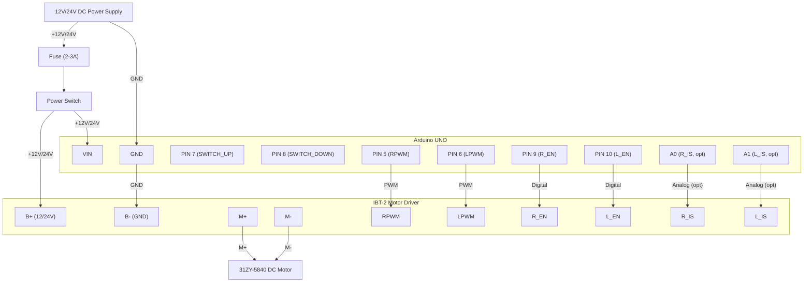
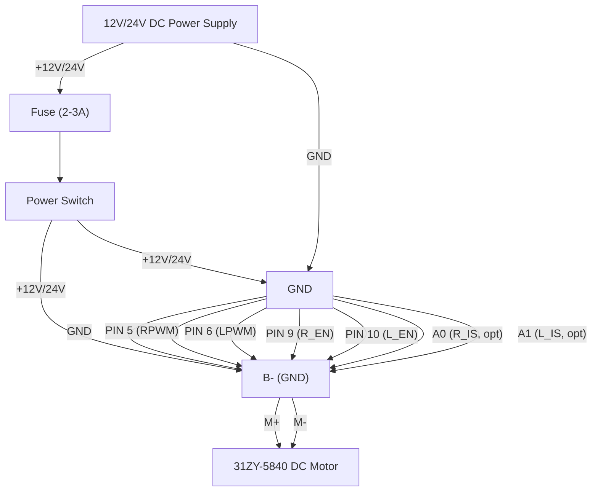

# Hardware Schematic & Wiring Guide

**Purpose:** Visual and textual reference for hardware connections in the Automated Mechanical Desk Lift system.

**Referenced documents:**
- [Schematic.md](Schematic.md) — detailed pin assignments and component specifications
- [PinConfig.h](../source/arduino/PinConfig.h) — software pin definitions

---

## Overview

This document provides:
1. A visual schematic (SVG) showing connections between Arduino UNO, IBT-2 motor driver, DC motor, and power supply.
2. A quick-reference wiring checklist.
3. Safety and grounding requirements.

---

## Schematic Diagram

**Key connections shown (BTS7960/IBT-2):**
- Arduino switch inputs (PIN 7, 8) → Rocker switch (ON/OFF/ON)
- Arduino → BTS7960/IBT-2 motor driver (control signals: RPWM, LPWM, R_EN, L_EN)
- BTS7960 → DC Worm Gear Motor (M+, M-)
- BTS7960 Power: B+ (12V/24V), B- (Power GND)
- Common ground connection (Arduino GND, BTS7960 GND, Power GND)

---

## Mermaid Wiring Diagram (Minimal System)

---

## Quick Wiring Checklist (BTS7960/IBT-2)

| Connection         | From           | To                | Notes |
|--------------------|----------------|-------------------|-------|
| **Motor Control**  | Arduino PIN 5 (PWM) | BTS7960 RPWM      | Motor direction/speed (Right PWM) |
|                    | Arduino PIN 6 (PWM) | BTS7960 LPWM      | Motor direction/speed (Left PWM) |
|                    | Arduino PIN 9       | BTS7960 R_EN      | Right Enable (tied to LEFT EN for safety) |
|                    | Arduino PIN 10      | BTS7960 L_EN      | Left Enable (tied to RIGHT EN for safety) |
| **Switch Input**   | Rocker Switch UP    | Arduino PIN 7     | ON/OFF/ON switch upper position |
|                    | Rocker Switch DOWN  | Arduino PIN 8     | ON/OFF/ON switch lower position |
|                    | Arduino A0     | BTS7960 R_IS      | (Optional) Current sense |
|                    | Arduino A1     | BTS7960 L_IS      | (Optional) Current sense |
| **Motor Power**    | Power +12V/24V | BTS7960 B+        | Motor supply |
|                    | Power GND      | BTS7960 B-        | Motor supply GND |
|                    | BTS7960 M+     | Motor terminal 1  | High-current path |
|                    | BTS7960 M-     | Motor terminal 2  | High-current path |
|                    |                |                   |                                |
| **Ground**         | Arduino GND    | BTS7960 GND       | **CRITICAL: Common ground** |
|                    | BTS7960 GND    | Power GND         | **CRITICAL: Common ground** |

---

## Critical Safety & Grounding Requirements

⚠️ **Common Ground:** Arduino GND, IBT-2 GND, and battery negative MUST be connected together. Failure to establish common ground can cause:
- Erratic motor behavior
- Damaged components
- Unreliable sensor readings

⚠️ **Motor Power Isolation:** Motor power (battery +) must NOT be routed through the Arduino. The Arduino 5V pin cannot supply sufficient current for the motor.

⚠️ **Fusing:** Add an inline fuse (2–3A recommended) between battery and IBT-2 Vmotor to protect against overcurrent faults.

⚠️ **Wiring Safety:** Always disconnect battery before making wiring changes. Double-check polarity before powering on.

---

## Pin Assignment Summary (BTS7960/IBT-2)

Refer to [PinConfig.h](../source/arduino/PinConfig.h) for software definitions.

| Arduino Pin | Function/Signal      | Connected To         | Description                       |
|-------------|----------------------|---------------------|-----------------------------------|
| 5           | RPWM (Right PWM)     | IBT-2 RPWM          | Motor speed/direction PWM (right) |
| 6           | LPWM (Left PWM)      | IBT-2 LPWM          | Motor speed/direction PWM (left)  |
| 7           | SWITCH_UP (Input)    | Rocker Switch UP    | ON/OFF/ON switch input (up)       |
| 8           | SWITCH_DOWN (Input)  | Rocker Switch DOWN  | ON/OFF/ON switch input (down)     |
| 9           | R_EN (Right Enable)  | IBT-2 R_EN           | Enable right half-bridge          |
| 10          | L_EN (Left Enable)   | IBT-2 L_EN           | Enable left half-bridge           |
| A0          | R_IS (Right Sense)   | IBT-2 R_IS (analog)  | Current sense (right, optional)   |
| A1          | L_IS (Left Sense)    | IBT-2 L_IS (analog)  | Current sense (left, optional)    |
| VIN         | Power Input          | 12V/24V DC Supply    | Main power input                  |
| GND         | Ground               | Common ground        | System ground                     |

---

## Component Specifications (DeskHigh torque branch)

| Component        | Model / Type                | Notes |
|------------------|----------------------------|-------|
| Microcontroller  | Arduino UNO (ATmega328P)   | 5V logic, 16 MHz |
| Motor Driver     | BTS7960 / IBT-2 H-Bridge   | Dual half-bridge, supports high current |
| Motor            | 31ZY-5840 DC Worm Gear     | 12V/24V, 10 RPM, high torque |
| Power Supply     | 12V or 24V DC, 5A+         | Match motor voltage rating |
|                  |                            |                     |

---

## Power Section (No Battery)

| Connection         | From               | To             | Notes                                 |
|--------------------|--------------------|----------------|---------------------------------------|
| **Power**          | 12V/24V DC Supply (+) | Arduino VIN    | Powers Arduino (regulated to 5V)      |
|                    | 12V/24V DC Supply (+) | ON/OFF Switch  | Fuse recommended (2–3A)               |
|                    | Switch output         | IBT-2 B+       | Motor power                           |
| **Ground**         | 12V/24V Supply (−)    | Arduino GND    | Common ground                         |
|                    | Arduino GND           | IBT-2 B-       | Common ground                         |

**v1.0 Hardware Configuration (Minimal Rocker Switch):**
- Arduino UNO (ATmega328P, 5V logic)
- 31ZY-5840 DC Worm Gear Motor (12V/24V, high torque)
- IBT-2/BTS7960 H-Bridge Motor Driver
- 12V or 24V DC supply (5A+ recommended)
- ON/OFF/ON Rocker switch (3-position, center-off)
- Connect RPWM (PIN 5) / LPWM (PIN 6) to IBT-2 PWM inputs
- Connect R_EN (PIN 9) / L_EN (PIN 10) to IBT-2 enable inputs (tied together for safety)
- Connect switch inputs (PIN 7, 8) to rocker switch terminals
- Optionally connect R_IS/L_IS to Arduino A0/A1 for current sensing
- **CRITICAL:** Maintain common ground between all components

---

## Additional Resources

- **Pin Configuration:** [PinConfig.h](../source/arduino/PinConfig.h) — Software pin definitions
- **Hardware Abstraction Layer:** [HAL.h](../source/arduino/HAL.h) / [HAL.cpp](../source/arduino/HAL.cpp)
- **Software Architecture:** [SoftwareArchitecture.md](SoftwareArchitecture.md)
- **Bill of Materials (BOM):** See project README
- **Testing procedures:** [SoftwareIntegrationTestsSpecification.md](SoftwareIntegrationTestsSpecification.md)
- **BTS7960/IBT-2 datasheet:** [Motor Driver Reference](https://www.electronicwings.com/nodemcu/bts7960-motor-driver-interfacing-with-nodemcu)

---

## Next Steps

- Verify all connections against this schematic before powering on.
- Run smoke tests (see [Integration Tests](../tests/IntegrationTests.cpp)).
- If wiring issues occur, check common ground and motor power routing first.

---

*For questions or to report schematic errors, open an issue or contact the project maintainers.*