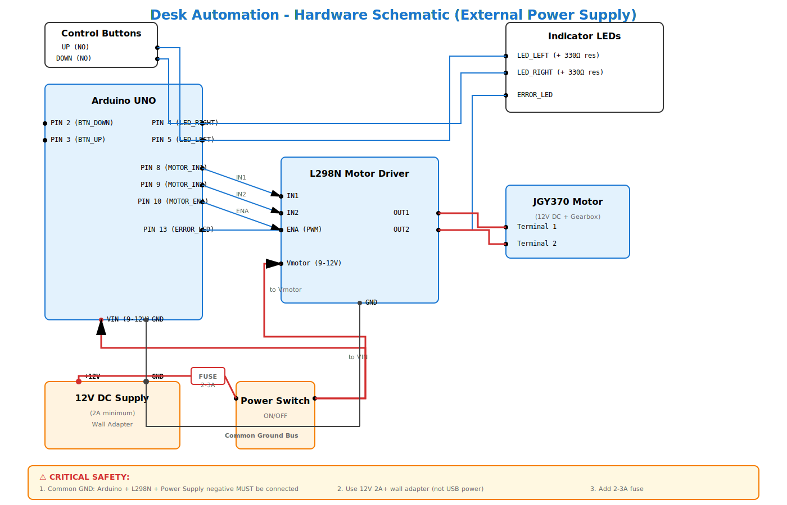

# Hardware Schematic & Wiring Guide

**Purpose:** Visual and textual reference for hardware connections in the Automated Mechanical Desk Lift system.

**Referenced documents:**
- [HardwareConnections.md](HardwareConnections.md) — detailed pin assignments and component specifications
- [PinConfig.h](../source/arduino/PinConfig.h) — software pin definitions

---

## Overview

This document provides:
1. A visual schematic (SVG) showing connections between Arduino UNO, L298N motor driver, DC motor, power supply, buttons, and LEDs.
2. A quick-reference wiring checklist.
3. Safety and grounding requirements.

---

## Schematic Diagram

**Key connections shown:**
- Arduino → L298N motor driver (control signals: ENA, IN1, IN2)
- L298N → JGY370 DC Motor (OUT1, OUT2)
- Battery → ON/OFF Switch → L298N motor power (Vmotor)
- Buttons (UP, DOWN) → Arduino digital inputs
- Indicator LEDs (LEFT, RIGHT, ERROR) → Arduino digital outputs
- Common ground connection (Arduino GND, L298N GND, Battery negative)

---

## Quick Wiring Checklist

| Connection | From | To | Notes |
|---|---|---|---|
| **Motor Control** | Arduino PIN 10 (ENA) | L298N ENA | PWM signal for motor speed |
| | Arduino PIN 8 (IN1) | L298N IN1 | Direction control |
| | Arduino PIN 9 (IN2) | L298N IN2 | Direction control |
| **Motor Power** | Battery positive | ON/OFF Switch | Add fuse (recommended) |
| | Switch output | L298N Vmotor | **Do NOT route through Arduino** |
| | L298N OUT1 | Motor terminal 1 | High-current path |
| | L298N OUT2 | Motor terminal 2 | High-current path |
| **User Input** | Button UP | Arduino PIN 3 | Pull-down or internal pull-up |
| | Button DOWN | Arduino PIN 2 | Pull-down or internal pull-up |
| **Visual Feedback** | Arduino PIN 5 | LED LEFT | Add current-limiting resistor |
| | Arduino PIN 4 | LED RIGHT | Add current-limiting resistor |
| | Arduino PIN 13 | ERROR LED | Built-in LED on UNO |
| **Ground** | Arduino GND | L298N GND | **CRITICAL: Common ground** |
| | L298N GND | Battery negative | **CRITICAL: Common ground** |

---

## Critical Safety & Grounding Requirements

⚠️ **Common Ground:** Arduino GND, L298N GND, and battery negative MUST be connected together. Failure to establish common ground can cause:
- Erratic motor behavior
- Damaged components
- Unreliable sensor readings

⚠️ **Motor Power Isolation:** Motor power (battery +) must NOT be routed through the Arduino. The Arduino 5V pin cannot supply sufficient current for the motor.

⚠️ **Fusing:** Add an inline fuse (2–3A recommended) between battery and L298N Vmotor to protect against overcurrent faults.

⚠️ **Wiring Safety:** Always disconnect battery before making wiring changes. Double-check polarity before powering on.

---

## Pin Assignment Summary

Refer to [PinConfig.h](../source/arduino/PinConfig.h) for software definitions.

| Arduino Pin | Function | Connected To |
|---|---|---|
| 2 | BTN_DOWN | Button (DOWN) |
| 3 | BTN_UP | Button (UP) |
| 4 | LED_RIGHT | Indicator LED |
| 5 | LED_LEFT | Indicator LED |
| 8 | MOTOR_IN1 | L298N IN1 |
| 9 | MOTOR_IN2 | L298N IN2 |
| 10 | MOTOR_ENA | L298N ENA (PWM) |
| 13 | ERROR_LED | Built-in LED / External error LED |
| GND | Ground | Common ground (L298N, battery) |

---

## Component Specifications

| Component | Model / Type | Notes |
|---|---|---|
| Microcontroller | Arduino UNO (ATmega328P) | 5V logic, 16 MHz |
| Motor Driver | L298N Dual H-Bridge | Supports up to 2A per channel |
| Motor | JGY370 DC Motor with Gearbox | 12V nominal, check stall current |
| Power Supply | 9–12V Battery | Match motor voltage rating |
| Buttons | Momentary push buttons | NO (Normally Open) |
| LEDs | Standard 5mm LEDs | Add 220Ω–330Ω resistors |

---

## Modified Power Section (No Battery)

| Connection | From | To | Notes |
|---|---|---|---|
| **Shared Power** | 12V DC Supply (+) | Arduino VIN | Powers Arduino (regulated to 5V internally) |
| | 12V DC Supply (+) | ON/OFF Switch | Fuse recommended (2–3A) |
| | Switch output | L298N Vmotor | Motor power |
| **Ground** | 12V Supply (−) | Arduino GND | Common ground |
| | Arduino GND | L298N GND | Common ground |

**Required hardware changes:**
- Replace 9V battery with 12V 2A DC barrel jack power supply
- Add 2.1mm barrel jack connector to Arduino VIN and L298N Vmotor (via switch)
- Maintain common ground between all components

---

## Additional Resources

- **Detailed wiring and troubleshooting:** [HardwareConnections.md](HardwareConnections.md)
- **Bill of Materials (BOM):** See project README
- **Testing procedures:** [SoftwareIntegrationTestsSpecification.md](SoftwareIntegrationTestsSpecification.md)

---

## Next Steps

- Verify all connections against this schematic before powering on.
- Run smoke tests (see [Integration Tests](../tests/IntegrationTests.cpp)).
- If wiring issues occur, check common ground and motor power routing first.

---

*For questions or to report schematic errors, open an issue or contact the project maintainers.*