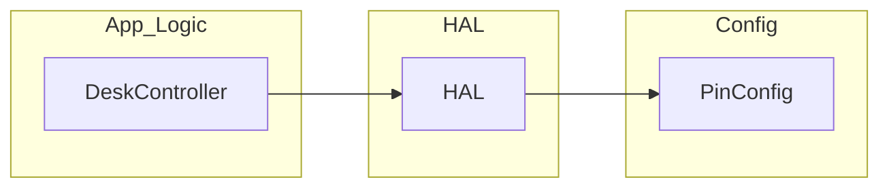
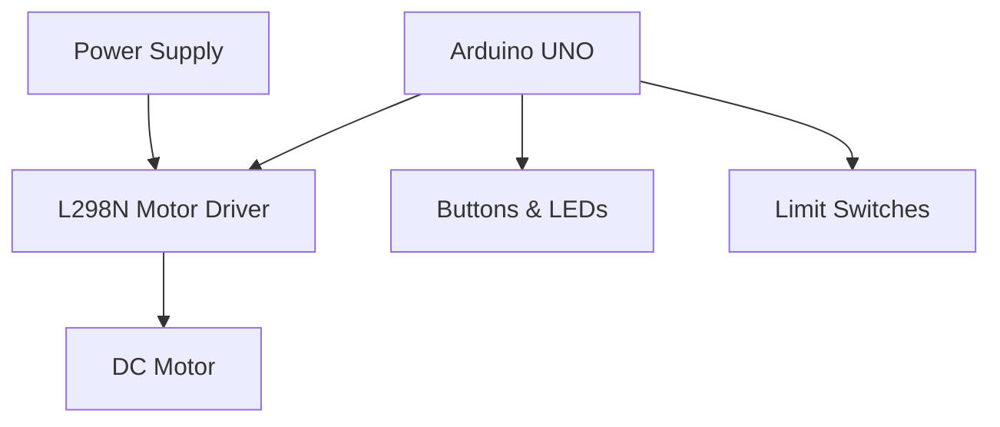
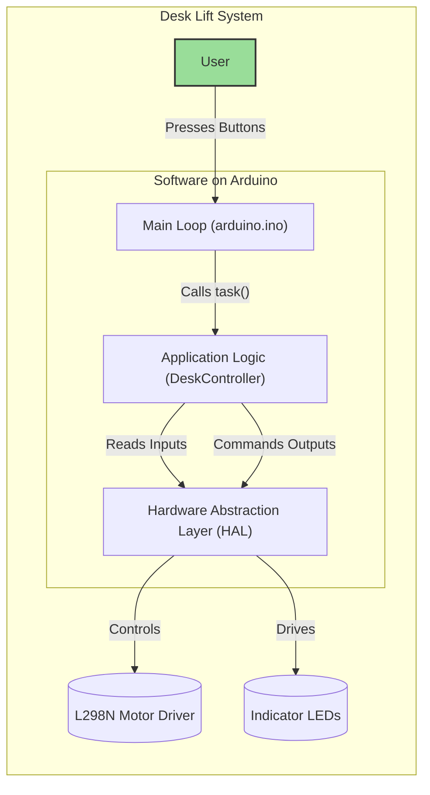

# Software Architecture

This document describes the architecture of the Automated Mechanical Desk Lift system. It is designed to help developers, testers, and stakeholders understand the structure, principles, and key components for safe, modular, and maintainable development.

---

## Navigation

- [System Use Cases](SystemUseCases.md)
- [Software Requirements](SoftwareRequirements.md)
- [Software Detailed Design](SoftwareDetailedDesign.md)
- [Traceability Matrix](TraceabilityMatrix.md)

---

## Purpose

The purpose of this document is to provide a comprehensive architectural blueprint for the Automated Mechanical Desk Lift software. It is intended for software developers, system testers, and project managers. This document answers key questions about the system's structure, its core components, the principles guiding its design, and how it satisfies functional and non-functional requirements.

---

## Architectural Principles

- **Modularity:** Separation of hardware abstraction, control logic, and configuration.
- **Safety:** Fault detection, error handling, and safe state transitions.
- **Testability:** Host-based unit testing and clear interfaces.
- **Extensibility:** Support for future hardware and feature enhancements.

---

## Architectural Views

This section describes the system from different perspectives, following the "4+1" architectural model.

### Logical View
The logical view describes the system's structure in terms of its key software modules and their responsibilities. The architecture is layered to separate concerns.

- **Application Logic Layer (`DeskController.h/.cpp`):** The core of the system. It contains the state machine (IDLE, MOVING_UP, etc.), processes inputs, and makes decisions based on system rules. It is completely decoupled from the hardware.
- **Hardware Abstraction Layer (HAL) (`HAL.h/.cpp`):** Provides a consistent interface to the hardware. It abstracts the details of controlling the motor driver, reading buttons (including debouncing), and driving LEDs.
- **Configuration Layer (`PinConfig.h`):** A single point of configuration for all hardware pin assignments. Changes to wiring are isolated to this file.
- **Entry Point (`arduino.ino`):** Initializes the system and runs the main non-blocking loop, orchestrating calls between the application logic and the HAL.



### Physical View
The physical view describes the system's hardware components and their physical connections.

- **ECU:** Arduino UNO (or compatible).
- **Motor Driver:** L298N (IN1, IN2, ENA/PWM).
- **Actuator:** DC motor/gearbox driving desk lift.
- **Human Interface:** Up/Down buttons; indicator LEDs (Up, Down, Error).
- **Sensors:** Upper and lower limit switches.
- **Power:** Regulated supply (logic + motor power rails).



### Process View
The process view describes the system's runtime behavior. The system operates on a continuous, non-blocking loop within `arduino.ino`.
1.  **Read Inputs:** The loop reads the state of all hardware inputs (buttons, limit switches) via the HAL.
2.  **Execute Logic:** The collected inputs are passed to the `DeskApp_task` function in the `DeskController`. The state machine is evaluated, and a set of outputs is determined.
3.  **Write Outputs:** The main loop takes the outputs from the application logic and commands the HAL to update the hardware state (motor, LEDs).
4.  **Repeat:** The loop repeats, ensuring constant responsiveness to user input and system state changes.

### Functional / Use Case View
This view breaks down the system by its core functions and maps them to the modules that implement them and the use cases they satisfy.

| Function                             | Description                                                      | Primary Modules                                  | Related Use Cases   |
| ------------------------------------ | ---------------------------------------------------------------- | ------------------------------------------------ | ------------------- |
| Initialization                       | Initialize pins, outputs, and app state to IDLE                  | arduino.ino, HAL, DeskController                 | UC-01               |
| Input acquisition + debouncing       | Read buttons/limits; debounce buttons to avoid false triggers    | HAL (`HAL_readButton`, `HAL_debounceButton`) | UC-02, UC-03, UC-07 |
| State evaluation and transition      | Evaluate inputs, manage state machine, enforce rules             | DeskController                                   | UC-02..UC-08        |
| Motion command generation            | Command motor up/down/stop, apply direction and speed            | HAL (`HAL_MoveUp/Down`, `HAL_StopMotor`)     | UC-02, UC-03        |
| Safety interlocks and emergency stop | Stop motion on faults or unsafe inputs; handle dual-button press | DeskController, HAL                              | UC-04, UC-07, UC-08 |
| Dwell management                     | Enforce pause before reversal to protect hardware                | DeskController                                   | UC-02, UC-03        |
| Indicators and HMI                   | Drive LEDs for UP/DOWN/ERROR and status                          | HAL (LED setters/blinkers)                       | UC-02, UC-03, UC-05 |
| Power handling                       | Safe behavior on power loss/restore                              | arduino.ino, DeskController                      | UC-06               |
| Diagnostics and test hooks           | Host-based tests via structs and HAL abstraction                 | Tests, DeskController, HAL                       | All (verification)  |

---

## Design Constraints

- Must operate on Arduino UNO or compatible ECU
- Motor driver: L298N
- Limit switches and buttons: digital inputs
- Indicator LEDs: digital outputs
- Power supply: regulated, office environment
- Timing: non-blocking, responsive (<100ms reaction)
- Regulatory: must comply with ISO 25119, ASPICE (see the safety analysis in [SoftwareDetailedDesign.md](SoftwareDetailedDesign.md#safety-analysis-and-rationale) for details)

---

## Key Architectural Patterns

- **State Machine:** Manages desk movement, error states, and transitions.
- **Input/Output Structs:** Encapsulate data passed between layers for clarity and testability.
- **Non-blocking Loop:** Ensures responsiveness and safety.

---

## Safety and Fault Handling

- Emergency stop logic and error states are implemented in the Application Logic Layer.
- All movement is disabled on fault or error.
- System only resumes from error when safe conditions are detected.

---

## Inputs and Outputs Table

### Application Inputs

| Name             | Direction | Data Type | Acceptable Values | Description               |
| ---------------- | --------- | --------- | ----------------- | ------------------------- |
| btUPPressed      | Input     | Boolean   | true, false       | Up button pressed state   |
| btDOWNPressed    | Input     | Boolean   | true, false       | Down button pressed state |
| upperLimitActive | Input     | Boolean   | true, false       | Upper limit switch active |
| lowerLimitActive | Input     | Boolean   | true, false       | Lower limit switch active |

### Application Outputs

| Name     | Direction | Data Type | Acceptable Values | Description               |
| -------- | --------- | --------- | ----------------- | ------------------------- |
| moveUp   | Output    | Boolean   | true, false       | Command to move desk up   |
| moveDown | Output    | Boolean   | true, false       | Command to move desk down |
| stop     | Output    | Boolean   | true, false       | Command to stop motor     |
| error    | Output    | Boolean   | true, false       | Error state indicator     |

### Hardware Pins

| Name            | Direction | Type    | Range/Values         | Description              |
| --------------- | --------- | ------- | -------------------- | ------------------------ |
| ERROR_LED       | Output    | Digital | HIGH (1), LOW (0)    | Error indicator LED      |
| LED_LEFT_PIN    | Output    | Digital | HIGH (1), LOW (0)    | Left position LED        |
| LED_RIGHT_PIN   | Output    | Digital | HIGH (1), LOW (0)    | Right position LED       |
| BUTTON_UP_PIN   | Input     | Digital | HIGH (1), LOW (0)    | Up button hardware pin   |
| BUTTON_DOWN_PIN | Input     | Digital | HIGH (1), LOW (0)    | Down button hardware pin |
| IN1             | Output    | Digital | HIGH (1), LOW (0)    | Motor direction 1        |
| IN2             | Output    | Digital | HIGH (1), LOW (0)    | Motor direction 2        |
| ENA             | Output    | PWM     | 0–255 (Arduino PWM) | Motor speed (PWM)        |

---

## Interfaces

### HAL <-> Application Logic

Application logic interacts with the HAL using the following interface functions (as defined in `HAL.h`):

```cpp
// PinConfig.h
extern const int ERROR_LED;
extern const int LED_LEFT_PIN;
extern const int LED_RIGHT_PIN;
extern const int BUTTON_UP_PIN;
extern const int BUTTON_DOWN_PIN;
extern const int IN1;
extern const int IN2;
extern const int ENA;

// HAL.h
void HAL_init();
void HAL_SetErrorLED(bool state);
void HAL_SetMovingUpLED(bool state);
void HAL_SetMovingDownLED(bool state);
void HAL_SetWarningLED(bool state);
void HAL_SetPowerLED(bool state);
void HAL_SetMotorDirection(int direction);
void HAL_MoveUp(const unsigned char speed);
void HAL_MoveDown(const unsigned char speed);
void HAL_StopMotor();
void HAL_BlinkErrorLED();
void HAL_BlinkUPLED();
void HAL_BlinkDOWNLED();
bool HAL_GetMovingDownLED();
bool HAL_GetMovingUpLED();
bool HAL_GetErrorLED();
bool HAL_readButton(int pin);
bool HAL_debounceButton(const int pin, DebounceState &state, const unsigned long debounceDelay);
```

### Application Logic <-> Main Loop

The main loop passes input and output structs to the application logic (as defined in `DeskController.h`):

```cpp
typedef struct {
    bool btUPPressed;
    bool btDOWNPressed;
    bool upperLimitActive;
    bool lowerLimitActive;
} DeskAppInputs_t;

typedef struct {
    bool moveUp;
    bool moveDown;
    bool stop;
    bool error;
} DeskAppOutputs_t;

void DeskApp_task_init(DeskAppInputs_t* inputs, DeskAppOutputs_t* outputs);
DeskAppTask_Return_t DeskApp_task(const DeskAppInputs_t* inputs, DeskAppOutputs_t* outputs);
```

### Data Types

- All pin assignments: `int`
- Button/limit states: `bool`
- Motor direction: `int` (e.g., 0 = stop, 1 = up, -1 = down)
- Motor speed: `unsigned char` (0–255 for PWM)
- Debounce state: `DebounceState` struct (for button debouncing)

---

## Testability

- Host-based unit tests (g++) validate all control logic and state transitions.
- Tests are mapped to requirements and use cases for full traceability.

---

## Extensibility

- Architecture supports future enhancements (limit switches, current sensing, presets, calibration).
- Hardware abstraction allows for easy integration of new components.

---

## Traceability

- All architectural decisions and components are traceable to Software Requirements and System Use Cases.
- See [Software Requirements](SoftwareRequirements.md) and [Traceability Matrix](TraceabilityMatrix.md).
- System actors are defined in [System Use Cases](SystemUseCases.md#system-actors).

---

## System Context Diagram

This diagram shows the software system in the context of its users and the hardware it controls.



---

## Notes

- Architecture is subject to change based on future requirements or hardware updates.
- All design decisions follow industry standards for embedded and safety-critical systems.
