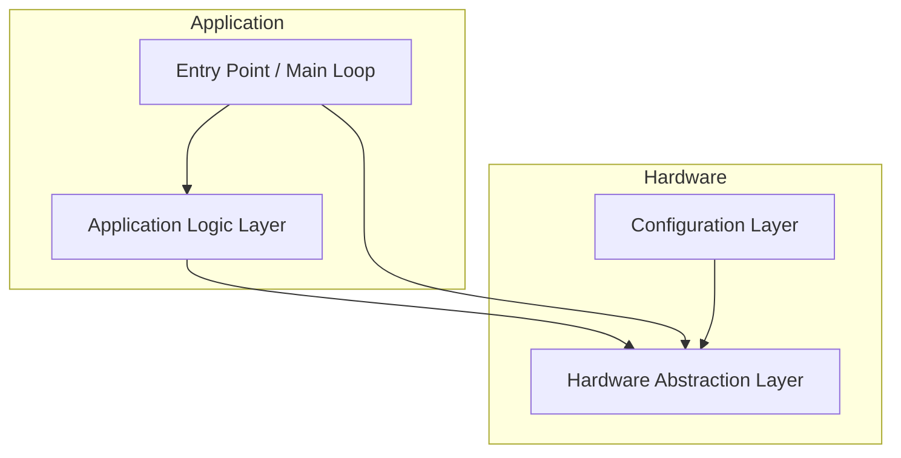

# Software Architecture

This document describes the architecture of the Automated Mechanical Desk Lift system. It is designed to help developers, testers, and stakeholders understand the structure, principles, and key components for safe, modular, and maintainable development.

---

## Navigation
- [Software Requirements](SoftwareRequirements.md)
- [Software Detailed Design](SoftwareDetailedDesign.md)
- [System Use Cases](SystemUseCases.md)
- [Traceability Matrix](TraceabilityMatrix.md)

---

## Purpose
Defines the structure, principles, and key components of the desk lift software. Use this document to onboard, extend, or maintain the system.

---

## Architectural Overview
- **PinConfig.h:** Centralizes all Arduino pin assignments for LEDs, buttons, and the motor driver.
- **HAL.h / HAL.cpp:** Hardware Abstraction Layer. Provides functions to initialize and control hardware components (LEDs, buttons, motor driver) without exposing low-level details to the main application logic.
- **DeskController.h / DeskController.cpp:** Contains the main application logic and state machine for desk movement. Processes user inputs and determines outputs for hardware control.
- **arduino.ino:** Entry point for the application. Handles setup, main loop, and high-level control flow. Reads inputs, runs application logic, and updates outputs.

---

## Architectural Principles
- **Modularity:** Separation of hardware abstraction, control logic, and configuration.
- **Safety:** Fault detection, error handling, and safe state transitions.
- **Testability:** Host-based unit testing and clear interfaces.
- **Extensibility:** Support for future hardware and feature enhancements.

---

## Code Structure
- **Modular Design:** Hardware, logic, and configuration are separated for clarity and maintainability.
- **State Management:** Uses input/output structs to pass data between layers.
- **Non-blocking Loop:** The main loop is designed to be responsive and non-blocking.

---

## Design Constraints
- Must operate on Arduino UNO or compatible ECU
- Motor driver: L298N
- Limit switches and buttons: digital inputs
- Indicator LEDs: digital outputs
- Power supply: regulated, office environment
- Timing: non-blocking, responsive (<100ms reaction)
- Regulatory: must comply with ISO 25119, ASPICE

---

## Layered Architecture
See detailed diagrams and rationale in [Software Detailed Design](SoftwareDetailedDesign.md).

---

*For questions or suggestions, open an issue or contact the project maintainers.*
	- Abstracts direct hardware access (LEDs, buttons, motor driver).
	- Provides initialization and control functions for hardware components.
	- Enables hardware replacement without changes to control logic.

### 2. Configuration Layer
	- Centralizes all pin assignments and hardware configuration.
	- Allows easy adaptation to different hardware setups.

### 3. Application Logic Layer
	- Implements the main state machine and control logic.
	- Processes user inputs and system states.
	- Determines outputs for hardware control.
	- Handles error detection, emergency stop, and safe transitions.

### 4. Entry Point / Main Loop
	- Initializes system and hardware.
	- Executes main loop: reads inputs, runs application logic, updates outputs.
	- Ensures non-blocking, responsive operation.

## Key Architectural Patterns
- **State Machine:** Manages desk movement, error states, and transitions.
- **Input/Output Structs:** Encapsulate data passed between layers for clarity and testability.
- **Non-blocking Loop:** Ensures responsiveness and safety.

---

## Safety and Fault Handling
- Emergency stop logic and error states are implemented in the Application Logic Layer.
- All movement is disabled on fault or error.
- System only resumes from error when safe conditions are detected.

---

## Inputs and Outputs Table

| Name                | Direction | Data Type | Acceptable Range / Values         | Description                       |
| btUPPressed         | Input     | Boolean   | TRUE (1), FALSE (0)               | Up button pressed state           |
| moveUp              | Output    | Boolean   | TRUE (1), FALSE (0)               | Command to move desk up           |
| moveDown            | Output    | Boolean   | TRUE (1), FALSE (0)               | Command to move desk down         |
| stop                | Output    | Boolean   | TRUE (1), FALSE (0)               | Command to stop motor             |
| error               | Output    | Boolean   | TRUE (1), FALSE (0)               | Error state indicator             |
| ERROR_LED           | Output    | Digital   | HIGH (1), LOW (0)                 | Error indicator LED               |
| LED_LEFT_PIN        | Output    | Digital   | HIGH (1), LOW (0)                 | Left position LED                 |
| LED_RIGHT_PIN       | Output    | Digital   | HIGH (1), LOW (0)                 | Right position LED                |
| BUTTON_UP_PIN       | Input     | Digital   | HIGH (1), LOW (0)                 | Up button hardware pin            |
| BUTTON_DOWN_PIN     | Input     | Digital   | HIGH (1), LOW (0)                 | Down button hardware pin          |
| IN1                 | Output    | Digital   | HIGH (1), LOW (0)                 | Motor direction 1                 |
| IN2                 | Output    | Digital   | HIGH (1), LOW (0)                 | Motor direction 2                 |
| ENA                 | Output    | PWM       | 0–255 (Arduino PWM range)         | Motor speed (PWM)                 |

---

## Testability
- Host-based unit tests (g++) validate all control logic and state transitions.
- Tests are mapped to requirements and use cases for full traceability.

---

## Extensibility
- Architecture supports future enhancements (limit switches, current sensing, presets, calibration).
- Hardware abstraction allows for easy integration of new components.

---

## Traceability
- All architectural decisions and components are traceable to Software Requirements and System Use Cases.
- See [Software Requirements](SoftwareRequirements.md) and [Traceability Matrix](TraceabilityMatrix.md).

---

## System Actors
| Actor              | Description                    |
|--------------------|-------------------------------|
| User               | Operates the desk              |
| Arduino Controller | Executes control logic         |
| DC Motor           | Provides mechanical movement   |
| Motor Driver       | Controls motor direction/power |
| Power Source       | Battery or external supply     |

---

## Diagram

---

## Notes
- Architecture is subject to change based on future requirements or hardware updates.
- All design decisions follow industry standards for embedded and safety-critical systems.
