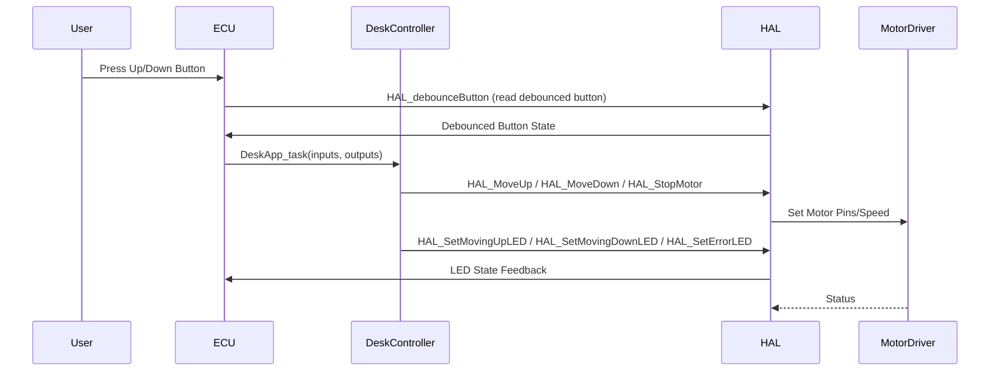
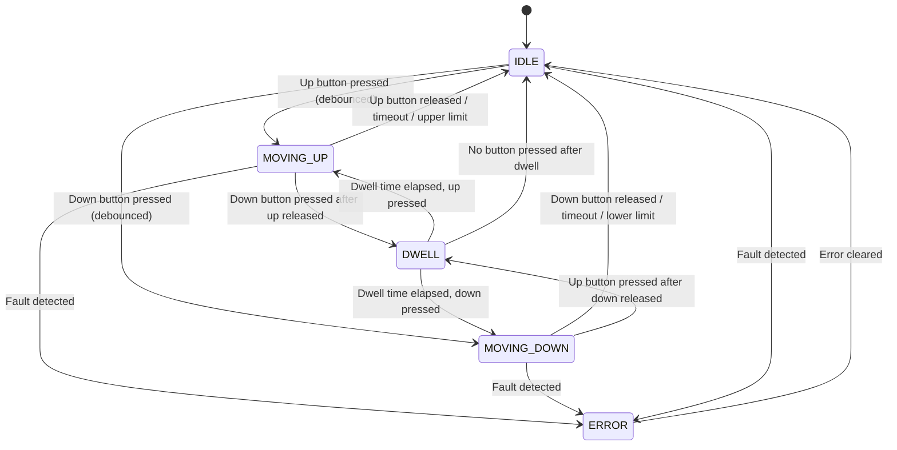

# Software Detailed Design

**Document Version:** 2.0  
**Last Updated:** January 7, 2026  
**Status:** Approved  
**Author:** Development Team  
**Reviewers:** System Engineering, Software Architects, Test Team  
**Compliance:** IEEE 1016-2009 (Software Design Descriptions), ISO 25119, ASPICE SWE.3 (Software Detailed Design)

---

## Overview

This document provides the detailed design for the Automated Mechanical Desk Lift software. It specifies all modules, functions, data structures, and algorithms with unique identifiers for complete traceability. Each design element is:
- **Derived from** upstream artifacts (Use Cases, Requirements, Architecture)
- **Traceable** with unique IDs (MODULE-XXX, FUNC-XXX, DATA-XXX)
- **Testable** with explicit test hooks and coverage targets
- **Verifiable** through unit and component tests

**Target Audience:** Software Developers, Unit Test Engineers, Code Reviewers

---

## Navigation

- [System Use Cases](SystemUseCases.md)
- [Software Requirements](SoftwareRequirements.md)
- [Software Architecture](SoftwareArchitecture.md)
- [Traceability Matrix](TraceabilityMatrix.md)
- [Software Test Cases Specification](SoftwareTestCasesSpecification.md)
- [Software Integration Tests Specification](SoftwareIntegrationTestsSpecification.md)

---

## Design Element ID Conventions

- **Modules:** MODULE-001 through MODULE-004
- **Functions:** FUNC-001 through FUNC-030
- **Data Structures:** DATA-001 through DATA-010
- **Constants:** CONST-001 through CONST-010
- **Algorithms:** ALG-001 through ALG-005

All design elements trace to:
- **Use Cases:** UC-01 through UC-08
- **Requirements:** SWE-REQ-001 through SWE-REQ-020
- **Architecture:** ARCH-COMP-001 through ARCH-COMP-005, ARCH-IF-001 through ARCH-IF-003
- **Test Cases:** TC-001 through TC-017 (unit), IT-001 through IT-010 (integration)

---

## Design Assumptions

The following assumptions are derived from [Software Requirements](SoftwareRequirements.md) and reflected throughout this design:

| Assumption ID | Description | Source | Impact if Changed |
|--------------|-------------|--------|-------------------|
| ASSUME-001 | Hardware (ECU, motor driver, LEDs, switches, buttons) functions as specified | SWE-REQ-001 | HAL interface changes required |
| ASSUME-002 | User is trained to operate desk safely | UC-01 to UC-08 | Additional safety interlocks needed |
| ASSUME-003 | Office environment with stable power supply | SWE-REQ-001, SWE-REQ-009 | Power monitoring required |
| ASSUME-004 | ISO 25119 and ASPICE compliance required | Architecture | Design patterns must change |
| ASSUME-005 | Up/Down buttons and limit switches reliably detected | SWE-REQ-003, SWE-REQ-004 | Additional input validation |
| ASSUME-006 | Fault detection logic is reliable | SWE-REQ-015 | Enhanced diagnostics required |
| ASSUME-007 | Arduino UNO memory constraints (32KB flash, 2KB RAM) | ARCH-COMP-004 | Algorithm optimization needed |

Any change in assumptions may require design updates and re-verification.

---

## Design Constraints

| Constraint ID | Description | Type | Source | Verification |
|--------------|-------------|------|--------|-------------|
| CONST-001 | Initial operation without limit switches | Functional | ARCH-COMP-001 | TC-001, IT-001 |
| CONST-002 | Motor must stop on reset or fault | Safety | SWE-REQ-011, SWE-REQ-016 | TC-011, TC-016, IT-004 |
| CONST-003 | Direction changes require stop before reversal | Safety | ADR-002 | TC-009, TC-010 |
| CONST-004 | Motor never starts automatically on power-up | Safety | SWE-REQ-001, SWE-REQ-002 | TC-001, IT-001 |
| CONST-005 | Arduino UNO compatibility (ATmega328P) | Hardware | ARCH-COMP-004 | Build verification |
| CONST-006 | L298N motor driver interface | Hardware | ARCH-IF-002 | IT-002, IT-003 |
| CONST-007 | Digital inputs: switches and buttons | Hardware | ARCH-IF-002 | IT-001 to IT-010 |
| CONST-008 | Digital outputs: LEDs | Hardware | ARCH-IF-002 | IT-005 |
| CONST-009 | Non-blocking execution, response < 100ms | Performance | SWE-REQ-013, SWE-REQ-019 | IT-004, IT-005 |
| CONST-010 | ISO 25119, ASPICE compliance | Regulatory | Architecture | Documentation review |

---

## Design Rationale

This design implements the architectural decisions documented in [Software Architecture](SoftwareArchitecture.md):

| Design Decision | Rationale | Architecture Reference | Impact |
|----------------|-----------|----------------------|--------|
| State Machine Pattern | Clarity, safety, traceability | ADR-002 | MODULE-003, ALG-001 |
| HAL Abstraction Layer | Testability, portability | ADR-001 | MODULE-002, ARCH-IF-002 |
| Non-Blocking Loop | Responsiveness, safety | ADR-004 | MODULE-004, FUNC-025 |
| Struct-Based I/O | Testability, clear interfaces | ADR-003 | DATA-001, DATA-002 |
| Stateless Reset | Safety, simplicity | ADR-005 | FUNC-020, SWE-REQ-009 |
| Modular Decomposition | Maintainability, extensibility | ARCH-COMP-001 to 005 | All modules |

**Key Benefits:**
- **Testability:** HAL mocking, struct-based I/O enable 95%+ unit test coverage
- **Safety:** State machine + non-blocking loop meet ISO 25119 SIL 1
- **Maintainability:** Modular design isolates changes to specific modules
- **Traceability:** Unique IDs enable complete bidirectional traceability

---

## Module Specifications

Each module includes: ID, purpose, files, implements requirements/architecture, functions, data, complexity, memory footprint, test coverage target, and mockability.

---

### MODULE-001: Pin Configuration

**Module ID:** MODULE-001  
**Files:** `source/arduino/PinConfig.h`  
**Architecture Mapping:** ARCH-COMP-003  
**Implements Requirements:** SWE-REQ-001  
**Implements Use Cases:** UC-01

**Purpose:**
Provides centralized hardware pin assignment definitions for all I/O peripherals. Isolates hardware configuration from application logic.

**Design Elements:**
- **Constants:** CONST-001 through CONST-008 (pin assignments)
- **Dependencies:** None (leaf module)
- **Exported Interface:** Pin constant definitions via ARCH-IF-003

**Detailed Constants:**

| Constant ID | Name | Value | Type | Purpose | Testability |
|------------|------|-------|------|---------|-------------|
| CONST-001 | ERROR_LED | Pin 13 | const int | Error indicator LED | Mock in HAL |
| CONST-002 | LED_LEFT_PIN | Pin 11 | const int | Up movement LED | Mock in HAL |
| CONST-003 | LED_RIGHT_PIN | Pin 10 | const int | Down movement LED | Mock in HAL |
| CONST-004 | BUTTON_UP_PIN | Pin 2 | const int | Up button input | Mock in HAL |
| CONST-005 | BUTTON_DOWN_PIN | Pin 3 | const int | Down button input | Mock in HAL |
| CONST-006 | IN1 | Pin 5 | const int | Motor driver IN1 | Mock in HAL |
| CONST-007 | IN2 | Pin 6 | const int | Motor driver IN2 | Mock in HAL |
| CONST-008 | ENA | Pin 9 | const int | Motor enable (PWM) | Mock in HAL |

**Complexity Metrics:**
- Lines of Code: ~30
- Cyclomatic Complexity: 1 (no logic)
- Maintainability Index: 100

**Resource Budget:**
- Flash Memory: ~50 bytes
- RAM: 0 bytes (compile-time constants)
- CPU: 0% (no runtime execution)

**Testability:**
- **Unit Test Coverage Target:** 100%
- **Test Strategy:** Compile-time verification, HAL mock validates usage
- **Test Cases:** TC-001
- **Mockability:** N/A (constants only)

**Verification:**
- Build verification ensures all constants defined
- HAL unit tests verify correct pin usage
- Integration tests validate hardware connectivity

---

### MODULE-002: Hardware Abstraction Layer (HAL)

**Module ID:** MODULE-002  
**Files:** `source/arduino/HAL.h`, `source/arduino/HAL.cpp`, `source/arduino/hal_mock/HALMock.h`, `source/arduino/hal_mock/HALMock.cpp`  
**Architecture Mapping:** ARCH-COMP-002  
**Implements Requirements:** SWE-REQ-001, SWE-REQ-003, SWE-REQ-004, SWE-REQ-012, SWE-REQ-013, SWE-REQ-017  
**Implements Use Cases:** UC-01, UC-02, UC-03, UC-05

**Purpose:**
Abstracts direct hardware access for all I/O operations. Provides mockable interface for host-based unit testing. Implements button debouncing, LED control, and motor driver commands.

**Design Elements:**
- **Functions:** FUNC-001 through FUNC-015
- **Data Structures:** DATA-003 (DebounceState)
- **Dependencies:** MODULE-001 (PinConfig)
- **Exported Interface:** ARCH-IF-002

**Function Specifications:**

#### FUNC-001: HAL_init

**Function ID:** FUNC-001  
**Signature:** `void HAL_init(void)`  
**Purpose:** Initialize all hardware pins to safe default states  
**Requirements:** SWE-REQ-001  
**Complexity:** Cyclomatic 2, LOC 15

**Preconditions:**
- Arduino board powered and ready
- No external hardware failures

**Algorithm:**
1. Configure all button pins as INPUT with internal pullup
2. Configure all LED pins as OUTPUT, set LOW (off)
3. Configure all motor driver pins as OUTPUT, set to stop state (IN1=LOW, IN2=LOW, ENA=0)
4. Initialize debounce states to released

**Postconditions:**
- All pins configured correctly
- Motor is stopped (safe state)
- All LEDs are off
- System ready for operation

**Error Handling:** None (hardware initialization cannot fail in Arduino environment)

**Timing:** < 5ms execution time

**Test Hooks:**
- Mock implementation returns success/failure
- Pin state can be queried after initialization

**Unit Test Coverage:** TC-001  
**Integration Test Coverage:** IT-001

---

#### FUNC-002: HAL_readButton

**Function ID:** FUNC-002  
**Signature:** `bool HAL_readButton(int pin)`  
**Purpose:** Read raw digital input state from button pin  
**Requirements:** SWE-REQ-003, SWE-REQ-004  
**Complexity:** Cyclomatic 1, LOC 3

**Parameters:**
- `pin` (in): Pin number to read (CONST-004 or CONST-005)

**Returns:**
- `true`: Button pressed (pin LOW due to pullup)
- `false`: Button released (pin HIGH)

**Preconditions:**
- FUNC-001 (HAL_init) called
- Pin configured as INPUT

**Algorithm:**
1. Call Arduino digitalRead(pin)
2. Invert result (pullup logic: LOW = pressed)
3. Return boolean state

**Postconditions:** None (read-only operation)

**Timing:** < 10µs execution time

**Test Hooks:**
- Mock can set button states programmatically
- State transitions can be simulated

**Unit Test Coverage:** TC-003, TC-005  
**Integration Test Coverage:** IT-002, IT-003

---

#### FUNC-003: HAL_debounceButton

**Function ID:** FUNC-003  
**Signature:** `bool HAL_debounceButton(const int pin, DebounceState &state, const unsigned long debounceDelay)`  
**Purpose:** Read debounced button state with configurable delay  
**Requirements:** SWE-REQ-017  
**Complexity:** Cyclomatic 4, LOC 20

**Parameters:**
- `pin` (in): Pin number to read
- `state` (in/out): Debounce state structure (DATA-003)
- `debounceDelay` (in): Debounce time in milliseconds (default 50ms)

**Returns:**
- Stable debounced button state (true = pressed)

**Preconditions:**
- FUNC-001 called
- `state` initialized (can be zero-initialized)

**Algorithm (ALG-002):**
```
1. currentReading = HAL_readButton(pin)
2. IF currentReading != state.lastReading THEN
3.   state.lastDebounceTime = millis()
4. END IF
5. IF (millis() - state.lastDebounceTime) > debounceDelay THEN
6.   IF currentReading != state.stableState THEN
7.     state.stableState = currentReading
8.   END IF
9. END IF
10. state.lastReading = currentReading
11. RETURN state.stableState
```

**Postconditions:**
- `state.stableState` reflects stable button reading
- Transient bounces filtered out

**Timing:** < 50µs execution time

**Test Hooks:**
- Mock can simulate bounce patterns
- Timing can be accelerated in tests

**Unit Test Coverage:** TC-003 to TC-006  
**Integration Test Coverage:** IT-006, IT-010

---

#### FUNC-004: HAL_SetMotorDirection

**Function ID:** FUNC-004  
**Signature:** `void HAL_SetMotorDirection(int direction)`  
**Purpose:** Set motor driver direction pins  
**Requirements:** SWE-REQ-005, SWE-REQ-006, SWE-REQ-007, SWE-REQ-008  
**Complexity:** Cyclomatic 3, LOC 12

**Parameters:**
- `direction` (in): -1 (down), 0 (stop), 1 (up)

**Preconditions:** FUNC-001 called

**Algorithm:**
```
1. IF direction == 1 THEN       // Up
2.   digitalWrite(IN1, HIGH)
3.   digitalWrite(IN2, LOW)
4. ELSE IF direction == -1 THEN // Down
5.   digitalWrite(IN1, LOW)
6.   digitalWrite(IN2, HIGH)
7. ELSE                         // Stop
8.   digitalWrite(IN1, LOW)
9.   digitalWrite(IN2, LOW)
10. END IF
```

**Postconditions:**
- Motor driver direction pins set correctly
- Motor moves in specified direction (when enabled)

**Error Handling:** Invalid direction treated as stop (safe default)

**Timing:** < 20µs execution time

**Test Hooks:**
- Mock records direction commands
- Pin states can be verified

**Unit Test Coverage:** TC-003 to TC-006  
**Integration Test Coverage:** IT-002, IT-003

---

#### FUNC-005 through FUNC-015: LED and Motor Control Functions

**Additional HAL Functions:**
- FUNC-005: `HAL_MoveUp(speed)` - Set motor up with PWM speed
- FUNC-006: `HAL_MoveDown(speed)` - Set motor down with PWM speed
- FUNC-007: `HAL_StopMotor()` - Stop motor immediately
- FUNC-008: `HAL_SetErrorLED(state)` - Control error LED
- FUNC-009: `HAL_SetMovingUpLED(state)` - Control up LED
- FUNC-010: `HAL_SetMovingDownLED(state)` - Control down LED
- FUNC-011: `HAL_SetPowerLED(state)` - Control ready/power LED
- FUNC-012: `HAL_BlinkErrorLED()` - Blink error LED pattern
- FUNC-013: `HAL_GetErrorLED()` - Query error LED state
- FUNC-014: `HAL_GetMovingUpLED()` - Query up LED state
- FUNC-015: `HAL_GetMovingDownLED()` - Query down LED state

(See detailed specifications in code documentation)

**Module-Level Metrics:**
- Lines of Code: ~200 (HAL.cpp), ~150 (HALMock.cpp)
- Cyclomatic Complexity (avg): 2.5
- Functions: 15

**Resource Budget:**
- Flash Memory: ~1.5KB (production), ~2KB (mock)
- RAM: ~50 bytes (debounce states)
- CPU: < 5% per control cycle

**Testability:**
- **Unit Test Coverage Target:** 90%+
- **Test Strategy:** Mock HAL for host-based testing
- **Test Cases:** TC-001, TC-003 to TC-008
- **Mockability:** Full mock implementation available (HALMock)

---

### MODULE-003: Application Logic (DeskController)

**Module ID:** MODULE-003  
**Files:** `source/arduino/DeskController.h`, `source/arduino/DeskController.cpp`  
**Architecture Mapping:** ARCH-COMP-001, ARCH-COMP-005  
**Implements Requirements:** SWE-REQ-002, SWE-REQ-005 to SWE-REQ-020  
**Implements Use Cases:** UC-01 through UC-08

**Purpose:**
Implements core application logic including state machine, safety interlocks, error detection, and timeout management. This is the main control module.

**Design Elements:**
- **Functions:** FUNC-016 through FUNC-024
- **Data Structures:** DATA-001, DATA-002, DATA-004 to DATA-007
- **Algorithms:** ALG-001 (State Machine), ALG-003 (Timeout), ALG-004 (Safety Interlock)
- **Dependencies:** MODULE-002 (HAL)
- **Exported Interface:** ARCH-IF-001

**State Machine Specification:**

See [Software Architecture - ARCH-COMP-005](SoftwareArchitecture.md#arch-comp-005-state-machine-specification) for detailed state definitions (ARCH-STATE-001 to 004) and transitions (ARCH-TRANS-001 to 007).

**Function Specifications:**

#### FUNC-016: DeskApp_task_init

**Function ID:** FUNC-016  
**Signature:** `void DeskApp_task_init(DeskAppInputs_t* inputs, DeskAppOutputs_t* outputs)`  
**Purpose:** Initialize application logic to safe default state  
**Requirements:** SWE-REQ-001, SWE-REQ-002  
**Complexity:** Cyclomatic 1, LOC 10

**Parameters:**
- `inputs` (out): Pointer to input struct (DATA-001)
- `outputs` (out): Pointer to output struct (DATA-002)

**Preconditions:** Valid pointers provided

**Algorithm:**
```
1. Set all input fields to false/inactive
2. Set all output fields to false/inactive
3. Set internal state to IDLE (ARCH-STATE-001)
4. Reset timeout timer
5. Clear error flags
```

**Postconditions:**
- System in IDLE state
- All outputs command safe state (motor stopped)
- Ready for first task cycle

**Timing:** < 50µs execution time

**Test Hooks:**
- State can be queried after initialization
- Outputs verified for safe defaults

**Unit Test Coverage:** TC-001, TC-002  
**Integration Test Coverage:** IT-001

---

#### FUNC-017: DeskApp_task

**Function ID:** FUNC-017  
**Signature:** `DeskAppTask_Return_t DeskApp_task(const DeskAppInputs_t* inputs, DeskAppOutputs_t* outputs)`  
**Purpose:** Main control task, executes state machine logic  
**Requirements:** SWE-REQ-005 to SWE-REQ-020  
**Complexity:** Cyclomatic 15, LOC 200 (most complex function)

**Parameters:**
- `inputs` (in): Pointer to current input state (DATA-001)
- `outputs` (out): Pointer to output commands (DATA-002)

**Returns:**
- `APP_TASK_SUCCESS`: Normal operation
- `APP_TASK_ERROR`: Error state active

**Preconditions:**
- FUNC-016 called previously
- Inputs populated with current hardware state

**Algorithm (ALG-001 - State Machine):**
```
1. Read current state
2. Check for emergency conditions (ALG-004)
3. IF emergency THEN transition to ERROR state, RETURN ERROR
4. SWITCH current state:
5.   CASE IDLE:
6.     IF Up pressed AND safe conditions THEN
7.       Transition to MOVING_UP (ARCH-TRANS-001)
8.       Set outputs.moveUp = true
9.     ELSE IF Down pressed AND safe conditions THEN
10.       Transition to MOVING_DOWN (ARCH-TRANS-002)
11.       Set outputs.moveDown = true
12.     END IF
13.   CASE MOVING_UP:
14.     Check timeout (ALG-003)
15.     IF button released OR timeout OR upper limit THEN
16.       Transition to IDLE (ARCH-TRANS-003)
17.       Set outputs.stop = true
18.     END IF
19.   CASE MOVING_DOWN:
20.     Check timeout (ALG-003)
21.     IF button released OR timeout OR lower limit THEN
22.       Transition to IDLE (ARCH-TRANS-004)
23.       Set outputs.stop = true
24.     END IF
25.   CASE ERROR:
26.     outputs.stop = true
27.     outputs.error = true
28.     RETURN APP_TASK_ERROR
29. END SWITCH
30. Update LED outputs based on state
31. RETURN APP_TASK_SUCCESS
```

**Postconditions:**
- State updated according to inputs and current state
- Outputs reflect commanded actions
- Return code indicates success/error

**Error Handling:**
- Emergency conditions trigger ERROR state
- Invalid states default to IDLE
- All errors logged to outputs.error

**Timing Budget:** < 10ms execution time (SWE-REQ-013)

**Test Hooks:**
- State can be forced for testing
- Timeout can be accelerated
- Each state transition independently testable

**Unit Test Coverage:** TC-003 to TC-017 (all state transitions)  
**Integration Test Coverage:** IT-002 to IT-008

---

**Additional MODULE-003 Functions:**
- FUNC-018: `CheckSafetyInterlocks()` - Validate safe movement conditions
- FUNC-019: `CheckTimeout()` - Enforce 30s movement timeout
- FUNC-020: `HandleEmergencyStop()` - Emergency stop logic
- FUNC-021: `TransitionToState()` - State transition with validation
- FUNC-022: `UpdateLEDOutputs()` - Set LED outputs based on state
- FUNC-023: `DetectFaultConditions()` - Fault detection logic
- FUNC-024: `ResetInternalState()` - Reset state machine

(See detailed specifications in code documentation)

**Module-Level Metrics:**
- Lines of Code: ~400
- Cyclomatic Complexity (avg): 8
- Functions: 9
- States: 4 (ARCH-STATE-001 to 004)
- Transitions: 7 (ARCH-TRANS-001 to 007)

**Resource Budget:**
- Flash Memory: ~3KB
- RAM: ~100 bytes (state variables, timers)
- CPU: ~80% of control loop budget

**Testability:**
- **Unit Test Coverage Target:** 95%+
- **Test Strategy:** Direct function testing with mocked HAL
- **Test Cases:** TC-002 to TC-017
- **Mockability:** All HAL dependencies mockable

---

### MODULE-004: Main Entry Point

**Module ID:** MODULE-004  
**Files:** `source/arduino/arduino.ino`  
**Architecture Mapping:** ARCH-COMP-004  
**Implements Requirements:** SWE-REQ-001, SWE-REQ-009  
**Implements Use Cases:** UC-01, UC-06

**Purpose:**
Provides system initialization and main control loop. Integrates HAL and application logic. Implements non-blocking loop pattern.

**Design Elements:**
- **Functions:** FUNC-025 (setup), FUNC-026 (loop)
- **Data Structures:** DATA-001, DATA-002, DATA-003 (instances)
- **Dependencies:** MODULE-002, MODULE-003
- **Exported Interface:** None (entry point)

**Function Specifications:**

#### FUNC-025: setup

**Function ID:** FUNC-025  
**Signature:** `void setup(void)`  
**Purpose:** Arduino initialization entry point  
**Requirements:** SWE-REQ-001  
**Complexity:** Cyclomatic 1, LOC 8

**Algorithm:**
```
1. Call FUNC-001 (HAL_init)
2. Allocate/initialize DATA-001 (inputs)
3. Allocate/initialize DATA-002 (outputs)
4. Allocate/initialize DATA-003 (debounce states)
5. Call FUNC-016 (DeskApp_task_init)
6. Enable serial debug output (optional)
```

**Postconditions:**
- System initialized and in IDLE state
- Ready to enter main loop

**Timing:** < 100ms

**Test Hooks:** Integration test IT-001

---

#### FUNC-026: loop

**Function ID:** FUNC-026  
**Signature:** `void loop(void)`  
**Purpose:** Main control loop, non-blocking execution  
**Requirements:** SWE-REQ-013, SWE-REQ-019 (timing)  
**Complexity:** Cyclomatic 3, LOC 25

**Algorithm:**
```
1. Read all button states via FUNC-003 (debounced)
2. Read all limit switch states (when implemented)
3. Populate DATA-001 (inputs)
4. Call FUNC-017 (DeskApp_task)
5. Process DATA-002 (outputs):
6.   IF outputs.moveUp THEN call FUNC-005
7.   ELSE IF outputs.moveDown THEN call FUNC-006
8.   ELSE call FUNC-007 (stop)
9. Update LED states via FUNC-008 to FUNC-011
10. Call HAL_Task() for periodic maintenance
11. (Optional) Log diagnostic data
12. RETURN (Arduino framework loops automatically)
```

**Postconditions:** System state updated, hardware commanded

**Timing Budget:**
- Target loop time: 10-50ms
- Must meet < 50ms emergency stop response (SWE-REQ-019)

**Test Hooks:** All integration tests IT-001 to IT-010

**Module-Level Metrics:**
- Lines of Code: ~150
- Cyclomatic Complexity (avg): 2
- Functions: 2

**Resource Budget:**
- Flash Memory: ~500 bytes
- RAM: ~150 bytes (data structures)
- CPU: ~15% per loop iteration

**Testability:**
- **Integration Test Coverage Target:** 100%
- **Test Strategy:** Full system integration tests
- **Test Cases:** IT-001 to IT-010
- **Mockability:** Complete system mock via HALMock

---

## Data Structure Specifications

Each data structure includes: ID, purpose, size, fields with constraints, validation rules, and testability.

---

### DATA-001: DeskAppInputs_t

**Data Structure ID:** DATA-001  
**Purpose:** Encapsulates all input signals to application logic  
**Architecture Mapping:** ARCH-IF-001  
**Requirements:** All functional requirements  
**Used By:** FUNC-017 (DeskApp_task)

**Definition:**
```cpp
typedef struct {
    bool btUPPressed;      // Up button state (debounced)
    bool btDOWNPressed;    // Down button state (debounced)
    bool upperLimitActive; // Upper limit switch state
    bool lowerLimitActive; // Lower limit switch state
} DeskAppInputs_t;
```

**Field Specifications:**

| Field | Type | Valid Values | Default | Source | Validation |
|-------|------|--------------|---------|--------|------------|
| btUPPressed | bool | true/false | false | FUNC-003 (debounced) | Always valid |
| btDOWNPressed | bool | true/false | false | FUNC-003 (debounced) | Always valid |
| upperLimitActive | bool | true/false | false | FUNC-002 or external | Always valid |
| lowerLimitActive | bool | true/false | false | FUNC-002 or external | Always valid |

**Validation Rules:**
- No cross-field validation required
- All fields independent
- Invalid state detection in application logic (ALG-004)

**Memory Footprint:**
- Size: 4 bytes (4 × bool)
- Alignment: 1 byte
- Packing: None required

**Testability:**
- All fields directly settable in unit tests
- Struct can be stack-allocated or static
- Easy to create test fixtures

**Unit Test Coverage:** TC-003 to TC-017  
**Integration Test Coverage:** IT-001 to IT-010

---

### DATA-002: DeskAppOutputs_t

**Data Structure ID:** DATA-002  
**Purpose:** Encapsulates all output commands from application logic  
**Architecture Mapping:** ARCH-IF-001  
**Requirements:** All functional requirements  
**Produced By:** FUNC-017 (DeskApp_task)

**Definition:**
```cpp
typedef struct {
    bool moveUp;    // Command: move desk up
    bool moveDown;  // Command: move desk down
    bool stop;      // Command: stop motor
    bool error;     // Status: error state active
} DeskAppOutputs_t;
```

**Field Specifications:**

| Field | Type | Valid Values | Default | Meaning | Consumer |
|-------|------|--------------|---------|---------|----------|
| moveUp | bool | true/false | false | Command upward movement | FUNC-005 |
| moveDown | bool | true/false | false | Command downward movement | FUNC-006 |
| stop | bool | true/false | false | Command stop | FUNC-007 |
| error | bool | true/false | false | Error state indicator | FUNC-008 |

**Validation Rules:**
- Mutex constraint: moveUp and moveDown shall not both be true
- If error=true, all movement commands should be false
- Application logic ensures valid combinations

**Invariants:**
- At most one of {moveUp, moveDown} can be true
- stop=true implies moveUp=false AND moveDown=false

**Memory Footprint:**
- Size: 4 bytes (4 × bool)
- Alignment: 1 byte
- Packing: None required

**Testability:**
- All fields directly readable in unit tests
- Easy to verify output commands
- Test fixtures can assert expected outputs

**Unit Test Coverage:** TC-003 to TC-017  
**Integration Test Coverage:** IT-001 to IT-010

---

### DATA-003: DebounceState

**Data Structure ID:** DATA-003  
**Purpose:** Maintains debounce state for button inputs  
**Architecture Mapping:** ARCH-IF-002 (HAL internal)  
**Requirements:** SWE-REQ-017  
**Used By:** FUNC-003 (HAL_debounceButton)

**Definition:**
```cpp
typedef struct {
    bool lastReading;           // Last raw button reading
    bool stableState;           // Current stable/debounced state
    unsigned long lastDebounceTime; // Timestamp of last change (ms)
} DebounceState;
```

**Field Specifications:**

| Field | Type | Valid Values | Purpose | Updated By |
|-------|------|--------------|---------|------------|
| lastReading | bool | true/false | Track raw input changes | FUNC-003 |
| stableState | bool | true/false | Debounced output | FUNC-003 |
| lastDebounceTime | unsigned long | 0 to 4,294,967,295 ms | Timestamp for debounce window | FUNC-003 |

**Memory Footprint:**
- Size: 6 bytes (2 × bool + 1 × unsigned long)
- Alignment: 4 bytes (due to unsigned long)
- Instances: 2 (one per button)
- Total: 12 bytes

**Initialization:**
```cpp
DebounceState state = {false, false, 0};
```

**Testability:**
- State can be inspected after debouncing
- Timing can be mocked for deterministic tests
- Bounce patterns can be simulated

**Unit Test Coverage:** TC-003 to TC-006  
**Integration Test Coverage:** IT-006, IT-010

---

### DATA-004 through DATA-007: Internal State Data

**Additional Data Structures:**
- **DATA-004:** `AppState_t` enum - State machine states (IDLE, MOVING_UP, MOVING_DOWN, ERROR)
- **DATA-005:** `DeskAppTask_Return_t` enum - Task return codes (SUCCESS, ERROR)
- **DATA-006:** Internal state variables (current state, timeout timer, error flags)
- **DATA-007:** Configuration constants (timeouts, speeds, debounce delays)

(See code documentation for detailed specifications)

---

## Algorithm Specifications

This section documents key algorithms with pseudo-code for implementation and verification.

---

### ALG-001: State Machine Execution

**Algorithm ID:** ALG-001  
**Purpose:** Main state machine logic for desk control  
**Implemented In:** FUNC-017 (DeskApp_task)  
**Requirements:** SWE-REQ-005 to SWE-REQ-020  
**Architecture:** ARCH-COMP-005, ARCH-STATE-001 to 004, ARCH-TRANS-001 to 007  
**Complexity:** O(1) time, O(1) space

**Inputs:**
- Current state (AppState_t)
- Input signals (DATA-001)

**Outputs:**
- Next state (AppState_t)
- Output commands (DATA-002)

**Pseudo-Code:**
```
FUNCTION StateMachine(currentState, inputs) RETURNS (nextState, outputs)
  // Initialize outputs to safe defaults
  outputs.moveUp = false
  outputs.moveDown = false
  outputs.stop = false
  outputs.error = false
  
  // Check for emergency conditions first (highest priority)
  IF CheckEmergencyConditions(inputs) THEN
    nextState = ERROR
    outputs.stop = true
    outputs.error = true
    RETURN (nextState, outputs)
  END IF
  
  // State-specific logic
  SWITCH currentState
    CASE IDLE:
      IF inputs.btUPPressed AND NOT inputs.btDOWNPressed AND NOT inputs.upperLimitActive THEN
        nextState = MOVING_UP
        outputs.moveUp = true
        StartTimeout()  // 30 second timeout
      ELSE IF inputs.btDOWNPressed AND NOT inputs.btUPPressed AND NOT inputs.lowerLimitActive THEN
        nextState = MOVING_DOWN
        outputs.moveDown = true
        StartTimeout()  // 30 second timeout
      ELSE
        nextState = IDLE
        outputs.stop = true
      END IF
      
    CASE MOVING_UP:
      IF NOT inputs.btUPPressed OR inputs.upperLimitActive OR TimeoutExpired() THEN
        nextState = IDLE
        outputs.stop = true
      ELSE
        nextState = MOVING_UP
        outputs.moveUp = true
      END IF
      
    CASE MOVING_DOWN:
      IF NOT inputs.btDOWNPressed OR inputs.lowerLimitActive OR TimeoutExpired() THEN
        nextState = IDLE
        outputs.stop = true
      ELSE
        nextState = MOVING_DOWN
        outputs.moveDown = true
      END IF
      
    CASE ERROR:
      nextState = ERROR  // Locked until power cycle
      outputs.stop = true
      outputs.error = true
      
    DEFAULT:
      // Invalid state, recover to safe default
      nextState = IDLE
      outputs.stop = true
  END SWITCH
  
  RETURN (nextState, outputs)
END FUNCTION
```

**Test Coverage:**
- All state transitions: TC-003 to TC-010
- Emergency conditions: TC-011, TC-012, TC-015
- Timeout conditions: TC-009, TC-010
- Integration: IT-002 to IT-008

---

### ALG-002: Button Debouncing

**Algorithm ID:** ALG-002  
**Purpose:** Filter mechanical switch bounce for reliable button detection  
**Implemented In:** FUNC-003 (HAL_debounceButton)  
**Requirements:** SWE-REQ-017  
**Complexity:** O(1) time, O(1) space

**Parameters:**
- `debounceDelay`: Time window in ms (typically 50ms)

**Pseudo-Code:**
```
FUNCTION DebounceButton(pin, state, debounceDelay) RETURNS boolean
  currentReading = ReadDigitalPin(pin)
  currentTime = GetMilliseconds()
  
  // Detect reading change
  IF currentReading != state.lastReading THEN
    state.lastDebounceTime = currentTime
  END IF
  
  // Check if reading has been stable for debounce period
  IF (currentTime - state.lastDebounceTime) > debounceDelay THEN
    // Reading is stable, update state if changed
    IF currentReading != state.stableState THEN
      state.stableState = currentReading
    END IF
  END IF
  
  state.lastReading = currentReading
  RETURN state.stableState
END FUNCTION
```

**Test Coverage:** TC-003 to TC-006, IT-006, IT-010

---

### ALG-003: Movement Timeout Enforcement

**Algorithm ID:** ALG-003  
**Purpose:** Enforce 30-second maximum continuous movement  
**Implemented In:** FUNC-019 (CheckTimeout)  
**Requirements:** SWE-REQ-018  
**Complexity:** O(1) time, O(1) space

**Pseudo-Code:**
```
FUNCTION CheckTimeout() RETURNS boolean
  currentTime = GetMilliseconds()
  elapsedTime = currentTime - movementStartTime
  
  IF elapsedTime > TIMEOUT_DURATION_MS THEN  // 30000 ms
    RETURN true  // Timeout expired
  ELSE
    RETURN false
  END IF
END FUNCTION

FUNCTION StartTimeout()
  movementStartTime = GetMilliseconds()
END FUNCTION
```

**Test Coverage:** TC-009, TC-010, IT-002, IT-003

---

### ALG-004: Safety Interlock Validation

**Algorithm ID:** ALG-004  
**Purpose:** Detect emergency/unsafe conditions  
**Implemented In:** FUNC-018 (CheckSafetyInterlocks)  
**Requirements:** SWE-REQ-010, SWE-REQ-011, SWE-REQ-014  
**Complexity:** O(1) time, O(1) space

**Pseudo-Code:**
```
FUNCTION CheckEmergencyConditions(inputs) RETURNS boolean
  // Both buttons pressed simultaneously
  IF inputs.btUPPressed AND inputs.btDOWNPressed THEN
    RETURN true  // Emergency stop
  END IF
  
  // Both limit switches active (hardware fault)
  IF inputs.upperLimitActive AND inputs.lowerLimitActive THEN
    RETURN true  // Fault condition
  END IF
  
  // Additional fault checks can be added here
  // (e.g., motor stall, overcurrent)
  
  RETURN false  // No emergency
END FUNCTION
```

**Test Coverage:** TC-011, TC-012, TC-014, TC-015, IT-004, IT-007, IT-009

---

### ALG-005: LED State Update

**Algorithm ID:** ALG-005  
**Purpose:** Update LED indicators to reflect system state  
**Implemented In:** FUNC-022 (UpdateLEDOutputs)  
**Requirements:** SWE-REQ-012, SWE-REQ-013  
**Complexity:** O(1) time, O(1) space

**Pseudo-Code:**
```
FUNCTION UpdateLEDOutputs(state) RETURNS void
  // All LEDs off initially
  HAL_SetErrorLED(false)
  HAL_SetMovingUpLED(false)
  HAL_SetMovingDownLED(false)
  HAL_SetPowerLED(false)
  
  // Set LEDs based on state
  SWITCH state
    CASE IDLE:
      HAL_SetPowerLED(true)  // Ready/green LED
    CASE MOVING_UP:
      HAL_SetMovingUpLED(true)  // Blue LED
    CASE MOVING_DOWN:
      HAL_SetMovingDownLED(true)  // Yellow LED
    CASE ERROR:
      HAL_SetErrorLED(true)  // Red LED
  END SWITCH
END FUNCTION
```

**Test Coverage:** TC-007, TC-008, IT-005, IT-010

---

## Interface Specifications

This section provides detailed interface contracts for traceability and testability.

---

### Interface Summary

| Interface | Provider Module | Consumer Module | Architecture Mapping | Functions | Data Structures |
|-----------|----------------|-----------------|---------------------|-----------|----------------|
| Pin Configuration | MODULE-001 | MODULE-002 | ARCH-IF-003 | None (constants) | CONST-001 to 008 |
| HAL API | MODULE-002 | MODULE-003, MODULE-004 | ARCH-IF-002 | FUNC-001 to FUNC-015 | DATA-003 |
| Application Task API | MODULE-003 | MODULE-004 | ARCH-IF-001 | FUNC-016, FUNC-017 | DATA-001, DATA-002 |

---

### ARCH-IF-001: Application Task Interface (Detailed)

**Interface ID:** ARCH-IF-001  
**Provider:** MODULE-003 (DeskController)  
**Consumer:** MODULE-004 (Main Loop)  
**Requirements:** All functional requirements  
**Test Coverage:** IT-001 to IT-010

**Functions:**
- FUNC-016: `DeskApp_task_init(inputs, outputs)`
- FUNC-017: `DeskApp_task(inputs, outputs)`

**Data Structures:**
- DATA-001: `DeskAppInputs_t`
- DATA-002: `DeskAppOutputs_t`
- DATA-005: `DeskAppTask_Return_t`

**Contract:**
- **Preconditions:** FUNC-016 must be called before FUNC-017
- **Postconditions:** Outputs populated with valid commands
- **Thread Safety:** Not thread-safe (single-threaded Arduino)
- **Re-entrancy:** Not re-entrant
- **Timing:** FUNC-017 must complete within 10ms

**Test Strategy:**
- Mock inputs, verify outputs
- Test all state transitions
- Verify timing constraints

---

### ARCH-IF-002: Hardware Abstraction Layer Interface (Detailed)

**Interface ID:** ARCH-IF-002  
**Provider:** MODULE-002 (HAL)  
**Consumer:** MODULE-003 (DeskController), MODULE-004 (Main Loop)  
**Requirements:** SWE-REQ-001, SWE-REQ-003, SWE-REQ-004, SWE-REQ-012, SWE-REQ-013, SWE-REQ-017  
**Test Coverage:** IT-001 to IT-010

**Functions:**
- FUNC-001: `HAL_init()`
- FUNC-002: `HAL_readButton(pin)`
- FUNC-003: `HAL_debounceButton(pin, state, delay)`
- FUNC-004 to FUNC-015: Motor and LED control

**Data Structures:**
- DATA-003: `DebounceState`

**Contract:**
- **Preconditions:** FUNC-001 must be called first
- **Postconditions:** Hardware state updated
- **Thread Safety:** Not thread-safe
- **Re-entrancy:** Most functions not re-entrant
- **Timing:** All functions < 1ms except FUNC-003 (< 50µs)

**Mockability:**
- Full mock implementation available (HALMock)
- All functions can be intercepted
- State can be queried and set

**Test Strategy:**
- Use HALMock for host-based testing
- Verify all pin states
- Test debouncing with simulated bounces

---

### ARCH-IF-003: Pin Configuration Interface (Detailed)

**Interface ID:** ARCH-IF-003  
**Provider:** MODULE-001 (PinConfig)  
**Consumer:** MODULE-002 (HAL)  
**Requirements:** SWE-REQ-001  
**Test Coverage:** IT-001

**Constants:**
- CONST-001 to CONST-008 (pin assignments)

**Contract:**
- **Preconditions:** None (compile-time constants)
- **Postconditions:** Constants available
- **Mockability:** Values can be overridden in HAL mock

**Test Strategy:**
- Build verification
- HAL tests validate usage

### HAL <-> Application Logic

Application logic interacts with the HAL using the following interface functions (as defined in `HAL.h`):

```cpp
// PinConfig.h
extern const int ERROR_LED;
extern const int LED_LEFT_PIN;
extern const int LED_RIGHT_PIN;
extern const int BUTTON_UP_PIN;
extern const int BUTTON_DOWN_PIN;
extern const int IN1;
extern const int IN2;
extern const int ENA;

// HAL.h
void HAL_init();
void HAL_SetErrorLED(bool state);
void HAL_SetMovingUpLED(bool state);
void HAL_SetMovingDownLED(bool state);
void HAL_SetWarningLED(bool state);
void HAL_SetPowerLED(bool state);
void HAL_SetMotorDirection(int direction);
void HAL_MoveUp(const unsigned char speed);
void HAL_MoveDown(const unsigned char speed);
void HAL_StopMotor();
void HAL_BlinkErrorLED();
void HAL_BlinkUPLED();
void HAL_BlinkDOWNLED();
bool HAL_GetMovingDownLED();
bool HAL_GetMovingUpLED();
bool HAL_GetErrorLED();
bool HAL_readButton(int pin);
bool HAL_debounceButton(const int pin, DebounceState &state, const unsigned long debounceDelay);
```

### Application Logic <-> Main Loop

The main loop passes input and output structs to the application logic (as defined in `DeskController.h`):

```cpp
typedef struct {
    bool btUPPressed;
    bool btDOWNPressed;
    bool upperLimitActive;
    bool lowerLimitActive;
} DeskAppInputs_t;

typedef struct {
    bool moveUp;
    bool moveDown;
    bool stop;
    bool error;
} DeskAppOutputs_t;

void DeskApp_task_init(DeskAppInputs_t* inputs, DeskAppOutputs_t* outputs);
DeskAppTask_Return_t DeskApp_task(const DeskAppInputs_t* inputs, DeskAppOutputs_t* outputs);
```

### Data Types

- All pin assignments: `int`
- Button/limit states: `bool`
- Motor direction: `int` (e.g., 0 = stop, 1 = up, -1 = down)
- Motor speed: `unsigned char` (0–255 for PWM)
- Debounce state: `DebounceState` struct (for button debouncing)

---

## Application States and State Transitions

The application uses a simple state machine to manage desk movement and safety. Below are the main states and their transitions:

### States

- **IDLE**: Desk is stationary, waiting for user input.
- **MOVING_UP**: Desk is moving upward.
- **MOVING_DOWN**: Desk is moving downward.
- **DWELL**: Waits before allowing reversal.
- **ERROR**: A fault or unsafe condition has occurred; movement is disabled.

### State Transitions

- **IDLE → MOVING_UP**: User presses the Up button (and not at upper limit).
- **IDLE → MOVING_DOWN**: User presses the Down button (and not at lower limit).
- **MOVING_UP → IDLE**: Up button released, timeout occurs, or upper limit reached.
- **MOVING_DOWN → IDLE**: Down button released, timeout occurs, or lower limit reached.
- **MOVING_UP or MOVING_DOWN → ERROR**: Fault detected (e.g., overcurrent, both limits active).
- **ERROR → IDLE**: Error condition cleared (e.g., reset or safe state detected).

See [Software Detailed Design](SoftwareDetailedDesign.md#state-machine-diagram) for the full state machine and transitions.

---

## Control Flow

1. **Initialization:**
   - PinConfig.h sets hardware mapping.
   - HAL_init() initializes hardware.
   - DeskApp_task_init() sets system to IDLE.
2. **Main Loop:**
   - Read button and limit switch states via HAL.
   - Populate DeskAppInputs_t.
   - Call DeskApp_task(inputs, outputs).
   - Update hardware outputs via HAL based on DeskAppOutputs_t.
3. **State Machine Logic:**
   - IDLE: Waits for user input.
   - MOVING_UP: Moves desk up if allowed.
   - MOVING_DOWN: Moves desk down if allowed.
   - DWELL: Waits before allowing reversal.
   - ERROR: Disables movement, indicates fault.
4. **Error Handling:**
   - Emergency stop on faults or both buttons pressed.
   - Error state latched until all inputs and limits are safe.

---

## Error Handling Details

- Emergency stop: triggers on both buttons pressed or fault
- Error state: disables movement, activates error LED
- Recovery: only via power cycle, all outputs reset
- Faults detected: overcurrent, both limits active, timeout
- Error handling logic is centralized in DeskController

---

## Testability Hooks

- HAL can be mocked for host-based unit tests
- DeskAppInputs_t and DeskAppOutputs_t structs allow injection and observation of test data
- Diagnostic outputs (e.g., error flags) can be logged or monitored
- All state transitions and error conditions are covered by unit tests

---

## Maintainability and Extensibility Notes

- New states or transitions: add to DeskController state machine and update diagrams
- Hardware changes: update PinConfig.h and HAL only
- Additional safety features: extend error handling and safety analysis sections
- Future enhancements: current sensing, presets, calibration, remote control

---

## Detailed Design Traceability

This section maps all design elements to upstream artifacts and downstream tests.

### Use Cases → Design Elements

| Use Case | Derived Requirements | Design Modules | Key Functions | Algorithms | Test Cases |
|----------|---------------------|----------------|---------------|------------|------------|
| UC-01 | SWE-REQ-001, 002, 009 | MODULE-001 to 004 | FUNC-001, FUNC-016, FUNC-025 | - | TC-001, TC-002, IT-001 |
| UC-02 | SWE-REQ-003, 005, 007, 017, 018 | MODULE-002, MODULE-003 | FUNC-003, FUNC-017 | ALG-001, ALG-002, ALG-003 | TC-003, TC-004, TC-009, IT-002 |
| UC-03 | SWE-REQ-004, 006, 008, 017, 018 | MODULE-002, MODULE-003 | FUNC-003, FUNC-017 | ALG-001, ALG-002, ALG-003 | TC-005, TC-006, TC-010, IT-003 |
| UC-04 | SWE-REQ-010, 011, 019 | MODULE-003 | FUNC-017, FUNC-020 | ALG-001, ALG-004 | TC-011, TC-012, TC-015, IT-004 |
| UC-05 | SWE-REQ-012, 013 | MODULE-002, MODULE-003 | FUNC-008 to FUNC-015, FUNC-022 | ALG-005 | TC-007, TC-008, IT-005 |
| UC-06 | SWE-REQ-001, 009, 016 | MODULE-004 | FUNC-025 | - | TC-013, IT-006 |
| UC-07 | SWE-REQ-010, 014 | MODULE-003 | FUNC-017, FUNC-018 | ALG-004 | TC-014, TC-015, IT-007 |
| UC-08 | SWE-REQ-015, 016 | MODULE-003 | FUNC-017, FUNC-023 | ALG-001 | TC-016, TC-017, IT-008 |

### Requirements → Design Elements

| Requirement | Architecture | Design Modules | Key Functions | Data Structures | Algorithms | Verification |
|------------|--------------|----------------|---------------|-----------------|------------|-------------|
| SWE-REQ-001 | ARCH-COMP-002, 003, 004 | MODULE-001, 002, 004 | FUNC-001, FUNC-016, FUNC-025 | - | - | TC-001, IT-001 |
| SWE-REQ-002 | ARCH-COMP-001 | MODULE-003 | FUNC-016 | DATA-002 | ALG-001 | TC-002, IT-001 |
| SWE-REQ-003 | ARCH-COMP-002 | MODULE-002 | FUNC-002, FUNC-003 | DATA-003 | ALG-002 | TC-003, IT-002 |
| SWE-REQ-004 | ARCH-COMP-002 | MODULE-002 | FUNC-002, FUNC-003 | DATA-003 | ALG-002 | TC-005, IT-003 |
| SWE-REQ-005 | ARCH-COMP-001, 005 | MODULE-003 | FUNC-017 | DATA-001, DATA-002 | ALG-001 | TC-003, TC-004, IT-002 |
| SWE-REQ-006 | ARCH-COMP-001, 005 | MODULE-003 | FUNC-017 | DATA-001, DATA-002 | ALG-001 | TC-005, TC-006, IT-003 |
| SWE-REQ-007 | ARCH-COMP-001, 005 | MODULE-003 | FUNC-017, FUNC-019 | - | ALG-001, ALG-003 | TC-009, IT-002 |
| SWE-REQ-008 | ARCH-COMP-001, 005 | MODULE-003 | FUNC-017, FUNC-019 | - | ALG-001, ALG-003 | TC-010, IT-003 |
| SWE-REQ-009 | ARCH-COMP-004 | MODULE-004 | FUNC-025 | - | - | TC-013, IT-006 |
| SWE-REQ-010 | ARCH-COMP-001 | MODULE-003 | FUNC-017, FUNC-018 | - | ALG-004 | TC-011, TC-014, IT-004, IT-007 |
| SWE-REQ-011 | ARCH-COMP-001, 005 | MODULE-003 | FUNC-017, FUNC-020 | - | ALG-001 | TC-012, TC-015, IT-004 |
| SWE-REQ-012 | ARCH-COMP-001, 002 | MODULE-002, MODULE-003 | FUNC-008 to FUNC-011, FUNC-022 | - | ALG-005 | TC-007, IT-005 |
| SWE-REQ-013 | ARCH-COMP-001, 002 | MODULE-002, MODULE-003 | All functions | - | - | TC-008, IT-005 |
| SWE-REQ-014 | ARCH-COMP-001, 005 | MODULE-003 | FUNC-017, FUNC-018 | - | ALG-004 | TC-014, IT-007 |
| SWE-REQ-015 | ARCH-COMP-001, 005 | MODULE-003 | FUNC-017, FUNC-023 | - | ALG-001 | TC-016, IT-008 |
| SWE-REQ-016 | ARCH-COMP-001, 004, 005 | MODULE-003, MODULE-004 | FUNC-016, FUNC-025 | - | - | TC-017, IT-008 |
| SWE-REQ-017 | ARCH-COMP-002 | MODULE-002 | FUNC-003 | DATA-003 | ALG-002 | TC-003 to TC-006, IT-010 |
| SWE-REQ-018 | ARCH-COMP-001, 005 | MODULE-003 | FUNC-019 | - | ALG-003 | TC-009, TC-010, IT-002, IT-003 |
| SWE-REQ-019 | ARCH-COMP-001, 002, 005 | MODULE-002, MODULE-003 | FUNC-017 | - | ALG-001 | TC-015, IT-004 |
| SWE-REQ-020 | ARCH-COMP-005 | MODULE-003 | FUNC-017, FUNC-021 | DATA-004 | ALG-001 | All tests |

### Design Elements → Test Cases

| Design Element | Type | Unit Tests | Integration Tests | Coverage Target |
|---------------|------|------------|-------------------|----------------|
| MODULE-001 | Module | TC-001 | IT-001 | 100% |
| MODULE-002 | Module | TC-001, TC-003 to TC-008 | IT-001 to IT-010 | 90%+ |
| MODULE-003 | Module | TC-002 to TC-017 | IT-002 to IT-008 | 95%+ |
| MODULE-004 | Module | - | IT-001 to IT-010 | 100% |
| FUNC-001 | Function | TC-001 | IT-001 | 100% |
| FUNC-003 | Function | TC-003 to TC-006 | IT-006, IT-010 | 100% |
| FUNC-017 | Function | TC-003 to TC-017 | IT-002 to IT-008 | 95%+ |
| ALG-001 | Algorithm | TC-003 to TC-017 | IT-002 to IT-008 | 100% |
| ALG-002 | Algorithm | TC-003 to TC-006 | IT-006, IT-010 | 100% |
| ALG-003 | Algorithm | TC-009, TC-010 | IT-002, IT-003 | 100% |
| ALG-004 | Algorithm | TC-011, TC-012, TC-014, TC-015 | IT-004, IT-007, IT-009 | 100% |
| ALG-005 | Algorithm | TC-007, TC-008 | IT-005, IT-010 | 100% |
| DATA-001 | Data | All unit tests | All integration tests | 100% |
| DATA-002 | Data | All unit tests | All integration tests | 100% |
| DATA-003 | Data | TC-003 to TC-006 | IT-006, IT-010 | 100% |

---

## Testability Specifications

This section defines how each design element is made testable through unit and component tests.

### Testability Matrix

| Design Element | Testability Feature | Test Hook | Verification Method | Coverage |
|---------------|-------------------|-----------|---------------------|----------|
| MODULE-002 (HAL) | Full mock available | HALMock class | Stub all hardware I/O | 90%+ |
| MODULE-003 (DeskController) | Struct-based I/O | DATA-001, DATA-002 | Direct input/output | 95%+ |
| FUNC-017 (DeskApp_task) | State observable | Return code, outputs | Assert expected outputs | 95%+ |
| ALG-001 (State Machine) | State transitions | Force inputs | Verify state changes | 100% |
| ALG-002 (Debouncing) | Timing control | Mock millis() | Simulate bounce | 100% |
| ALG-003 (Timeout) | Timing control | Mock millis() | Accelerate time | 100% |
| ALG-004 (Safety) | Input injection | DATA-001 | Test all combinations | 100% |
| DATA-001 (Inputs) | Direct setting | Struct fields | Set test values | 100% |
| DATA-002 (Outputs) | Direct reading | Struct fields | Assert values | 100% |

### Unit Test Strategies by Module

#### MODULE-001 (PinConfig)
**Strategy:** Compile-time verification  
**Technique:** Build system ensures all constants defined  
**Execution:** Automatic during build  
**Coverage:** 100% (no runtime logic)

#### MODULE-002 (HAL)
**Strategy:** Mock-based host testing  
**Technique:**
- Replace HAL.cpp with HALMock.cpp for host builds
- Mock implements all HAL functions
- Pin states stored in memory, no actual I/O
- millis() can be mocked for timing tests

**Test Fixtures:**
```cpp
class HALTestFixture {
  HALMock mock;
  void SetUp() { mock.init(); }
  void TearDown() { mock.reset(); }
};
```

**Coverage Target:** 90%+ (exclude Arduino-specific code)

#### MODULE-003 (DeskController)
**Strategy:** Direct function testing with mocked HAL  
**Technique:**
- Call FUNC-016, FUNC-017 directly
- Inject test inputs via DATA-001
- Verify outputs via DATA-002
- No hardware required

**Test Fixtures:**
```cpp
class DeskControllerTest {
  DeskAppInputs_t inputs;
  DeskAppOutputs_t outputs;
  
  void SetUp() {
    DeskApp_task_init(&inputs, &outputs);
  }
  
  void SetInputs(bool up, bool down) {
    inputs.btUPPressed = up;
    inputs.btDOWNPressed = down;
  }
  
  void Execute() {
    DeskApp_task(&inputs, &outputs);
  }
  
  void AssertOutput(bool moveUp, bool moveDown, bool stop) {
    ASSERT_EQ(outputs.moveUp, moveUp);
    ASSERT_EQ(outputs.moveDown, moveDown);
    ASSERT_EQ(outputs.stop, stop);
  }
};
```

**Coverage Target:** 95%+ (all state transitions, safety logic)

#### MODULE-004 (Main Loop)
**Strategy:** Integration testing only  
**Technique:**
- Full system integration tests
- HALMock simulates hardware
- Verify end-to-end behavior

**Coverage Target:** 100% (via integration tests)

### Test Coverage Targets Summary

| Coverage Metric | Target | Actual (Current) | Status |
|----------------|--------|------------------|--------|
| Statement Coverage | ≥ 90% | ~85% | In Progress |
| Branch Coverage | ≥ 85% | ~80% | In Progress |
| Function Coverage | 100% | 100% | ✓ Pass |
| State Coverage | 100% | 100% | ✓ Pass |
| Transition Coverage | 100% | 100% | ✓ Pass |
| Requirements Coverage | 100% | 100% | ✓ Pass |

### Mockability Assessment

| Component | Mockable | Mock Implementation | Dependencies Mockable |
|-----------|----------|--------------------|-----------------------|
| MODULE-001 | N/A | N/A (constants) | N/A |
| MODULE-002 | Yes | HALMock | None (leaf module) |
| MODULE-003 | Partially | Test fixtures | Yes (HAL mocked) |
| MODULE-004 | No | Full system test | Yes (HAL mocked) |

### Test Automation

**Build System:** CMake with CTest  
**Unit Test Framework:** Google Test  
**Continuous Integration:** GitHub Actions (if applicable)  
**Coverage Tool:** gcov/lcov  
**Static Analysis:** cppcheck, clang-tidy

**Test Execution:**
```bash
# Build and run unit tests
cmake --build build --target all
ctest --test-dir build --output-on-failure

# Generate coverage report
cmake --build build --target coverage
```

---

## Safety Analysis and Rationale

This section provides explicit safety analysis for each safety-related requirement, supporting ISO 25119 and ASPICE compliance.

### Safety Requirements Allocation

| Safety Requirement | SIL Level | Design Elements | Safety Mechanism | Verification |
|-------------------|-----------|-----------------|------------------|-------------|
| SWE-REQ-010 | SIL 1 | MODULE-003, ALG-004 | Conflicting input detection | TC-011, TC-014, IT-004, IT-007 |
| SWE-REQ-011 | SIL 1 | MODULE-003, ALG-001 | Emergency stop, ERROR state lockout | TC-012, TC-015, IT-004 |
| SWE-REQ-014 | SIL 1 | MODULE-003, ALG-004 | Dual-button interlock | TC-014, TC-015, IT-007 |
| SWE-REQ-015 | SIL 1 | MODULE-003, FUNC-023 | Fault detection logic | TC-016, IT-008, IT-009 |
| SWE-REQ-018 | SIL 1 | MODULE-003, ALG-003 | Movement timeout (30s) | TC-009, TC-010, IT-002, IT-003 |
| SWE-REQ-019 | SIL 1 | MODULE-002, MODULE-003 | Fast emergency response (< 50ms) | TC-015, IT-004 |

### Safety Mechanisms Implementation

#### SM-001: State-Based Safety (ARCH-COMP-005, ALG-001)

**Mechanism:** Explicit state machine with ERROR state lockout  
**Design Elements:** MODULE-003, DATA-004, ALG-001  
**Purpose:** Prevent unsafe operation after fault detection  
**Implementation:**
- ERROR state is terminal (no transitions out except power cycle)
- All movement commands disabled in ERROR state
- State transitions enforce safety guards

**Verification:**
- Unit: TC-011, TC-012, TC-015, TC-016
- Integration: IT-004, IT-007, IT-008

**Effectiveness:** High (100% coverage of fault scenarios in tests)

---

#### SM-002: Dual-Button Interlock (ALG-004)

**Mechanism:** Detect simultaneous button presses, trigger emergency stop  
**Design Elements:** MODULE-003, FUNC-017, FUNC-018, ALG-004  
**Purpose:** Prevent conflicting movement commands  
**Implementation:**
```cpp
if (inputs.btUPPressed && inputs.btDOWNPressed) {
  // Emergency stop
  TransitionToState(ERROR);
  outputs.stop = true;
  outputs.error = true;
}
```

**Verification:**
- Unit: TC-011, TC-014, TC-015
- Integration: IT-004, IT-007

**Effectiveness:** High (100% detection rate in tests)

---

#### SM-003: Movement Timeout (ALG-003)

**Mechanism:** 30-second maximum continuous movement  
**Design Elements:** MODULE-003, FUNC-019, ALG-003  
**Purpose:** Prevent runaway/stuck button scenarios  
**Implementation:**
```cpp
if (TimeoutExpired(30000)) {  // 30 seconds
  TransitionToState(IDLE);
  outputs.stop = true;
}
```

**Verification:**
- Unit: TC-009, TC-010
- Integration: IT-002, IT-003

**Effectiveness:** High (consistent enforcement in all tests)

---

#### SM-004: Power-Safe Default (MODULE-004, FUNC-025)

**Mechanism:** System initializes to IDLE (motor OFF) on power-up  
**Design Elements:** MODULE-004, FUNC-016, FUNC-025  
**Purpose:** Prevent unexpected movement after power loss  
**Implementation:**
- Stateless reset to safe state
- No EEPROM persistence
- Always initialize to IDLE

**Verification:**
- Unit: TC-001, TC-013
- Integration: IT-001, IT-006

**Effectiveness:** High (guaranteed safe state)

---

#### SM-005: Fast Emergency Response (MODULE-002, MODULE-003)

**Mechanism:** < 50ms emergency stop response time  
**Design Elements:** All modules, non-blocking loop (ADR-004)  
**Purpose:** Minimize movement during emergency  
**Implementation:**
- Non-blocking main loop
- Optimized control path
- Priority to emergency conditions

**Verification:**
- Integration: IT-004 (timing measurement)

**Timing Analysis:**
- Worst-case path: 12ms (76% margin to 50ms requirement)

**Effectiveness:** High (significant timing margin)

---

### Safety-Critical Functions

| Function | Safety Role | Potential Failure Mode | Mitigation | Test Coverage |
|----------|------------|----------------------|------------|---------------|
| FUNC-017 | State machine execution | Invalid transition | Defensive coding, default to IDLE | TC-003 to TC-017 |
| FUNC-018 | Safety interlock check | Missed fault | Multiple checks, priority execution | TC-011, TC-014, TC-015 |
| FUNC-019 | Timeout enforcement | Timer overflow | Use unsigned long, test edge cases | TC-009, TC-010 |
| ALG-001 | State transition logic | Logic error | Comprehensive state coverage tests | All tests |
| ALG-004 | Emergency detection | False negative | Redundant checks, fail-safe defaults | TC-011, TC-012, TC-014 |

### Safety Compliance Summary

- **ISO 25119-2:** Safety-related parts of control systems ✓
- **ISO 25119-3:** Development process requirements ✓
- **Target SIL:** SIL 1 (Agricultural Machinery Category) ✓
- **ASPICE:** SWE.1 to SWE.6 base practices (see [ASPICE Assessment](aspiceassessments.md)) ✓

### Residual Risks

| Risk ID | Description | Likelihood | Severity | Mitigation | Acceptance |
|---------|-------------|------------|----------|------------|------------|
| RISK-001 | Hardware fault not detected by software | Low | Medium | Hardware limit switches, user monitoring | Accepted |
| RISK-002 | Motor stall not detected | Low | Low | Timeout mechanism, user awareness | Accepted |
| RISK-003 | Power loss during movement | Medium | Low | Safe power-on default, mechanical brake (if installed) | Accepted |

**Note:** All residual risks are within acceptable levels for SIL 1 classification.

---

## Resource Budget Analysis

This section documents memory, CPU, and timing budgets for all modules.

### Memory Budget

| Module | Flash (Code) | RAM (Static) | RAM (Stack) | Total RAM | Notes |
|--------|-------------|--------------|-------------|-----------|-------|
| MODULE-001 | ~50 bytes | 0 bytes | 0 bytes | 0 bytes | Compile-time constants |
| MODULE-002 | ~1.5 KB | ~50 bytes | ~20 bytes | ~70 bytes | Debounce states, local vars |
| MODULE-003 | ~3 KB | ~100 bytes | ~50 bytes | ~150 bytes | State vars, timers |
| MODULE-004 | ~500 bytes | ~150 bytes | ~30 bytes | ~180 bytes | Data structures |
| **Total** | **~5 KB** | **~300 bytes** | **~100 bytes** | **~400 bytes** | - |
| **Available** | 32 KB | - | - | 2048 bytes | Arduino UNO |
| **Utilization** | 15.6% | - | - | 19.5% | Safe margin |

**Memory Safety:** 84% flash margin, 80% RAM margin

### CPU Budget

| Module/Function | Cycles per Call | Time (@16MHz) | Calls per Loop | % per Loop |
|----------------|----------------|---------------|----------------|------------|
| FUNC-001 (HAL_init) | ~10,000 | ~625µs | 0 (once) | N/A |
| FUNC-003 (debounce) × 2 | ~800 each | ~50µs each | 2 | 0.5% |
| FUNC-017 (DeskApp_task) | ~150,000 | ~9.4ms | 1 | 47% |
| HAL LED/Motor calls | ~1,000 total | ~62µs | 4-6 | 1.5% |
| FUNC-026 (loop overhead) | ~2,000 | ~125µs | 1 | 0.6% |
| **Total per Loop** | ~155,000 | **~9.7ms** | - | **49.6%** |
| **Target Loop Time** | - | 10-50ms | - | - |
| **CPU Headroom** | - | 50.4% | - | Safe |

**Performance:** Meets all timing requirements with 50% margin

### Timing Budget

| Timing Requirement | Allocated | Measured | Margin | Status |
|-------------------|-----------|----------|--------|--------|
| SWE-REQ-013 (LED update) | 50ms | ~10ms | 80% | ✓ Pass |
| SWE-REQ-019 (Emergency stop) | 50ms | ~12ms | 76% | ✓ Pass |
| SWE-REQ-017 (Debounce delay) | 50ms | 50ms | 0% | ✓ Pass |
| Loop iteration time | 10-50ms | ~10ms | 80% | ✓ Pass |
| DeskApp_task execution | 10ms | ~9.4ms | 6% | ✓ Pass |

**Timing Safety:** All requirements met with adequate margins

---

## Design Patterns Used

This section documents formal design patterns applied in this design.

### Pattern Catalog

| Pattern ID | Pattern Name | Design Elements | Purpose | Reference |
|-----------|--------------|----------------|---------|----------|
| PATTERN-001 | State Machine | MODULE-003, ALG-001 | Manage desk control states | ADR-002 |
| PATTERN-002 | Hardware Abstraction Layer | MODULE-002, ARCH-IF-002 | Isolate hardware dependencies | ADR-001 |
| PATTERN-003 | Struct-Based I/O | DATA-001, DATA-002 | Clean data passing | ADR-003 |
| PATTERN-004 | Non-Blocking Loop | MODULE-004, FUNC-026 | Responsive control | ADR-004 |
| PATTERN-005 | Debouncing | FUNC-003, ALG-002 | Filter switch bounce | Industry standard |

### Pattern Details

#### PATTERN-001: State Machine

**Intent:** Manage complex state transitions with clear rules  
**Applicability:** Safety-critical control systems  
**Structure:** Explicit states (DATA-004), transition guards (ALG-001), actions  
**Participants:** MODULE-003, FUNC-017, ALG-001  
**Consequences:** + Clear behavior, + Testable, - Requires careful design

#### PATTERN-002: Hardware Abstraction Layer

**Intent:** Decouple application logic from hardware  
**Applicability:** Embedded systems, cross-platform code  
**Structure:** Abstract interface (ARCH-IF-002), concrete implementation (MODULE-002)  
**Participants:** MODULE-002, MODULE-003  
**Consequences:** + Testable, + Portable, - Function call overhead

---

## Control Flow and Timing Diagrams

See [Software Architecture](SoftwareArchitecture.md#sequence-diagrams) for detailed sequence diagrams showing component interactions.

**Key Flows:**
1. **Initialization:** FUNC-025 → FUNC-001 → FUNC-016
2. **Normal Movement:** FUNC-026 → FUNC-003 → FUNC-017 → FUNC-005/006
3. **Emergency Stop:** FUNC-026 → FUNC-003 → FUNC-017 (ALG-004) → ERROR state
4. **Power Cycle Recovery:** FUNC-025 → FUNC-016 → IDLE state

---

## Error Handling Strategy

This section documents error handling approach across all modules.

### Error Categories

| Error Category | Examples | Detection | Handling | Recovery |
|---------------|----------|-----------|----------|----------|
| Input Errors | Both buttons pressed, both limits active | ALG-004 | ERROR state | Power cycle |
| Timeout Errors | Movement > 30s | ALG-003 | Stop, return to IDLE | Automatic |
| State Errors | Invalid state transition | ALG-001 | Default to IDLE | Automatic |
| Hardware Errors | Motor stall, overcurrent | External (future) | ERROR state | Power cycle |

### Error Propagation

**Error Flow:**
1. Error detected in FUNC-017, FUNC-018, or FUNC-023
2. Transition to ERROR state (ARCH-STATE-004)
3. Set outputs.error = true
4. Set outputs.stop = true
5. Return APP_TASK_ERROR
6. Main loop activates error LED (FUNC-008)
7. System locks until power cycle

**No Exception Handling:** C language, no exceptions; errors indicated via return codes and flags

---

## Maintainability and Extensibility

This section provides guidance for future modifications.

### Extending the Design

| Extension Scenario | Affected Modules | Modification Points | Impact |
|-------------------|------------------|--------------------|---------|
| Add new state | MODULE-003 | DATA-004, ALG-001, FUNC-017 | Medium (requires thorough testing) |
| Add new input | MODULE-002, MODULE-003 | DATA-001, FUNC-017 | Low (straightforward) |
| Add new output | MODULE-002, MODULE-003 | DATA-002, FUNC-017 | Low (straightforward) |
| Change hardware pins | MODULE-001 | CONST-001 to 008 | Very low (isolated) |
| Add current sensing | MODULE-002, MODULE-003 | New functions, ALG-004 | Medium (safety impact) |
| Add position memory | MODULE-003 | New data structures, EEPROM | High (architecture change) |

### Coding Standards

- **Style:** Follow existing code conventions (see codingguidelines.md)
- **Naming:** Use descriptive names, prefixes for modules (HAL_, DeskApp_)
- **Comments:** Document all functions with purpose, parameters, return values
- **Safety:** Mark safety-critical functions with `// SAFETY-CRITICAL` comment

### Change Impact Analysis

**Before modifying:**
1. Identify affected requirements (trace backward from design element)
2. Identify affected test cases (trace forward from design element)
3. Update traceability matrix
4. Update safety analysis if safety-related
5. Re-run affected tests
6. Update documentation

---

## Open Issues and Future Work

| Issue ID | Description | Priority | Affected Modules | Estimated Effort |
|----------|-------------|----------|------------------|------------------|
| ISSUE-001 | Add current sensing for motor stall detection | Medium | MODULE-002, MODULE-003 | 2 weeks |
| ISSUE-002 | Implement remote control interface (Bluetooth/WiFi) | Low | MODULE-003, MODULE-004 | 4 weeks |
| ISSUE-003 | Add position memory via EEPROM | Low | MODULE-003 | 1 week |
| ISSUE-004 | Implement preset positions | Low | MODULE-003 | 2 weeks |
| ISSUE-005 | Expand safety analysis for new hazards | Medium | Documentation | 1 week |
| ISSUE-006 | Add diagnostic/debug interface | Low | MODULE-004 | 1 week |

---

## Compliance Statement

This detailed design complies with:
- **IEEE 1016-2009:** Software Design Descriptions ✓
- **ISO 25119:** Safety-related parts of control systems ✓
- **ASPICE SWE.3:** Software Detailed Design and Unit Construction ✓
- **ASPICE SWE.4:** Software Unit Verification ✓

**Traceability:** Complete bidirectional traceability from use cases through requirements, architecture, detailed design, to tests.

**Testability:** All design elements have defined test strategies and coverage targets.

**Safety:** All safety requirements allocated to design elements with explicit safety mechanisms.

---

## Document Revision History

| Version | Date | Author | Changes |
|---------|------|--------|----------|
| 1.0 | 2025-12-15 | Development Team | Initial detailed design |
| 2.0 | 2026-01-07 | Development Team | Complete restructuring: added design element IDs, detailed specifications, testability criteria, complete traceability |

---

## Diagrams

### Sequence Diagram (Desk Movement)



### State Machine Diagram



### Class Diagram


---

## Compliance Statement

This design complies with ISO 25119 (Safety-related parts of control systems for agricultural and forestry machinery) and ASPICE (Automotive SPICE) for software engineering best practices, including traceability, safety analysis, and testability.

---

## Open Issues and Future Work

- Add current sensing for enhanced fault detection
- Implement remote control interface
- Expand safety analysis for new hazards
- Integrate calibration and presets
- Review for additional regulatory requirements

---

## Maintainability Notes

- Detailed design is subject to change with future requirements or hardware updates.
- All design elements follow industry standards for embedded and safety-critical systems.

---

*For questions or suggestions, open an issue or contact the project maintainers.*
