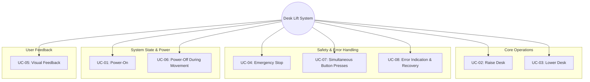

# System Use Cases

**Document Version:** 1.1  
**Last Updated:** January 7, 2026  
**Status:** Approved  
**Author:** Development Team  
**Reviewers:** System Engineering, Safety Team  

---

## Overview

This document describes the main use cases for the Automated Mechanical Desk Lift system. Use cases help clarify user interactions and drive requirements and test cases. Each use case follows IEEE 29148-2018 standard format.

---

## Navigation

- [Software Requirements](SoftwareRequirements.md)
- [Software Architecture](SoftwareArchitecture.md)
- [Software Test Cases Specification](SoftwareTestCasesSpecification.md)
- [Traceability Matrix](TraceabilityMatrix.md)

---

## Use Case Summary

| Use Case ID | Name | Priority | Frequency | Status | Related Requirements |
|------------|------|----------|-----------|--------|---------------------|
| UC-01 | Power-On the Desk Control System | Critical | Every Session | Approved | SWE-REQ-001, SWE-REQ-002 |
| UC-02 | Raise Desk | Critical | High | Approved | SWE-REQ-003, SWE-REQ-005, SWE-REQ-007 |
| UC-03 | Lower Desk | Critical | High | Approved | SWE-REQ-004, SWE-REQ-006, SWE-REQ-008 |
| UC-04 | Emergency Stop | Critical | Low | Approved | SWE-REQ-010, SWE-REQ-011 |
| UC-05 | Visual Feedback | High | Continuous | Approved | SWE-REQ-012, SWE-REQ-013 |
| UC-06 | Power-Off During Movement | Medium | Low | Approved | SWE-REQ-001, SWE-REQ-009 |
| UC-07 | Simultaneous Button Presses | High | Low | Approved | SWE-REQ-010, SWE-REQ-014 |
| UC-08 | Error Indication and Recovery | High | Low | Approved | SWE-REQ-015, SWE-REQ-016 |

---

## System Use Case Diagram

This diagram shows a hierarchical breakdown of the system's use cases, grouped by functionality, with the core system at the center.

---

## Use Cases

### UC-01: Power-On the Desk Control System

**Brief Description:** User powers on the desk control system, initializing all components and entering ready state.

**Actor:** User

**Trigger:** Power switch toggled to ON position

**Priority:** Critical

**Frequency:** Every session (daily/multiple times per day)

**Preconditions:**
- Power supply is connected (12V DC)
- All hardware components are properly connected
- No physical damage to system components

**Main Flow:**
1. User toggles the power switch to ON
2. Motor driver receives power from external supply
3. ECU powers up via regulated 5V supply
4. System performs self-check routine
5. System initializes to IDLE state
6. Ready indicator LED illuminates (green)
7. System is ready to accept user commands

**Alternative Flows:**
- **AF-01a:** If initialization fails, system enters ERROR state (see UC-08)
- **AF-01b:** If power supply voltage is out of range, error LED blinks

**Exception Flows:**
- **EF-01a:** Power supply failure → System shuts down safely
- **EF-01b:** Hardware fault detected → Enter ERROR state, illuminate error LED

**Postconditions:**
- **Success:** System is in IDLE state, ready LED ON, all inputs monitored
- **Failure:** System is in ERROR state, error LED ON

**Related Requirements:** SWE-REQ-001, SWE-REQ-002

**Test Cases:** TC-001, TC-002, IT-001

---

### UC-02: Raise Desk

**Brief Description:** User commands the desk to move upward by pressing and holding the Up button.

**Actor:** User

**Trigger:** Up button pressed

**Priority:** Critical

**Frequency:** High (multiple times per day)

**Preconditions:**
- System is in IDLE state (UC-01 completed)
- Desk is not at upper limit position
- No active error conditions
- Down button is not pressed

**Main Flow:**
1. User presses the "Up" button
2. ECU reads debounced Up button state via HAL_debounceButton()
3. System validates no conflicting inputs (Down button not pressed)
4. ECU transitions to MOVING_UP state
5. ECU sets motor direction to UP via HAL_setMotorDirection()
6. Motor driver energizes the motor
7. Desk begins moving upward
8. Up indicator LED turns ON (blue)
9. User holds button for desired movement duration
10. User releases Up button
11. ECU detects button release
12. Motor driver de-energizes motor
13. Desk stops moving
14. System transitions to IDLE state
15. Up indicator LED turns OFF, ready LED turns ON

**Alternative Flows:**
- **AF-02a:** Upper limit reached → Motor stops automatically, return to IDLE
- **AF-02b:** Maximum movement timeout (30s) → Motor stops, return to IDLE
- **AF-02c:** Button released immediately (< 50ms) → Ignore as noise, remain in IDLE

**Exception Flows:**
- **EF-02a:** Down button pressed during upward movement → Enter ERROR state (UC-04)
- **EF-02b:** Motor stall detected → Stop motor, enter ERROR state (UC-08)
- **EF-02c:** Overcurrent detected → Stop motor immediately, enter ERROR state

**Postconditions:**
- **Success:** System in IDLE state, desk at new higher position, ready LED ON
- **Failure:** System in ERROR state, desk stopped, error LED ON

**Related Requirements:** SWE-REQ-003, SWE-REQ-005, SWE-REQ-007, SWE-REQ-009

**Test Cases:** TC-003, TC-004, TC-009, IT-002

---

### UC-03: Lower Desk

**Brief Description:** User commands the desk to move downward by pressing and holding the Down button.

**Actor:** User

**Trigger:** Down button pressed

**Priority:** Critical

**Frequency:** High (multiple times per day)

**Preconditions:**
- System is in IDLE state (UC-01 completed)
- Desk is not at lower limit position
- No active error conditions
- Up button is not pressed

**Main Flow:**
1. User presses the "Down" button
2. ECU reads debounced Down button state via HAL_debounceButton()
3. System validates no conflicting inputs (Up button not pressed)
4. ECU transitions to MOVING_DOWN state
5. ECU sets motor direction to DOWN via HAL_setMotorDirection()
6. Motor driver energizes the motor
7. Desk begins moving downward
8. Down indicator LED turns ON (yellow)
9. User holds button for desired movement duration
10. User releases Down button
11. ECU detects button release
12. Motor driver de-energizes motor
13. Desk stops moving
14. System transitions to IDLE state
15. Down indicator LED turns OFF, ready LED turns ON

**Alternative Flows:**
- **AF-03a:** Lower limit reached → Motor stops automatically, return to IDLE
- **AF-03b:** Maximum movement timeout (30s) → Motor stops, return to IDLE
- **AF-03c:** Button released immediately (< 50ms) → Ignore as noise, remain in IDLE

**Exception Flows:**
- **EF-03a:** Up button pressed during downward movement → Enter ERROR state (UC-04)
- **EF-03b:** Motor stall detected → Stop motor, enter ERROR state (UC-08)
- **EF-03c:** Overcurrent detected → Stop motor immediately, enter ERROR state

**Postconditions:**
- **Success:** System in IDLE state, desk at new lower position, ready LED ON
- **Failure:** System in ERROR state, desk stopped, error LED ON

**Related Requirements:** SWE-REQ-004, SWE-REQ-006, SWE-REQ-008, SWE-REQ-009

**Test Cases:** TC-005, TC-006, TC-010, IT-003

---

### UC-04: Emergency Stop (Software-Based or Manual)

**Brief Description:** System immediately stops all motion when emergency condition is detected or both buttons are pressed simultaneously.

**Actor:** User, System (automatic)

**Trigger:** Both buttons pressed simultaneously OR system fault detected

**Priority:** Critical (Safety-related)

**Frequency:** Low (emergency use only)

**Preconditions:**
- System is powered on
- May occur during any operational state

**Main Flow:**
1. System detects emergency condition:
   - Both Up and Down buttons pressed simultaneously, OR
   - System fault/timeout detected
2. ECU immediately transitions to ERROR state
3. Motor driver is de-energized within 50ms
4. Desk movement stops immediately (emergency stop)
5. Error indicator LED turns ON (red)
6. All other indicator LEDs turn OFF
7. System locks in ERROR state
8. User is informed via visual feedback

**Alternative Flows:**
- **AF-04a:** Buttons released quickly (< 100ms) → Treat as accidental, return to IDLE
- **AF-04b:** Single button pressed after emergency stop → No action (system locked)

**Exception Flows:**
- **EF-04a:** Motor driver fails to de-energize → System logs fault, error LED blinks rapidly

**Postconditions:**
- **Success:** System in ERROR state, motor OFF, error LED ON, desk stopped
- System remains locked until power cycle

**Related Requirements:** SWE-REQ-010, SWE-REQ-011, SWE-REQ-014

**Test Cases:** TC-011, TC-012, TC-015, IT-004

---

### UC-05: Visual Feedback

**Brief Description:** System provides continuous visual feedback to user about current operational state through LED indicators.

**Actor:** User (observer), System (active)

**Trigger:** Continuous during operation (all states)

**Priority:** High

**Frequency:** Continuous (always active when powered)

**Preconditions:**
- System is powered on (UC-01)
- LED hardware is functional

**Main Flow:**
1. System continuously monitors current state
2. System updates LED indicators based on state:
   - **IDLE state:** Ready LED ON (green), all others OFF
   - **MOVING_UP state:** Up LED ON (blue), all others OFF
   - **MOVING_DOWN state:** Down LED ON (yellow), all others OFF
   - **ERROR state:** Error LED ON (red), all others OFF
3. LED updates occur within 50ms of state change
4. User observes LED status to understand system state
5. User makes decisions based on visual feedback

**Alternative Flows:**
- **AF-05a:** LED test mode during power-on → All LEDs flash sequentially for 500ms
- **AF-05b:** State transitions → Brief overlap (< 50ms) during LED switching

**Exception Flows:**
- **EF-05a:** LED hardware failure → System continues operation (degraded mode)
- **EF-05b:** Multiple LEDs ON simultaneously → Hardware fault, enter ERROR state

**Postconditions:**
- **Success:** User clearly understands current system state
- LEDs accurately represent system state at all times

**Related Requirements:** SWE-REQ-012, SWE-REQ-013

**Test Cases:** TC-007, TC-008, IT-005

---

### UC-06: Power-Off During Movement

**Brief Description:** User powers off the system during active desk movement, and system safely shuts down and recovers.

**Actor:** User

**Trigger:** Power switch toggled to OFF during MOVING_UP or MOVING_DOWN state

**Priority:** Medium (Safety consideration)

**Frequency:** Low (unintended or emergency)

**Preconditions:**
- System is in MOVING_UP or MOVING_DOWN state
- Desk is in motion
- Power switch is accessible

**Main Flow:**
1. User toggles power switch to OFF during desk movement
2. Power supply to system is interrupted
3. Motor driver loses power immediately (< 10ms)
4. Motor stops due to loss of power (mechanical inertia decay)
5. Desk coasts to stop (< 500ms)
6. All system components power down
7. All LEDs turn OFF
8. User waits for desk to stop completely
9. User toggles power switch back to ON
10. System performs power-on sequence (UC-01)
11. System initializes to IDLE state
12. System has no memory of previous state (stateless reset)

**Alternative Flows:**
- **AF-06a:** Power loss during button press → On restart, ignore stale button state
- **AF-06b:** Brief power interruption (< 100ms) → System may reset or continue

**Exception Flows:**
- **EF-06a:** Desk position unknown after power cycle → User must manually verify position

**Postconditions:**
- **Success:** System safely powered down, no damage to components
- On restart: System in IDLE state, ready for operation
- Desk position memory lost (no position tracking implemented)

**Related Requirements:** SWE-REQ-001, SWE-REQ-009

**Test Cases:** TC-013, IT-006

---

### UC-07: Simultaneous Button Presses

**Brief Description:** System detects and safely handles simultaneous pressing of both Up and Down buttons to prevent conflicting commands.

**Actor:** User (intentional or accidental)

**Trigger:** Both Up and Down buttons detected as pressed within debounce window

**Priority:** High (Safety interlock)

**Frequency:** Low (typically accidental)

**Preconditions:**
- System is powered on
- May occur from any state (IDLE, MOVING_UP, MOVING_DOWN)

**Main Flow:**
1. User presses both Up and Down buttons simultaneously (within 100ms)
2. ECU detects both buttons active via HAL_debounceButton()
3. System recognizes conflicting command
4. ECU immediately transitions to ERROR state (invokes UC-04)
5. Motor driver is de-energized
6. Any ongoing movement stops immediately
7. Error indicator LED turns ON (red)
8. System ignores all button inputs while in ERROR state
9. User releases both buttons
10. System remains in ERROR state (locked)
11. User must cycle power to recover (UC-01)

**Alternative Flows:**
- **AF-07a:** Buttons released within 100ms → Treat as noise/accidental, remain in previous state
- **AF-07b:** Simultaneous press from IDLE → Enter ERROR immediately, no movement initiated
- **AF-07c:** Simultaneous press during movement → Emergency stop, enter ERROR

**Exception Flows:**
- **EF-07a:** One button released while other held → Remain in ERROR until power cycle

**Postconditions:**
- **Success:** System in ERROR state, motor stopped, error LED ON
- No conflicting motion command executed
- System requires power cycle to resume operation

**Related Requirements:** SWE-REQ-010, SWE-REQ-014

**Test Cases:** TC-014, TC-015, IT-007

---

### UC-08: Error Indication and Recovery

**Brief Description:** System detects internal errors, provides clear indication, and allows user to recover through power cycle.

**Actor:** User, System (automatic detection)

**Trigger:** System fault detected (stall, timeout, invalid state, hardware fault)

**Priority:** High (System reliability)

**Frequency:** Low (rare, fault conditions only)

**Preconditions:**
- System is powered on and operational
- Error condition occurs during operation

**Main Flow:**
1. System detects an error condition:
   - Movement timeout exceeded (> 30s)
   - Motor stall detected
   - Both limit switches active (invalid)
   - Hardware fault detected
   - Invalid state transition
2. ECU immediately transitions to ERROR state
3. Motor driver de-energized (if moving)
4. Error indicator LED turns ON (solid red)
5. All other LEDs turn OFF
6. System logs error type (if diagnostic available)
7. System ignores all button inputs
8. User observes error LED indication
9. User identifies need for recovery
10. User toggles power switch OFF
11. User waits 2+ seconds
12. User toggles power switch ON
13. System performs power-on sequence (UC-01)
14. If error condition cleared: System enters IDLE state
15. If error persists: System re-enters ERROR state immediately

**Alternative Flows:**
- **AF-08a:** Transient error (electrical noise) → Error clears on power cycle
- **AF-08b:** Persistent hardware fault → Error LED blinks (different pattern)
- **AF-08c:** Multiple error recovery attempts → Consider service/repair needed

**Exception Flows:**
- **EF-08a:** Critical hardware failure → System cannot recover, requires repair
- **EF-08b:** Power cycle during error → Same as UC-06, restart from UC-01

**Postconditions:**
- **Success:** System recovers, enters IDLE state, ready for operation
- **Failure:** System remains in ERROR, requires troubleshooting/repair

**Related Requirements:** SWE-REQ-015, SWE-REQ-016

**Test Cases:** TC-016, TC-017, IT-008

---

## Functional Coverage Map

This map links core functions to the use cases that exercise them (see Architectural Overview for definitions).

- Initialization → UC-01
- Input acquisition + debouncing → UC-02, UC-03, UC-07
- State evaluation and transition → UC-02..UC-08
- Motion command generation → UC-02, UC-03
- Safety interlocks and emergency stop → UC-04, UC-07, UC-08
- Dwell management → UC-02, UC-03 (applies on direction changes)
- Indicators and HMI → UC-02, UC-03, UC-05
- Power handling → UC-06
