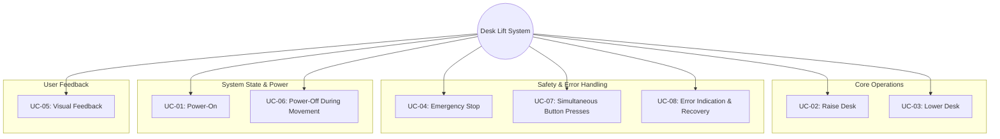

# System Use Cases

This document describes the main use cases for the Automated Mechanical Desk Lift system. Use cases help clarify user interactions and drive requirements and test cases.

---

## Navigation

- [Software Requirements](SoftwareRequirements.md)
- [Software Architecture](SoftwareArchitecture.md)
- [Software Test Cases Specification](SoftwareTestCasesSpecification.md)
- [Traceability Matrix](TraceabilityMatrix.md)

---

## System Use Case Diagram

This diagram shows a hierarchical breakdown of the system's use cases, grouped by functionality, with the core system at the center.

## Use cases

### UC-01: Power-On the Desk Control System

**Actor:** User**Main Flow:**

1. User toggles the power switch to ON.
2. Motor driver receives power.
3. ECU powers up (regulated supply).
4. System initializes and enters IDLE state; indicator LED shows ready status.

### UC-02: Raise Desk

**Actor:** User**Main Flow:**

1. User presses the “Up” button.
2. ECU reads the debounced Up button via HAL_debounceButton.
3. ECU sets motor direction to UP.
4. Motor driver energizes the motor.
5. Desk moves upward.
6. Up indicator LED is ON.
7. Motor stops when button is released, timeout occurs, or upper limit is reached.
8. Indicator LED returns to IDLE state.

### UC-03: Lower Desk

**Actor:** User**Main Flow:**

1. User presses the “Down” button.
2. ECU reads the debounced Down button via HAL_debounceButton.
3. ECU sets motor direction to DOWN.
4. Motor driver energizes the motor.
5. Desk moves downward.
6. Down indicator LED is ON.
7. Motor stops when button is released, timeout occurs, or lower limit is reached.
8. Indicator LED returns to IDLE state.

### UC-04: Emergency Stop (Software-Based or Manual)

**Actor:** User/System**Main Flow:**

1. User presses both buttons simultaneously, or system detects a fault/timeout.
2. Motor driver is de-energized.
3. Desk movement stops immediately.
4. Error indicator LED is ON.
5. User can clear error by cycling power.

### UC-05: Visual Feedback

**Actor:** User**Main Flow:**

1. System uses LEDs to indicate current state:
   - IDLE: Ready/neutral LED
   - MOVING_UP: Up LED
   - MOVING_DOWN: Down LED
   - ERROR: Error LED

### UC-06: Power-Off During Movement

**Actor:** User**Main Flow:**

1. User powers off the system while the desk is moving.
2. Motor stops immediately.
3. System resumes in IDLE state when powered back on.

### UC-07: Simultaneous Button Presses

**Actor:** User**Main Flow:**

1. User presses both Up and Down buttons.
2. System stops. No movement should be commanded.
3. If both buttons are released, desk stops.

### UC-08: Error Indication and Recovery

**Actor:** User**Main Flow:**

1. System detects an error (e.g., both limits active, overcurrent).
2. Error LED is ON.
3. User is informed of the error state.
4. User can attempt recovery by cycling power.

---

## Functional Coverage Map

This map links core functions to the use cases that exercise them (see Architectural Overview for definitions).

- Initialization → UC-01
- Input acquisition + debouncing → UC-02, UC-03, UC-07
- State evaluation and transition → UC-02..UC-08
- Motion command generation → UC-02, UC-03
- Safety interlocks and emergency stop → UC-04, UC-07, UC-08
- Dwell management → UC-02, UC-03 (applies on direction changes)
- Indicators and HMI → UC-02, UC-03, UC-05
- Power handling → UC-06
