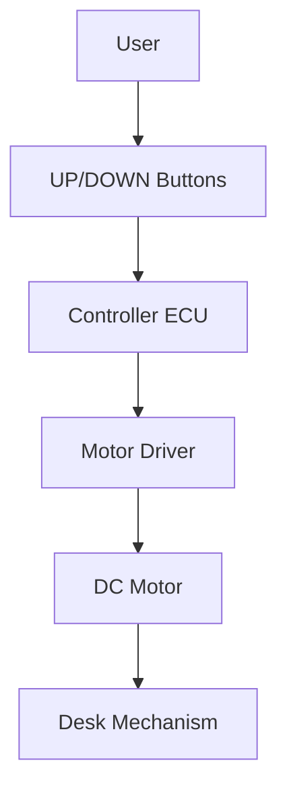

# System Feature Concept Review

**Feature Name:** Height Adjustment (Up/Down Motion)  
**Date:** February 21, 2026  
**Version:** 1.0  
**Prepared By:** System Engineering Team  
**Review Type:** Initial

## Feature Overview

### Business Context
- **Customer Need:** Ergonomic height adjustment without manual cranking.
- **Business Value:** Improved user comfort and productivity; core product differentiator.
- **Priority:** Critical

### Feature Description
The system provides motorized height adjustment across 30 cm to 120 cm. Users control motion with UP/DOWN buttons; motion continues while the button is held and stops on release. The feature is designed for smooth, predictable movement under rated load.

### Use Cases

#### Primary Use Case
**Actor:** User  
**Scenario:**
1. User presses and holds UP or DOWN.
2. Desk moves smoothly in the requested direction.
3. User releases the button at the desired height.

**Expected Outcome:** Desk reaches the target height and stops within the timing limits.

#### Alternative Use Cases
- Full-stroke adjustment from minimum to maximum.
- Adjustment under maximum rated load (20 kg).

## Technical Approach

### Proposed Solution
A single ECU reads button inputs, validates commands, and drives the motor through the L298N driver. Motion is controlled via direction and PWM signals. Limit sensors protect end-of-travel behavior.

### Architecture Diagram

### Key Design Decisions
1. **Decision:** Continuous-motion while button held.
   - **Rationale:** Simple, predictable user behavior and safety.
   - **Alternatives Considered:** One-touch presets (deferred).

2. **Decision:** Control loop scheduling (250 ms app task cadence).
   - **Rationale:** Deterministic behavior on constrained hardware.

## Requirements Summary

### Functional Requirements (High-Level)
| Req ID | Description | Priority |
|--------|-------------|----------|
| SysReq-001 | Height range 30-120 cm @ 20 kg | Critical |
| SysReq-002 | Start motion within 1.0 second | High |
| SysReq-004 | Full stroke within 30 seconds | High |
| SysReq-006 | Smooth motion without jerking | Medium |

### Non-Functional Requirements
- **Performance:** Response time <= 1.0 sec; full stroke <= 30 sec.
- **Safety:** Stop on release, limit enforcement (see safety features).
- **Usability:** Simple press-and-hold behavior.

## Impact Analysis

### Impact on Existing Systems
- **Control ECU:** Implements state machine and timing constraints.
- **Actuation:** Motor driver and mechanism sized for load and stroke.

### Dependencies
- **Hardware:** L298N driver, DC motor, limit sensors, power supply.
- **Software:** HAL input/output interfaces.

### Risks
| Risk | Impact | Probability | Mitigation |
|------|--------|-------------|------------|
| Motor torque insufficient under load | High | Medium | Verify with load testing, adjust gearing |
| Motion jitter from power noise | Medium | Low | Use stable power supply and filtering |

## Verification Approach

### Test Strategy
- **Unit Testing:** Validate control logic with mocks.
- **Integration Testing:** ECU and HAL interactions.
- **System Testing:** SYS-TC-001, SYS-TC-002, SYS-TC-006, SYS-TC-008.

### Acceptance Criteria
- [ ] Travel range 30-120 cm under 20 kg.
- [ ] Motion starts within 1.0 second.
- [ ] Full stroke within 30 seconds.
- [ ] Motion smooth with minimal vibration.

## Safety and Security Considerations

### Safety Analysis
- HARA completed; hazards confirmed in [02_02_HARA-complete.md](../02_02_HARA-complete.md).
- Safety mechanisms: stop on release, limit sensors, conflict detection.

### Security Analysis
- Not applicable (no external connectivity).

## Open Questions and Decisions Needed

### Questions
1. **Q:** Confirm rated load margin beyond 20 kg?
   - **Owner:** System Engineer
   - **Target Date:** [Pending]

### Decisions Required
- [ ] **Decision:** Final motor and gearbox sizing - **Owner:** Hardware Lead - **Date:** [Pending]

## Review Feedback

### Reviewer Comments
| Reviewer | Role | Comment | Status | Resolution |
|----------|------|---------|--------|------------|
| [Name] | [Role] | [TBD] | Open | |

### Action Items from Review
| Action | Owner | Due Date | Status |
|--------|-------|----------|--------|
| Schedule review meeting | System Engineer | [Pending] | Not Started |

## Approval

### Review Outcome
- ☐ **Approved**
- ☐ **Approved with Conditions**
- ☐ **Not Approved**

### Sign-Off
- **System Engineer:** [Pending]  
- **Technical Lead:** [Pending]  
- **Product Owner:** [Pending]  
- **Safety Engineer (if applicable):** Armando FuSaGuy - [Pending]

## Next Steps
1. Finalize system requirements and traceability updates.
2. Execute system tests and update the test report.
3. Confirm safety goal mappings in the RTM.
