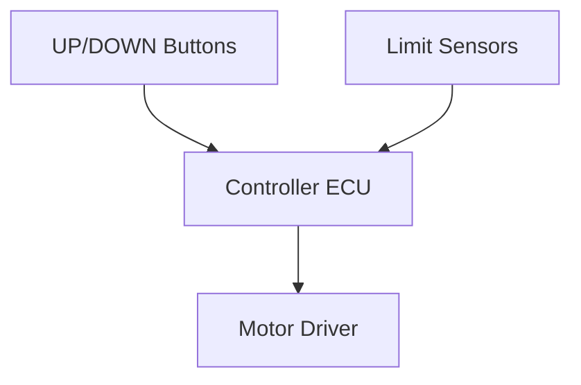

# System Feature Concept Review

**Feature Name:** Limit Protection and Conflicting Input Handling  
**Date:** February 21, 2026  
**Version:** 1.0  
**Prepared By:** System Engineering Team  
**Review Type:** Initial

## Feature Overview

### Business Context
- **Customer Need:** Safe end-of-travel operation and predictable behavior for invalid inputs.
- **Business Value:** Prevents damage and injury; improves reliability perception.
- **Priority:** Critical

### Feature Description
The system stops motion when upper or lower travel limits are reached, even if a button remains pressed. If UP and DOWN are pressed simultaneously, the system rejects the command and keeps the motor stopped.

### Use Cases

#### Primary Use Case
**Actor:** User  
**Scenario:**
1. User holds UP button to raise the desk.
2. Desk reaches upper limit.
3. System stops motion automatically.

**Expected Outcome:** No over-travel; motor stops safely.

#### Alternative Use Cases
- User presses UP and DOWN at the same time; system remains in IDLE.
- User holds DOWN at lower limit; motor remains stopped.

## Technical Approach

### Proposed Solution
The ECU continuously reads limit switches and button states. Limit signals override motor commands. Conflicting button inputs map to STOP behavior.

### Architecture Diagram

### Key Design Decisions
1. **Decision:** Limit sensors override user commands.
   - **Rationale:** Prevents mechanical over-travel and damage.

2. **Decision:** Conflicting inputs map to STOP state.
   - **Rationale:** Eliminates ambiguous behavior.

## Requirements Summary

### Functional Requirements (High-Level)
| Req ID | Description | Priority |
|--------|-------------|----------|
| SysReq-007 | Stop at mechanical travel limits | Critical |
| SysReq-005 | Reject simultaneous UP/DOWN inputs | Critical |

### Non-Functional Requirements
- **Safety:** Motor must not drive past travel limits.
- **Reliability:** Conflicting inputs do not cause oscillations.

## Impact Analysis

### Impact on Existing Systems
- **Control ECU:** Limit and conflict logic priority.
- **Sensing:** Reliable limit switch placement and wiring.

### Dependencies
- **Hardware:** Limit switches, wiring, debounced inputs.
- **Software:** Input validation logic.

### Risks
| Risk | Impact | Probability | Mitigation |
|------|--------|-------------|------------|
| Limit switch failure | High | Medium | Add diagnostic checks, periodic validation |
| User override behavior unclear | Medium | Low | Document behavior in user guide |

## Verification Approach

### Test Strategy
- **Unit Testing:** Limit and conflict logic via mocks.
- **Integration Testing:** Hardware input simulation.
- **System Testing:** SYS-TC-007, SYS-TC-009, SYS-TC-010.

### Acceptance Criteria
- [ ] Motor stops at upper and lower limits.
- [ ] No motion on simultaneous button press.

## Safety and Security Considerations

### Safety Analysis
- HARA completed; hazards confirmed in [02_02_HARA-complete.md](../02_02_HARA-complete.md).

### Security Analysis
- Not applicable.

## Open Questions and Decisions Needed

### Questions
1. **Q:** Are redundant limit sensors required?
   - **Owner:** Safety Engineer
   - **Target Date:** [Pending]

### Decisions Required
- [ ] **Decision:** Minimum acceptable limit sensor reliability - **Owner:** Hardware Lead - **Date:** [Pending]

## Review Feedback

### Reviewer Comments
| Reviewer | Role | Comment | Status | Resolution |
|----------|------|---------|--------|------------|
| [Name] | [Role] | [TBD] | Open | |

### Action Items from Review
| Action | Owner | Due Date | Status |
|--------|-------|----------|--------|
| Verify limit placement tolerance | Hardware Lead | [Pending] | Not Started |

## Approval

### Review Outcome
- ☐ **Approved**
- ☐ **Approved with Conditions**
- ☐ **Not Approved**

### Sign-Off
- **System Engineer:** [Pending]  
- **Technical Lead:** [Pending]  
- **Product Owner:** [Pending]  
- **Safety Engineer (if applicable):** Armando FuSaGuy - [Pending]

## Next Steps
1. Confirm limit sensor selection and reliability.
2. Execute SYS-TC-007, SYS-TC-009, SYS-TC-010.
3. Confirm safety goal mappings in the RTM.
