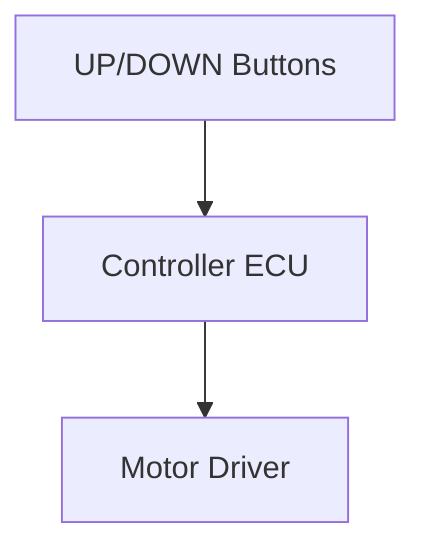

# System Feature Concept Review

**Feature Name:** No Motion Without Valid Command  
**Date:** February 21, 2026  
**Version:** 1.0  
**Prepared By:** System Engineering Team  
**Review Type:** Initial

## Feature Overview

### Business Context
- **Customer Need:** Prevent unintended movement when no one is operating the desk.
- **Business Value:** Reduces injury risk and liability; improves user trust.
- **Priority:** Critical

### Feature Description
The system keeps the motor in STOP whenever no valid UP or DOWN command is present. This prevents unintended motion due to noise, transient inputs, or idle-state faults.

### Use Cases

#### Primary Use Case
**Actor:** User  
**Scenario:**
1. System powered on with no button press.
2. Desk remains stationary.

**Expected Outcome:** Motor remains STOP with no motion.

#### Alternative Use Cases
- User nearby but not touching controls.
- System idle after previous movement.

## Technical Approach

### Proposed Solution
The control ECU validates inputs each cycle and asserts STOP unless exactly one valid button command is present. Debouncing prevents spurious inputs.

### Architecture Diagram

### Key Design Decisions
1. **Decision:** Default STOP state with explicit command gating.
   - **Rationale:** Fail-safe behavior for idle/no-input condition.

## Requirements Summary

### Functional Requirements (High-Level)
| Req ID | Description | Priority |
|--------|-------------|----------|
| SysReq-010 | Motor STOP when no valid command | Critical |
| FSR-001 | STOP on no valid command | Critical |

### Non-Functional Requirements
- **Safety:** No unintended motion in idle state.
- **Reliability:** Robust to input noise.

## Impact Analysis

### Impact on Existing Systems
- **Control ECU:** Input validation and command gating in IDLE.

### Dependencies
- **Software:** Debounce logic, state machine.
- **Hardware:** Button integrity, stable pull-ups.

### Risks
| Risk | Impact | Probability | Mitigation |
|------|--------|-------------|------------|
| Button noise causes false command | Medium | Low | Debounce window and command gating |

## Verification Approach

### Test Strategy
- **Unit Testing:** Verify STOP with no valid input.
- **System Testing:** SYS-TC-013.

### Acceptance Criteria
- [ ] Motor remains STOP with no valid input.
- [ ] No motion observed during idle.

## Safety and Security Considerations

### Safety Analysis
- HARA completed; hazards confirmed in [02_02_HARA-complete.md](../02_02_HARA-complete.md).
- Safety Goal: SG-001.

### Security Analysis
- Not applicable.

## Open Questions and Decisions Needed

### Questions
1. **Q:** Confirm acceptable debounce window for noisy environments?
   - **Owner:** Software Lead
   - **Target Date:** [Pending]

### Decisions Required
- [ ] **Decision:** Final debounce timing - **Owner:** Software Lead - **Date:** [Pending]

## Review Feedback

### Reviewer Comments
| Reviewer | Role | Comment | Status | Resolution |
|----------|------|---------|--------|------------|
| [Name] | [Role] | [TBD] | Open | |

### Action Items from Review
| Action | Owner | Due Date | Status |
|--------|-------|----------|--------|
| Run SYS-TC-013 | Test Engineer | [Pending] | Not Started |

## Approval

### Review Outcome
- ☐ **Approved**
- ☐ **Approved with Conditions**
- ☐ **Not Approved**

### Sign-Off
- **System Engineer:** [Pending]  
- **Technical Lead:** [Pending]  
- **Product Owner:** [Pending]  
- **Safety Engineer (if applicable):** Armando FuSaGuy - [Pending]

## Next Steps
1. Execute SYS-TC-013 and update test report.
2. Confirm safety goal mappings in the RTM.
