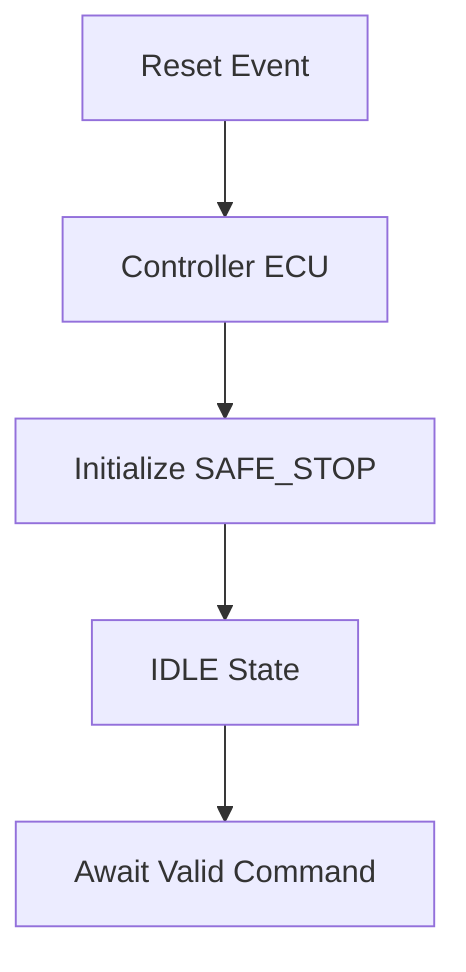

# System Feature Concept Review

**Feature Name:** Safe STOP After Reset or Brownout  
**Date:** February 21, 2026  
**Version:** 1.0  
**Prepared By:** System Engineering Team  
**Review Type:** Initial

## Feature Overview

### Business Context
- **Customer Need:** Safe recovery from power anomalies without unintended motion.
- **Business Value:** Improves reliability; reduces injury risk after power events.
- **Priority:** Critical

### Feature Description
The system enters a safe STOP state immediately after a reset or brownout event. The motor remains STOP until a valid command is issued, preventing unintended motion on power recovery.

### Use Cases

#### Primary Use Case
**Actor:** System  
**Scenario:**
1. Power anomaly or reset event occurs.
2. System restarts and initializes.
3. Motor remains STOP.
4. User must issue a new command to move.

**Expected Outcome:** Safe, predictable recovery with no unintended motion.

#### Alternative Use Cases
- Brownout during motion causes motor to stop safely.
- Power cycle restarts system to idle state.

## Technical Approach

### Proposed Solution
The control ECU initializes to SAFE_STOP state on reset. Application state machine begins in IDLE. No motion is commanded until a valid button press is detected.

### Architecture Diagram

### Key Design Decisions
1. **Decision:** Initialize to SAFE_STOP rather than previous state.
   - **Rationale:** Ensures deterministic safe behavior on recovery.

2. **Decision:** Require explicit new command post-reset.
   - **Rationale:** Prevents unintended motion from stale inputs.

## Requirements Summary

### Functional Requirements (High-Level)
| Req ID | Description | Priority |
|--------|-------------|----------|
| SysReq-011 | Safe STOP after reset/brownout | Critical |
| FSR-005 | STOP state after reset before new command | Critical |

### Non-Functional Requirements
- **Safety:** No motion on recovery; explicit command required.
- **Reliability:** Deterministic initialization.

## Impact Analysis

### Impact on Existing Systems
- **Control ECU:** Initialization sequence and state machine startup.

### Dependencies
- **Software:** Reset handling, state initialization.
- **Hardware:** Power supply stability (may require capacitors).

### Risks
| Risk | Impact | Probability | Mitigation |
|------|--------|-------------|------------|
| Watchdog-triggered reset causes loss of context | Medium | Low | Implement reset counter; log reset events |

## Verification Approach

### Test Strategy
- **Integration Testing:** Simulate reset/brownout conditions.
- **System Testing:** SYS-TC-014.

### Acceptance Criteria
- [ ] Motor STOP after reset/brownout.
- [ ] No motion until valid command issued.

## Safety and Security Considerations

### Safety Analysis
- HARA completed; hazards confirmed in [02_02_HARA-complete.md](../02_02_HARA-complete.md).
- Safety Goal: SG-006.

### Security Analysis
- Not applicable.

## Open Questions and Decisions Needed

### Questions
1. **Q:** How long should brownout be tolerated before triggering reset?
   - **Owner:** Hardware Lead
   - **Target Date:** [Pending]

### Decisions Required
- [ ] **Decision:** Brownout threshold voltage and timing - **Owner:** Hardware Lead - **Date:** [Pending]

## Review Feedback

### Reviewer Comments
| Reviewer | Role | Comment | Status | Resolution |
|----------|------|---------|--------|------------|
| [Name] | [Role] | [TBD] | Open | |

### Action Items from Review
| Action | Owner | Due Date | Status |
|--------|-------|----------|--------|
| Simulate brownout and reset in lab | Test Engineer | [Pending] | Not Started |

## Approval

### Review Outcome
- ☐ **Approved**
- ☐ **Approved with Conditions**
- ☐ **Not Approved**

### Sign-Off
- **System Engineer:** [Pending]  
- **Technical Lead:** [Pending]  
- **Product Owner:** [Pending]  
- **Safety Engineer (if applicable):** Armando FuSaGuy - [Pending]

## Next Steps
1. Execute SYS-TC-014 and update test report.
2. Confirm brownout threshold and power supply specs.
3. Confirm safety goal mappings in the RTM.
