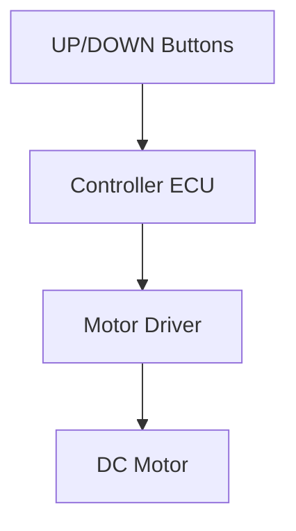

# System Feature Concept Review

**Feature Name:** Safety Halt on Button Release  
**Date:** February 21, 2026  
**Version:** 1.0  
**Prepared By:** System Engineering Team  
**Review Type:** Initial

## Feature Overview

### Business Context
- **Customer Need:** Immediate stop of motion when the user releases control.
- **Business Value:** Reduces injury risk and improves user trust.
- **Priority:** Critical

### Feature Description
The system stops desk motion within 500 ms of button release. This feature ensures the user can immediately halt motion to avoid hazards or stop at a desired height.

### Use Cases

#### Primary Use Case
**Actor:** User  
**Scenario:**
1. User presses and holds UP or DOWN.
2. Desk moves.
3. User releases the button.

**Expected Outcome:** Motor stops within 500 ms with minimal coasting.

#### Alternative Use Cases
- Emergency stop when an obstacle is detected by the user.

## Technical Approach

### Proposed Solution
The control ECU detects button release within the control loop and commands motor STOP. The motor driver is de-energized immediately and the system returns to IDLE.

### Architecture Diagram

### Key Design Decisions
1. **Decision:** Stop on button release without delay.
   - **Rationale:** Safety-critical requirement to prevent injury.

2. **Decision:** No latching or preset motion.
   - **Rationale:** Ensures user maintains continuous control.

## Requirements Summary

### Functional Requirements (High-Level)
| Req ID | Description | Priority |
|--------|-------------|----------|
| SysReq-003 | Halt motion within 500 ms of release | Critical |
| SysReq-002 | Response time for user input | High |

### Non-Functional Requirements
- **Performance:** Stop time <= 500 ms.
- **Safety:** Fail-safe default is motor STOP.

## Impact Analysis

### Impact on Existing Systems
- **Control ECU:** Release detection and STOP command priority.
- **Actuation:** Driver must support fast de-energize.

### Dependencies
- **Software:** Debounce and state machine responsiveness.
- **Hardware:** Motor driver and mechanical inertia.

### Risks
| Risk | Impact | Probability | Mitigation |
|------|--------|-------------|------------|
| Coasting exceeds 1 cm | High | Medium | Tune deceleration, verify with tests |
| Debounce delay impacts stop time | Medium | Low | Validate debounce window in tests |

## Verification Approach

### Test Strategy
- **Unit Testing:** Verify release handling in software.
- **Integration Testing:** Validate ECU to driver timing.
- **System Testing:** SYS-TC-005.

### Acceptance Criteria
- [ ] Motor stops within 500 ms after release.
- [ ] Coasting <= 1 cm.

## Safety and Security Considerations

### Safety Analysis
- HARA completed; hazards confirmed in [02_02_HARA-complete.md](../02_02_HARA-complete.md).

### Security Analysis
- Not applicable.

## Open Questions and Decisions Needed

### Questions
1. **Q:** Confirm acceptable coasting tolerance for product safety claims.
   - **Owner:** Safety Engineer
   - **Target Date:** [Pending]

### Decisions Required
- [ ] **Decision:** Final stop-time acceptance threshold - **Owner:** System Engineer - **Date:** [Pending]

## Review Feedback

### Reviewer Comments
| Reviewer | Role | Comment | Status | Resolution |
|----------|------|---------|--------|------------|
| [Name] | [Role] | [TBD] | Open | |

### Action Items from Review
| Action | Owner | Due Date | Status |
|--------|-------|----------|--------|
| Confirm stop timing on hardware | Test Engineer | [Pending] | Not Started |

## Approval

### Review Outcome
- ☐ **Approved**
- ☐ **Approved with Conditions**
- ☐ **Not Approved**

### Sign-Off
- **System Engineer:** [Pending]  
- **Technical Lead:** [Pending]  
- **Product Owner:** [Pending]  
- **Safety Engineer (if applicable):** Armando FuSaGuy - [Pending]

## Next Steps
1. Validate timing in integration tests.
2. Execute SYS-TC-005 and update test report.
3. Confirm safety goal mappings in the RTM.
